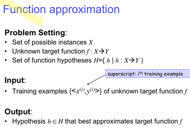
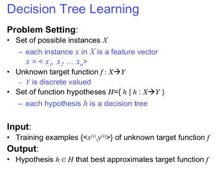
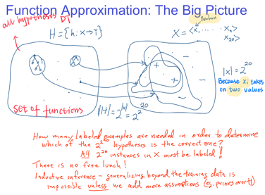

This is my study notes of 
[CMU - Machine Learning 10-701](http://www.cs.cmu.edu/~tom/10701_sp11/lectures.shtml)

Lecture 1 Intro to ML and Decision Trees   
Lecture 2 Decision tree learning and Review of probability

## 1. Machine Learning as Function approximation

### 1.1 Function approximation 

<Take decision tree as an example

#### 1.1.1 Search and optimization - Free lunch therom

***Learning is search/optimization problem over H***  
- Various objective functions
  - minimize training error
  - among hypotheses that minimize training error, 
- But inductive learning without some bias is futile

> There is no free lunch!
>Inductive Inference- generalizing beyond the training data is impossible **unless** we add more assumptions **(Priors asserts)**

**This is usually done by bayes' inference**

#### 1.1.2 Bayes' Inference - Prior assumption

