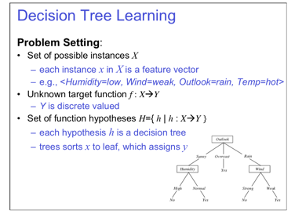
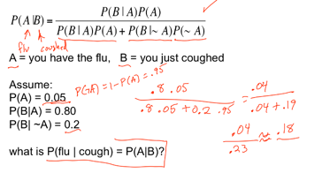
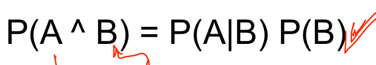
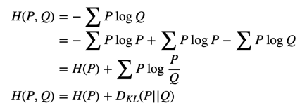
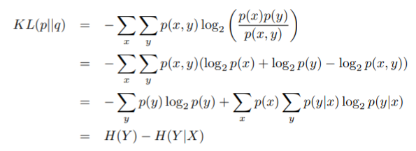
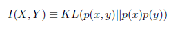
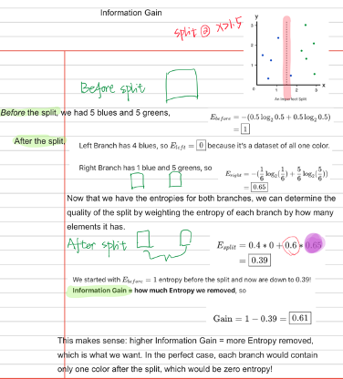
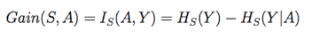

This is my study notes of 
[CMU - Machine Learning 10-701](http://www.cs.cmu.edu/~tom/10701_sp11/lectures.shtml)

Lecture 1 Intro to ML and Decision Trees   
Lecture 2 Decision tree learning and Review of probability

## 1. Machine Learning as Function approximation

### 1.1 Function approximation 

Take decision tree as an example

We're actually looking for a **_boolean function_**

#### 1.1.1 Search and optimization - Free lunch therom

***Learning is search/optimization problem over H***  
- Various objective functions
  - minimize training error
  - among hypotheses that minimize training error, 
- But inductive learning without some bias is futile

> There is no free lunch!
>Inductive Inference- generalizing beyond the training data is impossible **unless** we add more assumptions **(Priors asserts)**

>This is usually done by bayes' inference

#### 1.1.2 Bayes' Inference - Prior assumption

Joint probability  
  

Conditional Probability  
 
 

Marginal Probability   
The marginal probability P(X) is computed by summing (or integrating) the joint probability over other variables.

In many ML problems, we build a **joint distribution model** for all the variables. Once it is modeled, we can inference the probability of a single or a subset of variables (p(x₁) or p(x₁, x₂, x₃)) by summing or integrating over the rest of the variables.  

Bayes' Rule  

    

B is the features of Decision tree  

What does all this have to do with function approximation?

##### Beta distribution

---
Independent Events -- Joint distribution

#### 1.1.3 Entropy
[Here is the reference](https://medium.com/@jonathan_hui/machine-learning-summary-fundamental-6562ff7448a)  
[Visualization](http://colah.github.io/posts/2015-09-Visual-Information/#fn4)  

| Name  |Formula   |
|---|---|
| Information of an event   |  I(x) = -log(p(x)) |
| Entropy of a random variable   ||
|  Cross entropy H(P,Q) |  |
|KL Divergence | |
|Conditional entropy||
|Information gain ||

 

- Cross entropy=conditional entropy
- Information gain=KL Divergence （In decision tree）  

---
 
The Shannon **information content** is the amount of information gain when **an event x occurs**. Mathematically, it is defined as:  

  

In computer science, the information content can also be viewed as the number of bits to encode the information most efficiently

X is called a random variable if it holds a value generated from a random process (a stochastic process), e.g. the face value in rolling dice or the total number of heads after flipping a coin 20 times.

**Entropy H** measures the expected information content of **a random variable**. To calculate the value, we sum up all information content with a weight equals to its occurrence frequency.  

##### **Cross entropy H(P,Q)**  
Cross-entropy H(P, Q) measures the expected number of bits to encode X with distribution P using an encoding scheme targeted for distribution Q.

In ML, we want our predictions Q to match the ground truth P. If they match, **the cross-entropy will be the minimum** and therefore, we often use it as our training objective.  

The cross-entropy for our example is
  

As shown above, the cost function for many classification problems is simply

##### **KL-divergence**  
KL-divergence measures the difference between two distributions P and Q.  
  

Cross entropy -Entropy = KL Divergence

i.e., KL-Divergence measures the inefficiency of representing P with encoding scheme Q — the extra-bits to encode the information with the sub-optimal scheme. Therefore, KL-divergence is always greater or equal to zero

##### **Conditional Entropy**

The conditional entropy H(Y|X) is the entropy of Y given X is known. If Y can be separated according to X, this is the weighted entropy of the separated groups and calculated as:

  

#### **Information gain I(X,Y)- mutual information**
Mutual information (or Information gain) I(X; Y) is the information obtained on the random variable X when Y is observed.

 Use KL-divergence for mutual information gain 

  

>**A could be seen as the features of the decision tree**

**Example**  

 
Information Gain is the expected reduction in entropy of target variable Y for data sample S, due to sorting on variable A
  

Intuitively, mutual information measures how much information do we gain by knowing Y? 
- If knowing Y gives us all the information about X, the conditional entropy H(X|Y) is zero because there is no more information we needed on X. The mutual information I becomes H(X) (or H(Y)).For example, if we know the label (Y) of an object, we gain a lot of information about its raw image (X). 
We should not mistake its picture with other objects. Therefore the information gain I(X;Y) is high. 

Let’s visualize this with sets. The mutual information is its overlap.

