ML -Looking for Joint probability model  
Continued lecture 1 and 2

## 2. Machine learning and joint distribution
Machine learning is looking for a conditional probability P(Y|X) by finding joint distribution

 ### 2.1 Inference with the Joint distribution
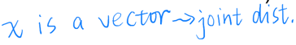
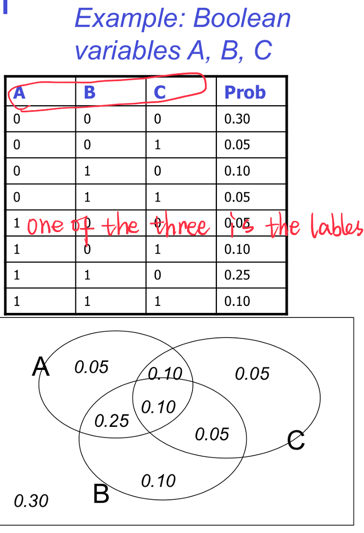

Example:  

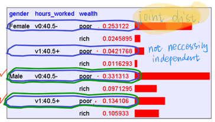  

_**The 4th column shows share of the examples and hence the table is actually a dataset..**_

> The joint distribution allows us to compute the joint probability/marginal prob and hence conditional prob P(Y|X) 

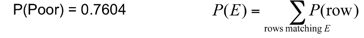
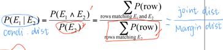
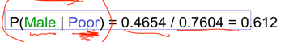

1.	Suppose we want to learn the function f: <G, H> —>W

2.	Equivalently, P(W | G, H)   Solution: learn joint distribution from data, calculate P(W | G, H)   

e.g., P(W=rich | G = female, H = 40.5)= 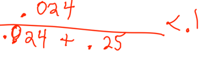

#### 2.1.1 How to find the joint distribution - MLE/MAP

**Cost function_ corss entropy (KL-divergence) _ MAP _MLE**
- The core of Bayesian Inference is to combine two different distributions (likelihood and prior) into one “smarter” distribution (posterior). 
- Posterior is “smarter” in the sense that the classic maximum likelihood estimation (MLE) doesn’t take into account a prior. Once we calculate the posterior, we use it to find the “best” parameters and the “best” is in terms of maximizing the posterior probability, given the data. 
- This process is called Maximum A Posteriori (MAP). The optimization used in MAP is the same as the one used in typical machine learning, such as gradient descent or Newton’s method, etc.

##### MLE and MAP
[Reference](https://towardsdatascience.com/bayesian-inference-intuition-and-example-148fd8fb95d6)  
[Reference1](https://wiseodd.github.io/techblog/2017/01/01/mle-vs-map/)  
[Reference2](https://medium.com/@jonathan_hui/machine-learning-summary-fundamental-6562ff7448a)

- MLE  
likelihood function P(X|θ)  
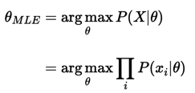
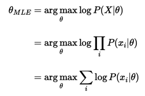

- MAP   
it works on a posterior distribution, not only the likelihood.  
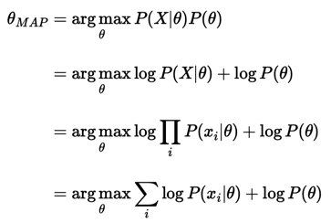

- Comparing both MLE and MAP equation, the only thing differs is the inclusion of prior P(θ) in MAP, otherwise they are identical.
- What it means is that, the likelihood is now **weighted with some weight coming from the prior**.

Assume prior P(θ) is a **uniform distribution** and MAP=MLE  

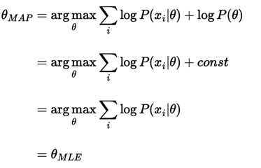  

if we use the simplest prior in MAP estimation, like a uniform prior, 
- we assign equal weights on all possible values of θ. 
- The implication is that the likelihood equivalently weighted by some constants. 
  - Being constant, we could be ignored from our MAP equation, as it will not contribute to the maximization.    

**If we use different prior, say, a Gaussian, then our prior is not constant anymore, 
as depending on the region of the distribution, the probability is high or low, never always the same.**

 Prior p(θ) turns into an L2-regularization term in the objective function   
  
  
  
If we assume the model parameters θ are zero centered, and p(θ) and p(y|θ) are both Gaussian distributed, 
we can prove that MAP arrives with the same objective as using L2 as the cost function with added L2 regularization.

  

Conceptually, p(θ) can be viewed as a regularization factor. 
It can penalize a cost function if θ deviates from our prior belief. 

    

To make a new prediction, we use the posterior p(θ | X, y) in our training as p(θ). Then we find the marginal probability p(y₀|x₀) by integrating over θ. This is Marginal inference. 
We compute the probability of a variable by summing everything else out.

---
##### Bayesian inference
[Reference](https://github.com/yz599/2020_2/blob/master/2020/CMU/Bayesian%20Inference%20example.ipynb)

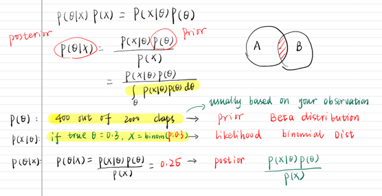

|   |Example   |  |
|---|---|---|
| P(θ): | say 400 out 2000 claps --- your guess based on one observation --- Beta distribution  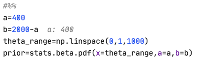  |The clapping probability for the prior was 20%. 400/2000|
| P(XIθ)| 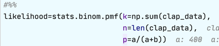  |
| P(θIX)| posterior = likelihood * prior  |Now, the posterior has its peak around 0.25%.|
|X|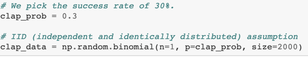|The clapping probability for the data was given as 30%.|

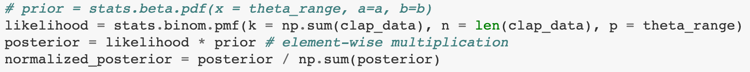
- Because we incorporated more information through sampling, 
the range of possible parameters is now narrower.   
- The more data you gather, the graph of the posterior will look more like that of the **likelihood and less like that of the prior**.
- In other words, as you get more data, the **original prior distribution matters less**. 

#### 2.1.2 Cross entropy- cost function - MLE/MAP 

#### 2.1.3 Conjugate prior
[Reference](https://medium.com/@jonathan_hui/machine-learning-summary-fundamental-6562ff7448a)

