## Elements of algorithm

Algorithms, in their simplest form, are just a sequence of actions, **a list of instructions**.

Essentially, we can say that algorithms are composed of the following **four elements**:
- Sequential operations
- Actions based on the state of a data structure
- Iteration, repeating an action a number of times
- Recursion, calling itself on a subset of inputs

In general, we can discern three broad approaches to algorithm design. They are:
- Divide and conquer
- Greedy algorithms
- Dynamic programming

### 1. Variable in python as reference

Variable names can be bound to different values and types during program execution. Each value is of a type, a string, or integer for
example; however, the name that points to this value does not have a specific type.

This is different from many languages such as C and Java where a name represents a fixed size,
type, and location in memory. This means when we initialize variables in Python, we do not
need to declare a type. Also, variables, or more specifically the objects they point to, can
change type depending on the values assigned to them,

- All data types in Python are objects. In fact, pretty much everything is an object in Python,
including modules, classes, and functions, as well as literals such as strings and integers.
- Each object in Python has **a type, a value, and an identity**.

greet ="hello world"
- an instance of a string object with the
- value "hello world" and the identity of greet.
- The identity of an object acts as a pointer to the object's location in memory.

The type of an object, also known as the object's class, describes the
object's internal representation as well as the methods and operations it supports. Once an
instance of an object is created, its identity and type cannot be changed.

#### 1.1 Compare with Variable in C
| #  | Meaning  |   |   |   |
|---|---|---|---|---|
| 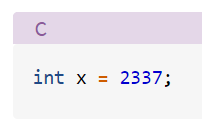    | 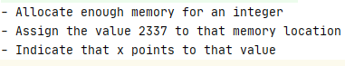  |   |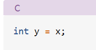  | 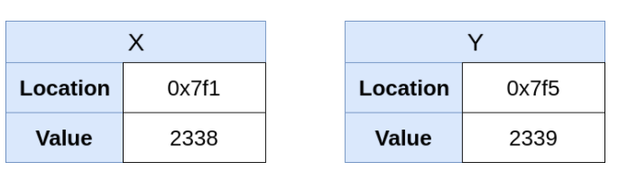  |
| 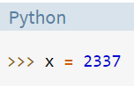  | 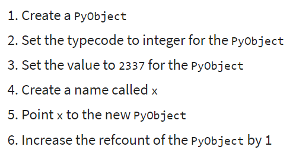  | 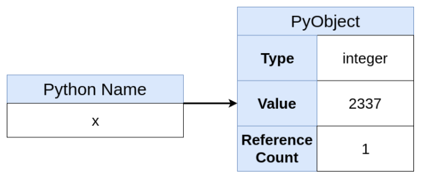  | 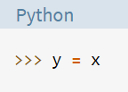  |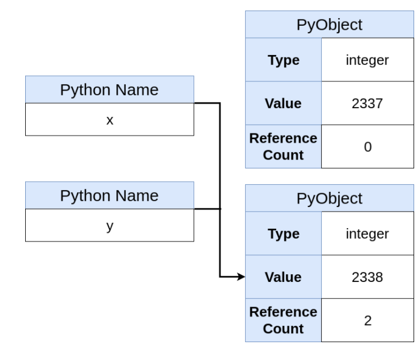   |
| C  | It means that **x is the memory location**, not just a name for it.  |The variable x is mutable | y=x  |This code creates a new box called y and copies the value from x into the box!   |
|Python| x points to a reference to an object and does not own the memory space as before|Each object in Python has **a type, a value, and an identity**. _type()/==/id()..is.._|y=x|Now you can see that a new Python object has not been created, just a new name that points to the same object.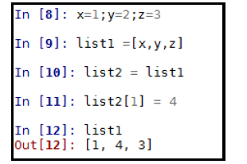 |

Instead of x owning the block of memory where the value 2337 resides, the newly created Python object owns the memory where 2337 lives. 

This diagram helps illustrate that x points to a reference to an object and doesn’t own the memory space as before. 
It also shows that the x = 2338 command is not an assignment, but rather binding the name x to a reference.
##### Variable/pointer in C
  
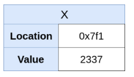
- Allocate enough memory for an integer
- Assign the value 2337 to that memory location
- Indicate that x points to that value

>- Variable x has a fake memory location of 0x7f1 and the value 2337. 
>- x owns the memory location. x is, at first, an empty box that can fit exactly one integer in which integer values can be stored.
>- When you assign a value to x, you’re placing a value in the box that x owns.
>- **And the variable x is mutable.**  

 If, later in the program, you want to change the value of x, you can do the following:
Notice that the location of x didn’t change, just the value itself. This is a significant point. 
It means that **x is the memory location**, not just a name for it.

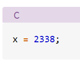
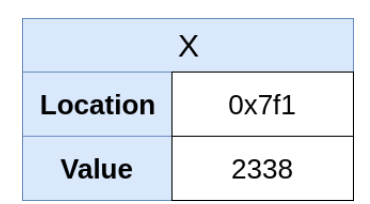  

Introduce a new name
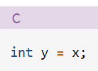    

This code creates a new box called y and copies the value from x into the box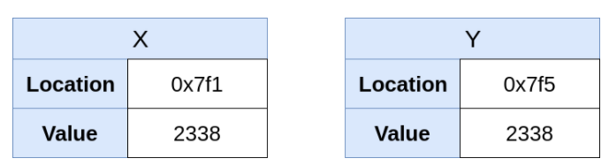

Notice the new location 0x7f5 of y. Even though the value of x was copied to y, the variable y owns some new address in memory.

##### Names in Python
Python does not have variables. It has names.  

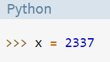
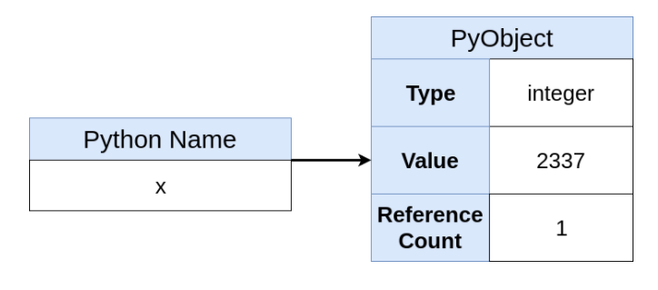
PyObject is defined as a C struct.

This diagram helps illustrate that x points to a reference to an object and does not own the memory space as before.   

>Each object in Python has **a type, a value, and an identity**. 

greet ="hello world"
- creating an **instance of a string object** with the value "hello world" and 
- the **identity of greet**. The identity of an object acts as a pointer to the object's
location in memory. 
- The **type of an object**, also known as the object's class, describes the 
object's internal representation as well as the methods and operations it supports. 
Once an instance of an object is created, its identity and type cannot be changed.

Reassign a value 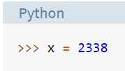
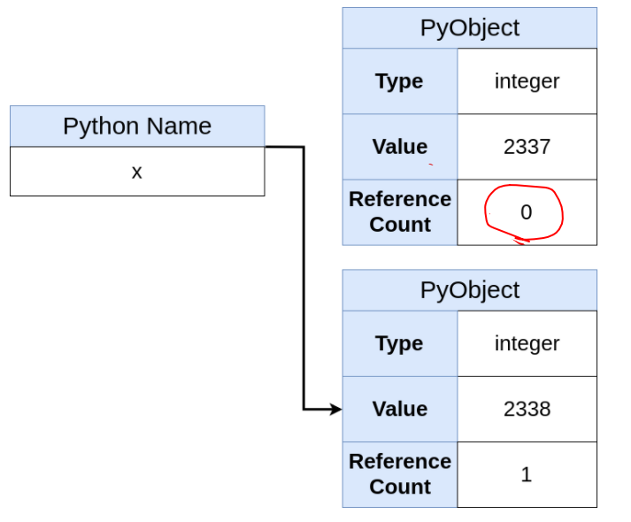

Introduce a new name
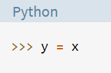

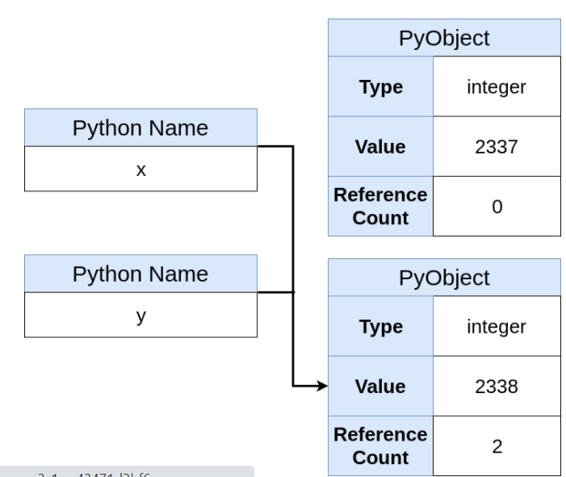   

Now you can see that a new Python object has not been created, just a new name that points to the same object. 
Also, the object’s refcount has increased by one. You could check for object identity equality to confirm that they are the same:

Create a new object
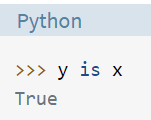
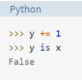
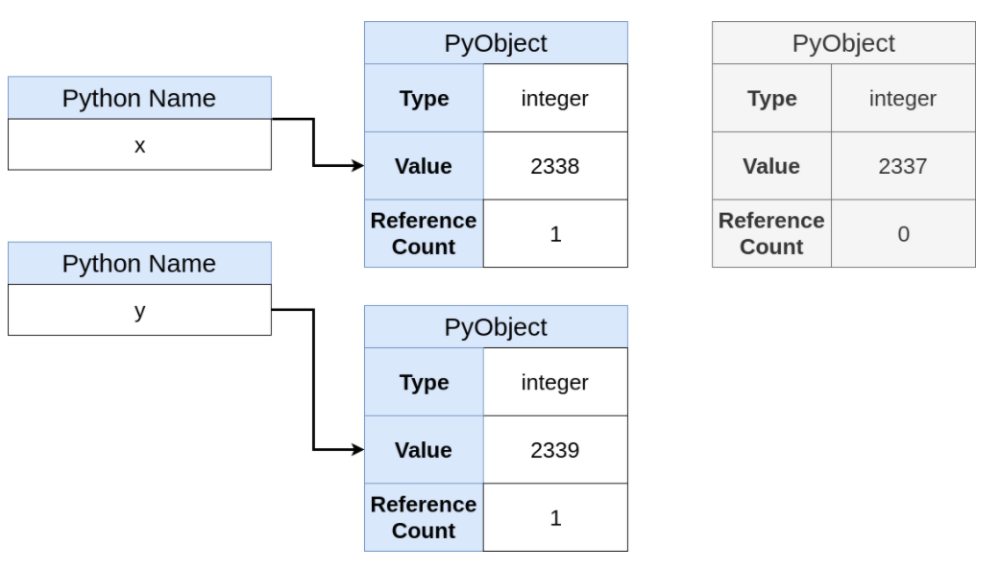

##### Simulating pointers in Python
In fact, there are multiple ways to simulate pointers in Python. You’ll learn two in this section:

- Using mutable types as pointers
- Using custom Python objects

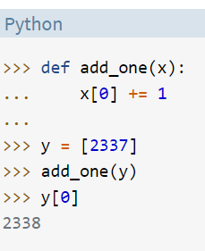