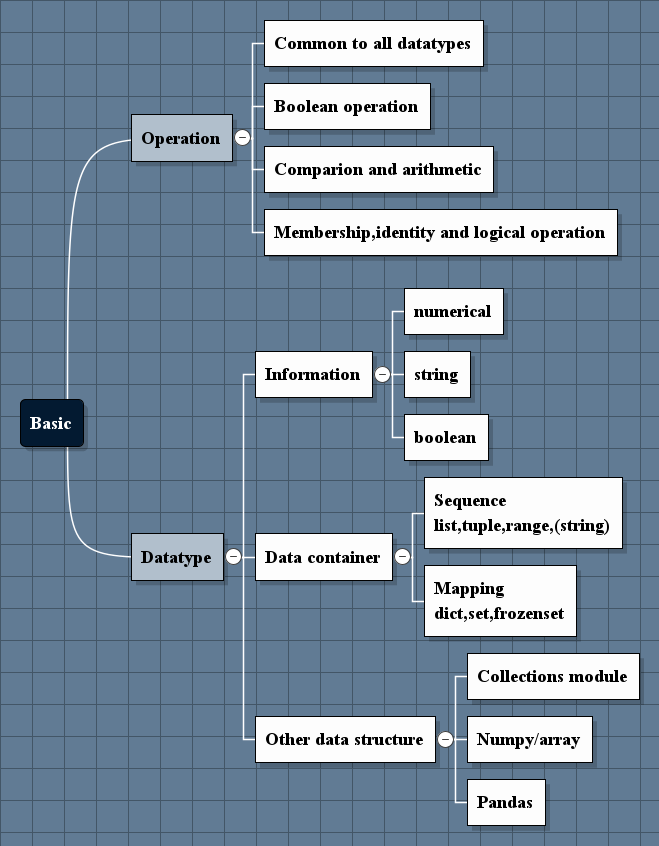
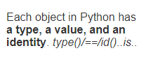

##Data types and structures

### 1. Operations common to all data type
- 
- tested for a truth value 
 
>False values
- The None type
- False
- An integer, float, or complex zero
- An empty sequence or mapping
- An instance of a user-defined class that defines a __len__() or __bool__()
method that returns zero or False

