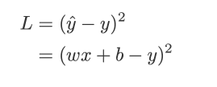
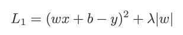
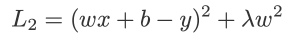
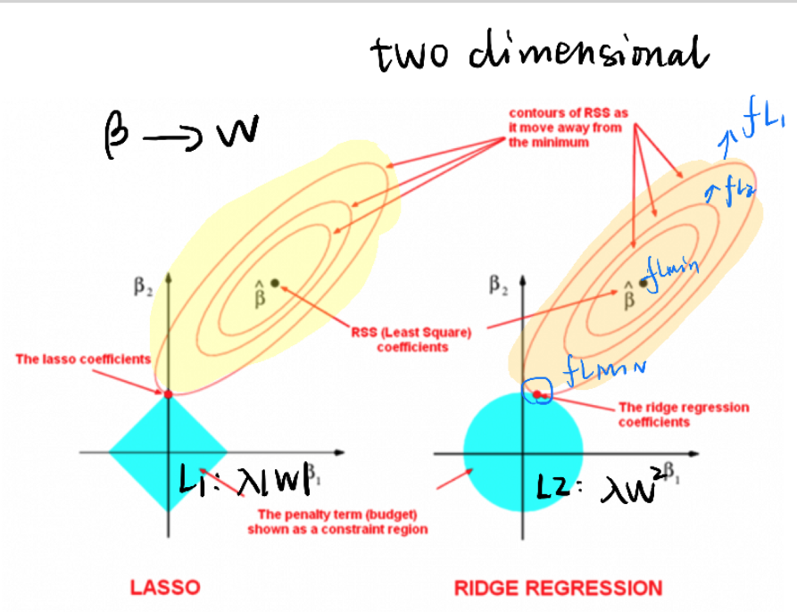

## 1. [Linear regression]()

### 1.1 Implement in python

#### 1.1.1 **EDA**- Used to exame correlation of features 
[Calculate pearsoneR](https://realpython.com/numpy-scipy-pandas-correlation-python/#correlation)

- [numpy](https://numpy.org/doc/stable/reference/routines.statistics.html)
- pandas
- spicy.stats.
- scatter_plot

#### 1.1.2 Linear regression

- np.polyfit()
- sklearn

### 1.2 Understand linear regression
- Statistical reference (Pearson R)
- Machine learning  (Optimization)    
  
|   |   |   |   |   |
|---|---|---|---|---|
|  Stat| MLE  |   |   |   |
|  ML | OLD (loss function)  |   |   |   |
|   |   |   |   |   |

    OLD = MLE

Solutions:
- Gradient descent (Optimization)
  
   - Batch GD
   - SGD
   - Mini-batch GD
- Close solution (linear algebra)
     

### 1.3 Overfitting problem
[Implement](https://harvard-iacs.github.io/2018-CS109A/labs/lab-5/student/)

- Cross validation
- Regularization
#### 1.3.1 L1 and L2 Regularization

- **Loss function with no regularisation**:  

>This is a Ellipse
- **Loss function with L1 regularisation**：  
- **Loss function with L2 regularisation**:  
   
   >Demonstrated by a two dim cases,[x1,x2],  
     
     

#### 1.3.2 L1/L2 regularization and PCA

   

