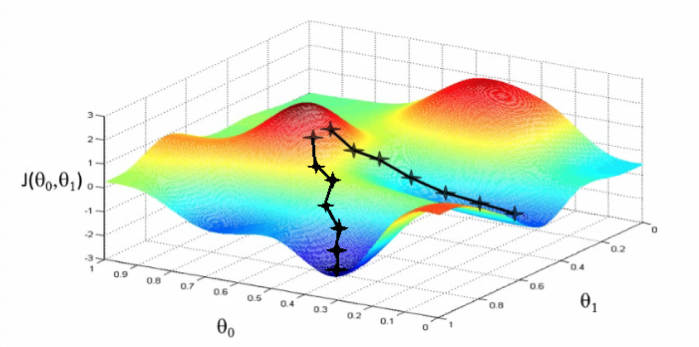
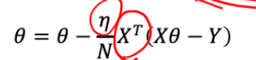
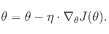
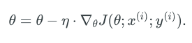
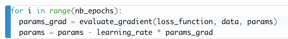
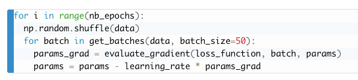

# 1. Optimization - function approximation
## 1.1 No free lunch theorem
For Inductive inference 
- Assumptions are made for a specific **learning task[dataset]** (prior distribution)
- Thus reduces the generability of the algorithm
- No one mothed dominates all others over all possible **datasets**
> There is no free lunch!  
>**Inductive Inference**- generalizing beyond the training data is impossible **unless** we add more assumptions **(Priors asserts)**

>This is usually done by bayes' inference

### 1.1.1 Over/underfitting - bias and variance
**Bias error**: are the simplifying **assumptions made by a model** to make the target function easier to learn

High-Bias: Suggests more assumptions about the form of the target function
>Underfitting(biased)

**Variance error**: 
Variance is the amount that the estimate of the target function will change if different training data was used. 

**High Variance:** Suggests large changes to the estimate of the target function with changes to the training dataset.
>Overfitting (High variance)

  

Low-variance machine learning algorithms include:
- Linear Regression, 
- Linear Discriminant Analysis and 
- Logistic Regression.  

High-variance machine learning algorithms include: 
- Decision Trees, 
- k- Nearest Neighbors and 
- Support Vector Machines

### 1.1.2 Prevent overfitting
#### Cross validation
#### [Regularization](https://charlesliuyx.github.io/2017/10/03/%E3%80%90%E7%9B%B4%E8%A7%82%E8%AF%A6%E8%A7%A3%E3%80%91%E4%BB%80%E4%B9%88%E6%98%AF%E6%AD%A3%E5%88%99%E5%8C%96/)
- Regularization applies to **objective functions** in ill-posed optimization problems.
- Won't impact the 
- The regularization term, or penalty, imposes a cost on the 
optimization function for overfitting the function or to find an optimal solution.  

[Other regularization](https://en.wikipedia.org/wiki/Regularization_(mathematics)#Classification)
  

## 1.2 Gradient descent
### 1.2.1 [Optimization](https://ruder.io/optimizing-gradient-descent/)
- **Target**: find **theta** to minimize value of cost function   
- **Why**: Minimize loss function
  
### 1.2.2 How
- **How**: move **theta** in a specific direction [gradient] to efficiently minimize loss function **from initial position**  

  - **loss function** - minimize
  - **gradient** of loss function
    - training data
    - ethta
    
  - **learning rate** speed/(-)direction
  - **Initializing ethta** High position
  - **Relationship between each iteration**  站在上一个点 求导和往下走
  _**ethta2= **ethta1** -lr*gradient@**ethta1**_  
  
  [Reference](https://towardsdatascience.com/implement-gradient-descent-in-python-9b93ed7108d1)                                                                                                                                                                                                                                                                                                                                                    

#### **Explanation of N in the equation**  
 

### 1.2.3 Normalization                                                                                                                                                                                                                                                                                                                                                                  
                                                                                                                                                                                                                                                                                                                                                                  
Now that we can compute the gradient of the loss function, the procedure of **repeatedly evaluating 
the gradient** and then performing a parameter update is called Gradient Descent. [Reference](https://cs231n.github.io/optimization-1/)

### 1.2.4 [**Implement**](https://www.geeksforgeeks.org/ml-stochastic-gradient-descent-sgd/?ref=rp):  
#### [Three variants of GD](https://www.geeksforgeeks.org/ml-mini-batch-gradient-descent-with-python/?ref=rp)
  - [**Batch Gradient Descent**](https://ruder.io/optimizing-gradient-descent/index.html#gradientdescentvariants)
  - **Stochastic Gradient Descent**- one random sample
  
     The extreme case of this is a setting where the mini-batch contains only a single example. 
     This process is called Stochastic Gradient Descent (SGD) (or also sometimes on-line gradient descent).
      
  - [**Mini-batch Gradient Descent**](https://www.geeksforgeeks.org/ml-mini-batch-gradient-descent-with-python/?ref=rp)  
    Performs an update for every mini-batch of n training examples:
    >The size of the mini-batch is a hyperparameter but it is not very common to cross-validate it.   
                                                                                                                                                                                               
                                                                                                                                                                                               

|   |   |   |
|---|---|---|
| Batch  |    
 | entire training dataset  |
| SGD  |   
  |  each training example |
| mini-batch  |   
  | every mini-batch of n training examples  |

  

  

  
  

# 2. [Hyperparameter](https://www.analyticssteps.com/blogs/introduction-model-hyperparameter-and-tuning-machine-learning)

 - a hyperparameter is a parameter whose value is used to control the **learning process**.
 - By contrast, the values of other parameters (typically node weights) are derived via **training**.
 - Two categories:
   -  **model hyperparameters**, that cannot be inferred while fitting the machine to the training set because they refer to the **model selection task**, _-topology and size of a neural network_
   -  or **algorithm hyperparameters**, that in principle have no influence on the performance of the model but affect the **speed and quality of the learning process.** _- learning rate and mini-batch size._
   -  **Cross-validation** is often used to estimate this generalization performance.[2]

>For instance, LASSO is an algorithm that adds a **regularization hyperparameter** to ordinary least squares regression, which has to be set **before** estimating the parameters through the training algorithm.

# 3. Preprocessing data
## 3.1 [Why and when normalize/standarlize data](https://www.analyticsvidhya.com/blog/2020/04/feature-scaling-machine-learning-normalization-standardization/)  
[Reference](https://towardsdatascience.com/normalization-vs-standardization-quantitative-analysis-a91e8a79cebf)  
