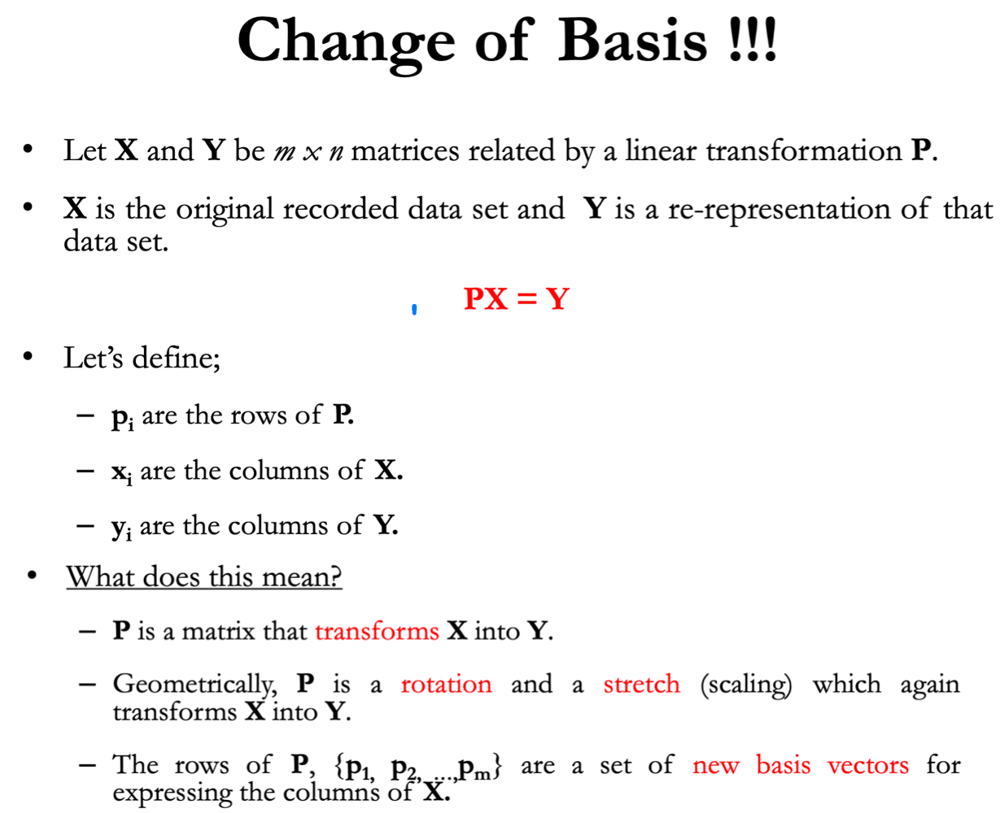

# 1. Linear algebra
###  1.1 Dot product
- dimensional analysis (distance to boundary)
- similarity/closeness
- projection (base)

  

---
  

---
  

### 1.2 [Matrix dot product vector/matrix]((https://charlesliuyx.github.io/2017/10/06/【直观详解】线性代数的本质/#矩阵乘法与线性变换复合))

#### 1.2.1 从右往左读 Ax=b 
- **linear transform- matrix A*x**: 
  - **matrix A** rotate/scale the vector x to **a new one**..

- **change basis (b)-projection (x) onto row vectors of A*x**: x columns project on the **row vector of A**
  -  >**Inversed 右到左**: find the **coordinates of b** (which is x) in space A  **[Represent b in space A-change basis- like linear regression]**   
    

- n*m 的几何意义是将m维空间（输入空间）映射到n维空间（输出空间）上
  - >注意这里的输入空间，输出空间的概念，阅读方向同样也是从右向左的（靠右的是输入，靠左的是输出）
_**两个矩阵相乘的意义是将右边矩阵中的每一列向量变换到左边矩阵中以每一行行向量为基所表示的空间中去。也就是说一个矩阵可以表示一种线性变换**_

矩阵的行是这个变换的输出空间维数，而列是变换的输入空间维数。矩阵乘法从右向左读，第一个变换的 
M2 的输出向量的维度（M2的行）必须和第二个变换 M1的输入向量（M1的列）维度相等，才可以计算。也就是说，类似于插头和插座的关系，我只有三头插座，你来一个双头插头肯定没法用的.  

#### 1.2.2 Geometric interpretation
  

  

  

#### 1.2.3 Linear transformation characteristics
##### Determinant of the _**matrix**_
##### Eigenvector and eigen value of the _**matrix**_ - remain in the original span   

In linear algebra, an eigenvector or characteristic vector of a linear transformation is a nonzero vector that changes by a scalar factor when that linear transformation is applied to it.

在变换的过程中，空间内大部分的向量都离开了它所张成的空间（即这个向量原点到终点构成的直线） ，还有一部分向量留在了它所张成的空间，矩阵对它仅仅是拉伸或者压缩而已，如同一个标量。

  

  

-----
#### 1.2.4 矩阵对角化 
##### **From the perspective of linear transform,** 
  - Project vector to the the new base that composed by eigenvectors of the matrix. 
  - The transform turns into scaling the vector's projection(components) on the eigenvector.
  - Then convert the scaled components into the original base 
> So that's exactly what eigenvector means.
**It's good to represent the matrix by its eigenvectors - diagonalization of the matrix**

##### **The application of diagonalization**
- Linear transform by change basis of vector to eigenvectors  
     The **same linear transform** of **the same vector** that represented by different base  
       
- Principal component analysis of X - diagonalization of covariance matrix - orthogonal linear transform

### 1.3 [PCA](https://zhuanlan.zhihu.com/p/77151308) 
- linear transform (rotate) the original dataset **Y=PX**  
**Motivation**: 寻找一个一维基，使得所有数据变换为这个基上的坐标表示后，方差值最大。
- x的协方差矩阵对角化 
   - 当协方差为 0 时，表示两个变量完全独立。为了让协方差为 0，我们选择第二个基时只能在与第一个基正交的方向上进行选择，因此最终选择的两个方向一定是正交的。

  

至此，我们得到了降维问题的优化目标：将一组 N 维向量降为 K 维，其目标是选择 K 个**单位正交基**，使得原始数据变换到这组基上后，各变量两两间协方差为 0，而变量方差则尽可能大（在正交的约束下，取最大的 K 个方差）。

>y=PX  
- X is the origianl data
- y is the coordinate after the **projection/linear transform** of X
- y has the largest covariance

PCA is defined as an **orthogonal linear transformation** that transforms the data to a new coordinate system such that the greatest variance by some scalar projection of the data comes to lie on the first coordinate (called the first principal component), the second greatest variance on the second coordinate, and so on.

#### 1.3.1 Covariance matrix

- X.T turns column vectors of matrix X to row vectors  
- X.T*X means each column of X multiply its self (row vector of X.T)

  

#### 1.3.2 PCA:

设原始数据矩阵 X 对应的协方差矩阵为 C，而 P 是一组基按行组成的矩阵，设 Y=PX，则 Y 为 X 对 P 做基变换后的数据。设 Y 的协方差矩阵为 D，我们推导一下 D 与 C 的关系：  

  

- 我们要找的 P 是能让**原始协方差矩阵**_对角化的 P_。
   - 为了让两个变量尽可能表示更多的原始信息，我们希望它们之间不存在线性相关性，因为相关性意味着两个变量不是完全独立，必然存在重复表示的信息。

   

   
 
## 1.4 [Regularization](https://charlesliuyx.github.io/2017/10/03/%E3%80%90%E7%9B%B4%E8%A7%82%E8%AF%A6%E8%A7%A3%E3%80%91%E4%BB%80%E4%B9%88%E6%98%AF%E6%AD%A3%E5%88%99%E5%8C%96/)

 

