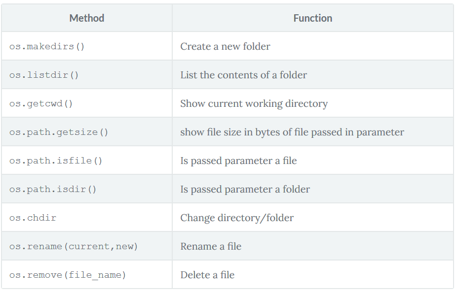

# 1. OS module - Operating system
  

# 2. Encoding
# 3. Errors
## 3.1. Openfile- 'FileNotFoundError'

```python
try:
    my_file_handle=open("folder/test.txt")
except IOError:
    print("File not found or path is incorrect")
finally:
    print("exit")
```

## 3.2 Createfile
  
