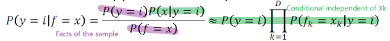
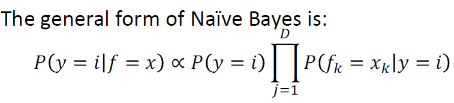
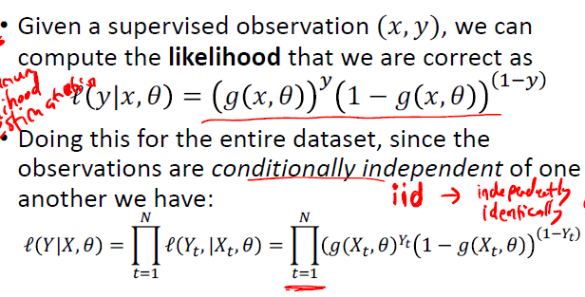
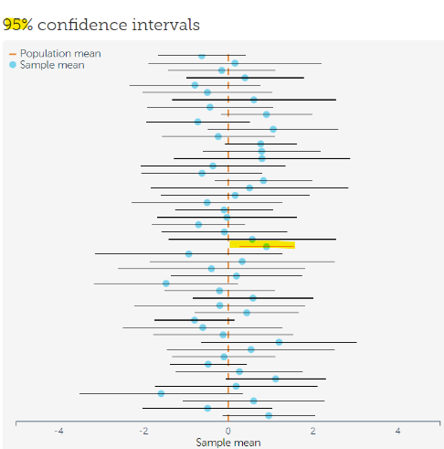

# 1. Central Limit Theorem (CLT)  

- Implication: think about this as one-time sampling with sample size of n and the theorem talks about 
  - What will happen when n approaches infinity
  - The average Xn bar could be learned from this **one-time n samples** as Normal distribution

## 1.1 The IID assumption/conditionally independent
### 1.1.1 Navie bayesian  

- a **special case of decision tree** with features that are **conditionally independent**
### 1.1.2 Logistic regression

## 1.2 Normality assumption
- Raw data is typically **not normally distributed**
- **Errors** and averages and totals in large samples are

## 1.3 Statistical inference
- Statistical inference is the process of using data analysis to **deduce** properties of an underlying distribution of probability.
- Inferential statistical analysis infers properties of a **population**, for example by testing hypotheses and deriving estimates.
- In **machine learning**, the term inference is sometimes used instead to mean **"make a prediction, by evaluating an already trained model"**

## 1.4 Foundation of parametric test
Assumptions of parametric test： 

## 1.5 **Confidence interval:**   
**95% confidence interval has two means:**
- a 95% CI computed from a normal sample distribution (Xbar - Normal(miu,std/n)) - CLT
- a probability of repeated CIs (Samples) that contain true parameter

**Sampling error**
- A single sample - CLT
- Repeated sampling to get sampling distribution of statistic
----

- [Uncertainty of the sampling process/algorithm to obtain the sample that create the interval](https://thestatsninja.com/2019/02/19/how-to-navigate-confidence-intervals-with-confidence/)
- [Confidence interval varies with sample ](https://www.statisticssolutions.com/misconceptions-about-confidence-intervals/)  
  - sampling causes error/variation in confidence interval
- The logic of confidence intervals is based on long-run results — frequentist inference
- Our confidence is in the procedures/algrithm of data sampling
---

## 1.6 Interpretation of CI
**Repeated sampling:**
  - The **confidence level** represents the theoretical **long-run frequency** (i.e., the proportion) of confidence intervals 
that contain the true value of the unknown population parameter.

  - OUR CONFIDENCE IS IN THE DATA COLLECTION METHOD
>“If we took samples of this same size over and over again (think: in the long run) using this same method, 
>we would expect to capture the true mean weight of an adult female panda 95% of the time.”

- Notice this IS a probability. A 95% probability of capturing the true mean exists BEFORE taking the sample. 
- A different sample would produce a different interval. 

---
**Single sample:**
1. **True value is a constant**, a single CI of a **realized dataset** either contains the population mean or it does not
2. **To be select sample**:
  When we talk about the probability of a single CI, it is before any data are sampled and given a plan for how to construct the confidence interval, 
  the probability is 95% that the **yet-to-be-calculated** interval will cover the true value: 
  at this point, the limits of the interval are yet-to-be-observed random variables.
     >Like before you flip the coin, 0.5 chance you get a head but after you flip the coin, it's either head or tail
3. **After select sample (foundation of hypothesis test)**:   
"The confidence interval represents values for the population parameter for which the difference between the parameter and the observed estimate is 
not statistically significant at the 10% level".
4. **Interpret hypothesis testing**  
In each of the above, the following applies: If the true value of the parameter lies outside the 90% confidence interval, 
then a sampling event has occurred (namely, obtaining a point estimate of the parameter at least this far from the true parameter value) 
which had a probability of 10% (or less) of happening by chance.
>Only 10% (1-a) of the sampling event has a CI that doesn't include true parameter - not likely to happen

**How**   

- Sampling distribution of Xbar is normal dist(u,std/n), it's 95% CI could be easily computed 
- Std/n represents the sampling error which is related to sample size n, large n, small variation **use one sample to estimate(CLT)**
- Why one sample could be used for hypothesis test...See above

Most people don’t want to take 1000 new samples and plot the histogram,  so they use a short cut: they say, 
I’m going to assume that the SD of this sample (remember that SE = SD / SqRT(N) ) is representative of the SD of the population, 
and then I’ll just build a confidence interval around my sample mean, and +/- 2*SE should give me a range that it 95% likely to contain the true mean.

**Why2-(compare with coin fliping)** 
> - Think about this as the probability of the **to-be-select**-event is 95%; 
> - event is when you **select one sample** from the (selected)100 samples, the CI computed from the sample contain the true parameter..
  
    “If we took samples of this same size over and over again (think: in the long run) using this same method, we would expect to capture the true mean weight of an adult female panda 95% of the time.”
  
   - 95 of 100 times event happens= event happens 95% chance (Head of coin 95/100 of flipping coin test)
   - Event = choose a sample and the CI contain true value (head of coin)
   
   
 **Law of large numbers** that when the event is repeated, the average of the results (propotion of CI containing true value) obtained from a large number of trials 
 should be close to the expected value (of the event that CI containing true)
 
So if you randomly select one sampling (corresponding CI), the pre-known probability that CI of it contains true is 95%.

  

**Misinterpretation**
- There is a 95% chance that the true population mean falls within the confidence interval.” **(FALSE)**
> Once an experiment is done and an interval calculated, this interval either covers the parameter value or it does not; 
>it is no longer a matter of probability.

- The mean will fall within the confidence interval 95% of the time.” **(FALSE)**
> The parameter is an unknown constant and no probability statement concerning its value may be made…” 

- A particular confidence interval of 95% calculated from an experiment does not mean that there is a 95% probability of a sample parameter 
from a repeat of the experiment falling within this interval.

## 1.7 Confidence interval (P-value) and hypothesis test
Hypothesis tests based on statistical significance are another way of expressing confidence intervals (more precisely, confidence sets). In other words, every hypothesis test based on significance can be obtained via a confidence interval, and every confidence interval can be obtained via a hypothesis test based on significance.

#### P value
The p-value is the probability that a given result (or a more significant result) would occur under the null hypothesis