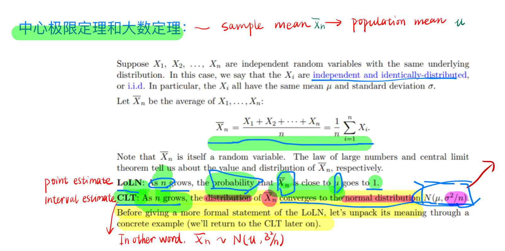

# 1. Central Limit Theorem (CLT)  

- Implication: think about this as one-time sampling with sample size of n and the theorem talks about 
  - What will happen when n approaches infinity
  - The average Xn bar could be learned from this **one-time n samples** as Normal distribution

## The IID assumption
## 1.1 Foundation of parametric test
Assumptions of parametric test： 

## **Confidence interval:** 
- Including sampling error
- 
if same sampling process is repeated, 95 out 100 times the Xn bar falls into the interval