# 1. Bayes' Inference - Prior assumption

## 1.1 Three probabilities
### Joint probability  
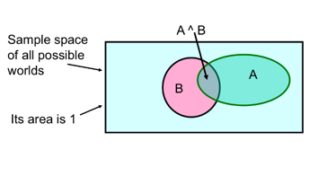  

### Conditional Probability  
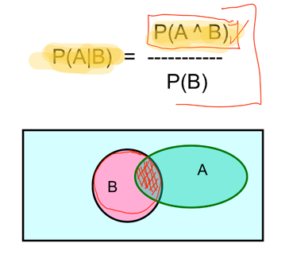 
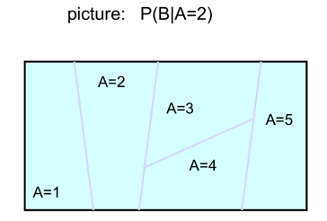 

### Marginal Probability   
The marginal probability P(X) is computed by summing (or integrating) the joint probability over other variables.

In many ML problems, we build a **joint distribution model** for all the variables. Once it is modeled, we can inference the probability of a single or a subset of variables (p(x₁) or p(x₁, x₂, x₃)) by summing or integrating over the rest of the variables.  

## 1.2 Bayes' Rule  
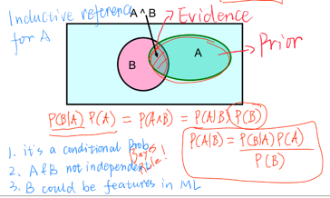

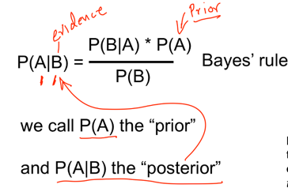    

B is the features of Decision tree  

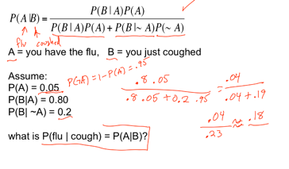

What does all this have to do with function approximation?
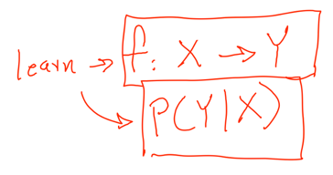

##### Beta distribution

---
Independent Events -- Joint distribution
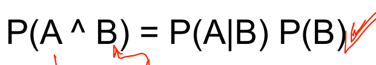
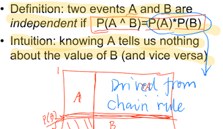

 ## 2. Inference with the Joint distribution

Example:  

  

_**The 4th column shows share of the examples and hence the table is actually a dataset..**_

> The joint distribution allows us to compute the joint probability/marginal prob and hence conditional prob P(Y|X) 

1.	Suppose we want to learn the function f: <G, H> —>W >>

2.	Equivalently, P(W | G, H)   Solution: learn joint distribution from data, calculate P(W | G, H)   

e.g., P(W=rich | G = female, H = 40.5)= 

## 3. Bayesian inference
[Reference](https://github.com/yz599/2020_2/blob/master/2020/CMU/Bayesian%20Inference%20example.ipynb)

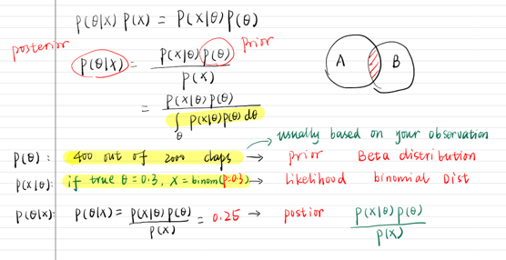

|   |Example   |  |
|---|---|---|
| P(θ): | say 400 out 2000 claps --- your guess based on one observation --- Beta distribution  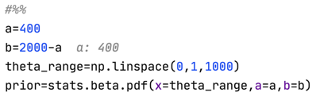  |The clapping probability for the prior was 20%. 400/2000|
| P(XIθ)| 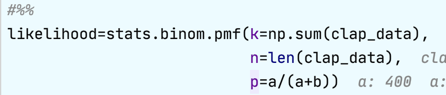  |
| P(θIX)| posterior = likelihood * prior  |Now, the posterior has its peak around 0.25%.|
|X|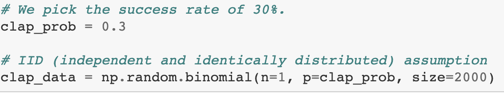|The clapping probability for the data was given as 30%.|

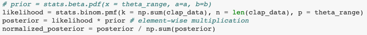
- Because we incorporated more information through sampling, 
the range of possible parameters is now narrower.   
- The more data you gather, the graph of the posterior will look more like that of the **likelihood and less like that of the prior**.
- In other words, as you get more data, the **original prior distribution matters less**. 

# 4. [Conditional Independence ](https://towardsdatascience.com/conditional-independence-the-backbone-of-bayesian-networks-85710f1b35b)