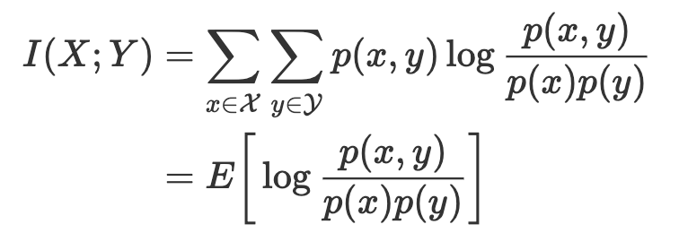
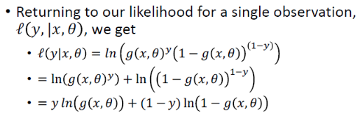

# 1.Entropy
[Here is the reference](https://medium.com/@jonathan_hui/machine-learning-summary-fundamental-6562ff7448a)  
[Visualization](http://colah.github.io/posts/2015-09-Visual-Information/#fn4)  

| Distribution - concept  |Formula   |
|---|---|
|Joint entropy ||
|Marginal distribution|P(x)*P(y)|
|Mutual information ||

| Classification  |Formula   |
|---|---|
| Information of an event   |  I(x) = -log(p(x)) |
| Entropy of a random variable   ||
|Cross entropy H(P,Q) |  |
|KL Divergence | |

 

| Decision tree  |Formula   |
|---|---|
|Conditional entropy||
|Information gain ||
|KL_distance |Equation is different from above |

Mutual information=Information gain=KL Divergence Under **Decision tree**

  

---
## 1.1 Information
The Shannon **information content** is the amount of information gain when **an event x occurs**. Mathematically, it is defined as:  

  

In computer science, the information content can also be viewed as the number of bits to encode the information most efficiently

X is called a random variable if it holds a value generated from a random process (a stochastic process), e.g. the face value in rolling dice or the total number of heads after flipping a coin 20 times.

## 1.2 [Entropy - one rv](https://homes.cs.washington.edu/~ewein//blog/2020/07/30/joint-entropy/)
**Entropy H** measures the expected information content of **a random variable**. To calculate the value, we sum up all information content with a weight equals to its occurrence frequency.  

## 1.3 [Two rvs](https://homes.cs.washington.edu/~ewein//blog/2020/07/30/joint-entropy/)

- **Joint entropy**: However, we often want to understand not just the uncertainty in a single event XX, but the **joint uncertainty of two events X and Y**
- **Conditional entropy**: knowing the outcome of one event YY changes the amount of uncertainty we have about XX. 
   >Going back to our weather example, suppose that we’re back in Seattle during the winter and everyone knows the weather will be overcast all the time - how does this affect the amount of information/surprise contained in our temperature report
- **Marginal distribution** 
- **Independent rvs** 
- **Mutual information**:Sometimes, instead of looking at the new uncertainty H(Y|X)H(Y∣X), we instead want to understand the change in uncertainty caused by knowing XX. 

| Prob of 2 rvs  |   |   |   
|---|---|---|
|Joint entropy  | P(x,y) |   |   
|Conditional Entropy   |P(xIy)  | | 
|Marginal dist  |P(x),P(y)    |  |   
|Independent rvs   | P(x,y)=P(x)*P(y)  |   | 
| Chain rule  |P(x,y) = p(xIy)*p(y)   |   |  
|Mutual information|  ||

### **1.3.1 Joint entropy**

### **1.3.2 Conditional Entropy**

The conditional entropy H(Y|X) is the entropy of Y given X is known. If Y can be separated according to X, this is the weighted entropy of the separated groups and calculated as:

  

## **1.4 Information gain I(X,Y)- mutual information-KL distance(three ways to understand)**

|   |   |   |   |   |
|---|---|---|---|---|
| Two rv  |   | Concept  | Mutual information  |   |
| Learned Y class dist. vs real Y  |   | Classification learning  | Cross entropy  |KL-distance   |
|Known Feature Y vs class X  |    |Decision tree   | Information gain  |   |
#### Joint distribution P(x,y) vs independent P(x)*P(y) (_Conceptually_)
>How different the **joint distribution of X and Y** is from what it would be if they were **independent** (and the joint was simply the product of marginals). 

- amount of information X and Y provide about each other then would be to compare the ratio p(x,y)/p(x)p(y)
- **in other words, how far the true joint distribution is from what independence would be.**
- If X and Y are independent (i.e., p(x,y) = p(x)p(y)), then intuitively our variables are contain no information about each other. 
- On the other hand, for non-independent XX and YY, knowing the value of one variable should provide some reduction in uncertainty of the other variable. 
  
>mutual information is precisely the reduction of uncertainty of XX due to the knowledge of YY.

 

---
#### Distance between two distribution (Classification)
>(Learned Q and P--Cross entropy-entropy) 
>This is different from definition 3, since it's the comparison between Learned dist of Y and real Y in classification

 

----
#### Information obtained on the random variable X when Y is observed. (Classification_Y is features of DT)
- I(X;Y) as the reduction in uncertainty of XX given YY.
- **measure how much information the variables contain about each other.**
- **Mutual information and entropy**
 
>**A could be seen as the features of the decision tree**

## 1.5 Classification 
### 1.5.1 Cross entropy H(P,Q)
Cross-entropy H(P, Q) measures the expected number of bits to encode X with distribution P using an encoding scheme targeted for distribution Q.

In ML, we want our predictions Q to match the ground truth P. If they match, **the cross-entropy will be the minimum** and therefore, we often use it as our training objective.  

The cross-entropy for our example is
  

As shown above, the cost function for many classification problems is simply

### 1.5.2 KL-divergence 
KL-divergence measures the difference between two distributions P and Q.  
  

Cross entropy -Entropy = KL Divergence

i.e., KL-Divergence measures the inefficiency of representing P with encoding scheme Q — the extra-bits to encode the information with the sub-optimal scheme. Therefore, KL-divergence is always greater or equal to zero
 Use KL-divergence for mutual information gain 
## 1.6 Decision tree
### 1.6.1 Information gain - mutual information 

Information Gain is the expected reduction in entropy of target variable Y for data sample S, due to sorting on variable A
  

Intuitively, mutual information measures how much information do we gain by knowing Y? 
- If knowing Y gives us all the information about X, the conditional entropy H(X|Y) is zero because there is no more information we needed on X. The mutual information I becomes H(X) (or H(Y)).For example, if we know the label (Y) of an object, we gain a lot of information about its raw image (X). 
We should not mistake its picture with other objects. Therefore the information gain I(X;Y) is high. 

Let’s visualize this with sets. The mutual information is its overlap.

### 1.6.2 KL Divergence Under **Decision tree**

  

# 2. Cost function - MLE/MAP
**Cost function_ cross entropy (KL-divergence) _ MAP _MLE**
- The core of Bayesian Inference is to combine two different distributions (likelihood and prior) into one “smarter” distribution (posterior). 
- Posterior is “smarter” in the sense that the classic maximum likelihood estimation (MLE) doesn’t take into account a prior. Once we calculate the posterior, we use it to find the “best” parameters and the “best” is in terms of maximizing the posterior probability, given the data. 
- This process is called Maximum A Posteriori (MAP). The optimization used in MAP is the same as the one used in typical machine learning, such as gradient descent or Newton’s method, etc.

## 2.1 What's MLE and MAP 
[Reference](https://towardsdatascience.com/bayesian-inference-intuition-and-example-148fd8fb95d6)  
[Reference1](https://wiseodd.github.io/techblog/2017/01/01/mle-vs-map/)  
[Reference2](https://medium.com/@jonathan_hui/machine-learning-summary-fundamental-6562ff7448a)

### 2.1.1 MLE  
likelihood function P(X|θ) 

### 2.1.2 MAP   
it works on a posterior distribution, not only the likelihood.  

- Comparing both MLE and MAP equation, the only thing differs is the inclusion of prior P(θ) in MAP, otherwise they are identical.
- What it means is that, the likelihood is now **weighted with some weight coming from the prior**.

## 2.2 MAP vs MLE
### 2.2.1 Assume prior P(θ) is a **uniform distribution** and MAP=MLE  

  

if we use the simplest prior in MAP estimation, like a uniform prior, 
- we assign equal weights on all possible values of θ. 
- The implication is that the likelihood equivalently weighted by some constants. 
  - Being constant, we could be ignored from our MAP equation, as it will not contribute to the maximization.    

### 2.2.2 Prior= a **Gaussian**,MAP = L2 regularization of MLE
**If we use different prior, say, a Gaussian, then our prior is not constant anymore, 
as depending on the region of the distribution, the probability is high or low, never always the same.**

 MAP turns into an L2-regularization term in the objective function   
  
  
  
If we assume the model parameters θ are zero centered, and p(θ) and p(y|θ) are both Gaussian distributed, 
we can prove that MAP arrives with the same objective as using L2 as the cost function with added L2 regularization.

  

Conceptually, p(θ) can be viewed as a regularization factor. 
It can penalize a cost function if θ deviates from our prior belief. 

    

To make a new prediction, we use the posterior p(θ | X, y) in our training as p(θ). Then we find the marginal probability p(y₀|x₀) by integrating over θ. This is Marginal inference. 
We compute the probability of a variable by summing everything else out.

## 2.3 Cost function vs MLE vs MAP
### **Cost function is equivalent to (derived from) MLE and MAP (with regularization)**
### 2.3.1 Linear regression

### 2.3.2 Classification - minimize cross entropy  

  
