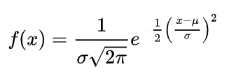
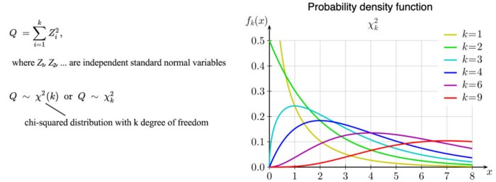

# [1. Overview-Important distributions](https://jonathan-hui.medium.com/machine-learning-summary-fundamental-6562ff7448a)
  

| Dist  |Expression   |
|---|---|
| Bernoulli Dist   |   |   
| Binomial Dist  |    |   
| Possion Dist   |    | 
| Exponential Dist  |    |
| Normal Dist   |  |
| multivariate normal dist |  |

---
  
[Possion Dist](https://towardsdatascience.com/poisson-distribution-intuition-and-derivation-1059aeab90d)

# 2. Multivariate normal distribution

- x is a real k-dimensional column vector   
- 
- 
## 2.1  Mahalanobis distance
  
- represents the distance of the test point x from the mean mu. 
- when k=1, the distribution reduces to a univariate normal distribution and the Mahalanobis distance reduces to the absolute value of the standard score. 
## 2.2 Bivariate 

**- explains why Ellipse**

  
https://online.stat.psu.edu/stat505/lesson/4/4.2

>ellipses, whose principal axes are defined by the eigenvectors of the covariance matrix Sigma.
## 2.3 [Eigenvectior](https://stats.stackexchange.com/questions/447266/multivariate-gaussian-normal-distribution-sigma-covariance-and-eigenvector)

[Reference](https://online.stat.psu.edu/stat505/lesson/4/4.6)
## 2.4 [Bivariate correlation](http://www2.cmp.uea.ac.uk/~jrk/distribution/correlations/corr.html)

# 3. [Statistic test distributions](https://programming.vip/docs/5ef5604414c57.html)
## 1.1 [Beta distribution and Dirichlet distribution](https://towardsdatascience.com/beta-distribution-intuition-examples-and-derivation-cf00f4db57af)
## 1.2 Chi-square distribution
 
