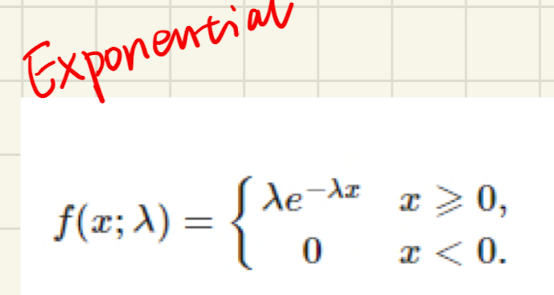

# [1. Overview-Important distributions](https://jonathan-hui.medium.com/machine-learning-summary-fundamental-6562ff7448a)
  

| Dist  |Expression   |
|---|---|
| Bernoulli Dist   |   |   
 | Binomial Dist  |    |   
| Possion Dist   |    | 
| Exponential Dist  |    |
| Normal Dist   |  |
| multivariate normal dist |  |

---
  
[Possion Dist](https://towardsdatascience.com/poisson-distribution-intuition-and-derivation-1059aeab90d)

# 2. Multivariate normal distribution
- Linear combination of standard normal distribution variables..(shift u, scale sigma, **rotate cov(x,y)**)
- (x-u)/sigma  standarlize x

- x is a real k-dimensional column vector   
- 
-   

  

## 2.0 Covariance matrix and [its eigenvector](https://www.visiondummy.com/2014/04/geometric-interpretation-covariance-matrix/)

  

### 2.0.1 Singular matrix - correlation:

### 2.0.2 Eigen vector

- covariance matrix of our data is a diagonal matrix, 
- such that the covariances are zero, 
- that the variances must be equal to the eigenvalues \lambda

-  eigenvalues still represent the variance magnitude in the direction of the largest spread of the data,
-  the variance components of the covariance matrix represent the spread **along the axes**.
-  Original the variance magnitude in the direction of the **x-axis and y-axis**

Trace(A)=sum of eigenvalues of A
## 2.1  Mahalanobis distance
  
- represents the distance of the test point x from the mean mu. 
- when k=1, the distribution reduces to a univariate normal distribution and the Mahalanobis distance reduces to the absolute value of the standard score. 

[Geometric interpretation1](https://blogs.sas.com/content/iml/2012/02/15/what-is-mahalanobis-distance.html)
[Geometric interpretation2](https://www.visiondummy.com/2014/04/geometric-interpretation-covariance-matrix/)
## 2.2 Bivariate 

>ellipses, whose principal axes are defined by the eigenvectors of the covariance matrix Sigma.
## 2.3 [Eigenvectior](https://stats.stackexchange.com/questions/447266/multivariate-gaussian-normal-distribution-sigma-covariance-and-eigenvector)

https://piazza.com/class_profile/get_resource/iwgts4iuaq41h1/izu8e14rji55wk
https://www.byclb.com/TR/Tutorials/neural_networks/ch4_1.htm
https://www.byclb.com/TR/Tutorials/neural_networks/

[Reference](https://medium.com/@SeoJaeDuk/archived-post-multivariate-gaussian-distributions-and-entropy-3-991578ca534c)
## 2.4 [Bivariate correlation](http://www2.cmp.uea.ac.uk/~jrk/distribution/correlations/corr.html)

# 3. [Statistic test distributions](https://programming.vip/docs/5ef5604414c57.html)
## 1.1 [Beta distribution and Dirichlet distribution](https://towardsdatascience.com/beta-distribution-intuition-examples-and-derivation-cf00f4db57af)
## 1.2 Chi-square distribution
 
