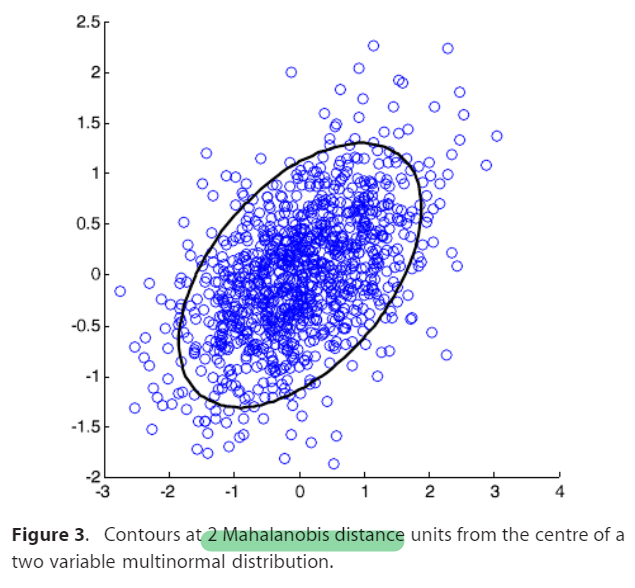
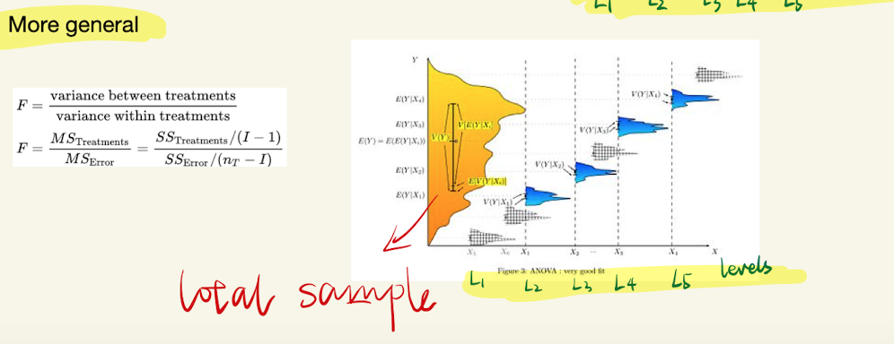

# [1. Overview-Important distributions](https://jonathan-hui.medium.com/machine-learning-summary-fundamental-6562ff7448a)
  

| Dist  |Expression   |
|---|---|
| Bernoulli Dist   |   |   
 | Binomial Dist  |    |   
| Possion Dist   |    | 
| Exponential Dist  |    |
| Normal Dist   |  |
| multivariate normal dist |  |

---
[common distributions](https://www.itl.nist.gov/div898/handbook/eda/section3/eda366.htm)
  
[Possion Dist](https://towardsdatascience.com/poisson-distribution-intuition-and-derivation-1059aeab90d)

[Beta distribution and Dirichlet distribution](https://towardsdatascience.com/beta-distribution-intuition-examples-and-derivation-cf00f4db57af)
# 2. Multivariate normal distribution
- Linear combination of standard normal distribution variables..(shift u, scale sigma, **rotate cov(x,y)**)
- (x-u)/sigma  standarlize x

- x is a real k-dimensional column vector   
- 
-   

  

## 2.0 Covariance matrix and [its eigenvector](https://www.visiondummy.com/2014/04/geometric-interpretation-covariance-matrix/)

  

### 2.0.1 Singular matrix - correlation:

### 2.0.2 Eigen vector

- covariance matrix of our data is a diagonal matrix, 
- such that the covariances are zero, 
- that the variances must be equal to the eigenvalues \lambda

-  eigenvalues still represent the variance magnitude in the direction of the largest spread of the data,
-  the variance components of the covariance matrix represent the spread **along the axes**.
-  Original the variance magnitude in the direction of the **x-axis and y-axis**

Trace(A)=sum of eigenvalues of A
## 2.1  Mahalanobis distance
  
- represents the distance of the test point x from the mean mu. 
- when k=1, the distribution reduces to a univariate normal distribution and the Mahalanobis distance reduces to the absolute value of the standard score. 

[Geometric interpretation1](https://blogs.sas.com/content/iml/2012/02/15/what-is-mahalanobis-distance.html)
[Geometric interpretation2](https://www.visiondummy.com/2014/04/geometric-interpretation-covariance-matrix/)
## 2.2 Bivariate 

>ellipses, whose principal axes are defined by the eigenvectors of the covariance matrix Sigma.
## 2.3 [Eigenvectior](https://stats.stackexchange.com/questions/447266/multivariate-gaussian-normal-distribution-sigma-covariance-and-eigenvector)

https://piazza.com/class_profile/get_resource/iwgts4iuaq41h1/izu8e14rji55wk
https://www.byclb.com/TR/Tutorials/neural_networks/ch4_1.htm
https://www.byclb.com/TR/Tutorials/neural_networks/

[Reference](https://medium.com/@SeoJaeDuk/archived-post-multivariate-gaussian-distributions-and-entropy-3-991578ca534c)
## 2.4 [Bivariate correlation](http://www2.cmp.ue'a.ac.uk/~jrk/distribution/correlations/corr.html)

# 3. [Statistic test distributions - parametric](https://programming.vip/docs/5ef5604414c57.html)

[Classical EDA](https://www.itl.nist.gov/div898/handbook/eda/section3/eda3.htm)
- [Graph](https://www.itl.nist.gov/div898/handbook/eda/section3/eda34.htm)
- [Quantitative Techniques](https://www.itl.nist.gov/div898/handbook/eda/section3/eda35.htm)

Many of the quantitative techniques fall into two broad categories:
- Interval estimation
- Hypothesis tests

 
[Ref](https://www.itl.nist.gov/div898/handbook/eda/section3/eda35.htm)

| Sampling Variable of interest:  | test  |
|---|---|
| mean   | z/t/F-test  |
| variance (M-distance)| chi-square  |
| proportion (mean) | z-test   |
| goodness of fit 1/proportion  |chi-square1|
| factor effect (LR correlation)  |chi-square (frequency)/F-test (mean)|
| median etc    |boostrap|

Assumptions:
- Z/t test (independent, normal or CTL)
- Chi-square(independent, normal, or CTL)= M-distance = squared z-score non-parametric analysis 
- F-test (normal, independent, homogeneity of  **residuals** = LR )

>Techniques for comparing **means of normal populations** generally assume the populations have the same variance. 
ANOVA techniques - test whether this assumption of **homogeneity of variance** is reasonable. 

[1. Goodness of fit](https://www.itl.nist.gov/div898/handbook/prc/section2/prc21.htm)
- Chi-square test for continuous and discrete distributions;
- Kolmogorov-Smirnov test for continuous distributions based on the empirical distribution function (EDF);
- Anderson-Darling test for continuous distributions.

## 3.1 [t-test](https://sphweb.bumc.bu.edu/otlt/MPH-Modules/Menu/)

- [One sample](https://www.kristakingmath.com/blog/test-statistics-for-means-and-proportions)
  

- Two samples  
  
  
- Dependent/paired t-test
  
- More than two sample - ANOVA

### [Z-score](https://www.machinelearningplus.com/statistics/mahalanobis-distance/)
## 3.2 Chi-square distribution
### Distribution
  

### Assumption
- **Parametric:** 
Test statistics that follow a Chi square distribution occur when the observations are independent and normally distributed, 
which assumptions are often justified under the central limit theorem. 
- **non-parametric:**
There are also chi-square tests for testing the null hypothesis of independence of a pair of random variables based on observations of the pairs.
---
### [Mahalanobis distribution (z-score)](https://onlinelibrary.wiley.com/doi/full/10.1002/cem.2680)

  

  

> - Multidimension distance doesn't have a sign so squared value is used
> - M distance is sum of squared z score 
>- This result can be used to evaluate (subjectively) whether a data point may be an outlier and 
whether observed data may have a multivariate normal distribution.

  

### 3.2.1 Contingency table
[ref](https://www.datascienceblog.net/post/statistical_test/contingency_table_tests/)
  

## 3.3 F-distribution
### Distribution
 

---
### Assumption
In addition to the quantitative ANOVA output, it is recommended that any analysis of variance be complemented with model validation. At a minimum, this should include

- A run sequence plot of the residuals.
- A normal probability plot of the residuals.
- A scatter plot of the predicted values against the residuals.

[Univariate measurement process](https://www.itl.nist.gov/div898/handbook/eda/section3/eda355.htm)

### Purpose

The F distribution is the **ratio of two chi-square distributions** with degrees of freedom ν1 and ν2, respectively, 
where each chi-square has first been divided by its degrees of freedom. 
### F-test and t-test

### 3.3.1 ANOVA  
The ANOVA is based on the law of total variance, 
where the observed variance in a particular variable is partitioned into components 
attributable to different sources of variation. 
In its simplest form, ANOVA provides a statistical test of whether two or more population means are equal, 
and therefore generalizes the t-test beyond two means. 

**[Intuition:](https://en.wikipedia.org/wiki/Analysis_of_variance)**  

**Application:**  
Classical" ANOVA for balanced data does three things at once:

- As exploratory data analysis, an ANOVA employs an additive data decomposition, and its sums of squares indicate the variance of each component of the decomposition (or, equivalently, each set of terms of a linear model).
- Comparisons of mean squares, along with an F-test ... allow testing of a nested sequence of models.
- Closely related to the ANOVA is a linear model fit with coefficient estimates and standard errors.[12]

**Assumption:**  
The normal-model based ANOVA analysis assumes the **independence, normality and homogeneity of variances** of the **residuals**.

**How: Partitioning of the sum of squares**  

the model for a simplified ANOVA with one type of treatment at different levels:

- partitioning of the total sum of squares SS into components related to the effects used in the model. 

- one of these components (that for error) specifies a **chi-squared distribution **which describes the associated sum of squares

**F-test**  
  

### 3.3.2 [Linear regression](http://www.stat.yale.edu/Courses/1997-98/101/anovareg.htm#:~:text=Analysis%20of%20Variance%20(ANOVA)%20consists,(yi%20%2D%20i).)

- SST=SSM+SSE
- Correlation: r² = SSM/SST
 >explaining the fraction of variability in the data explained by the regression model.

- Null hypothesis beta=0; F=SSM/SSE

> When the MSM term is large relative to
the MSE term, then the ratio is large and there is evidence against the
null hypothesis.

### 3.3.3 Factor effect

# Examples
# 4. [Nonparametric test](https://sphweb.bumc.bu.edu/otlt/mph-modules/bs/bs704_nonparametric/bs704_nonparametric_print.html)