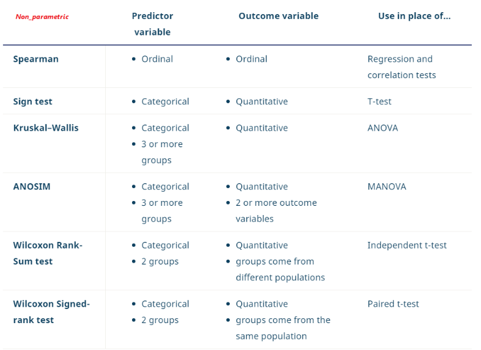

# A/B test

| Features  |   |   |   |   
|---|---|---|---|
|**2 scenarios** | compare populations or (univariate..)  | assess relationships between variables using samples.(multi-factors..)  |   |
|**3 forms**   | tests of comparison  | correlation  | regression.  |
|**2 types of stat tests**  | parametric  |non parametric |**Statistical assumptions- 3**   | 
|**4 types of test statistics**   | t/z/F/X2-value  |   |   |  
|**5 steps**   | | |  |

# 1. Overview
## 1.1 List of tests 
- exact test
- permutation test

|Three types|Parametric|Non_parametric|Test statistic|
|---|---|---|---|
|Comparison   |t(pairedT)/ANOVA|WR_sum/sign_test(WS_rank)/KW   |t/   |
|Correlation  |Pearson/chi-square|Spearman|   |
|Regression   |linear/logistic regression| Spearman  |   |

  
## 1.2 Test statistics

### 1.2.1 [Chi-square](https://en.wikipedia.org/wiki/Chi-square_distribution) 
- with k degrees of freedom is the distribution of a sum of the squares of k independent standard normal random variables. 
- The simplest chi-square distribution is the square of a standard normal distribution. So wherever a normal distribution 
could be used for a hypothesis test, a chi-square distribution could be used.  
