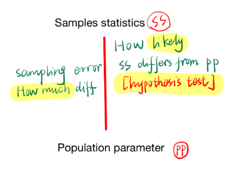
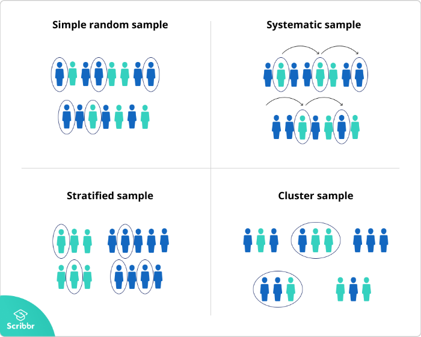
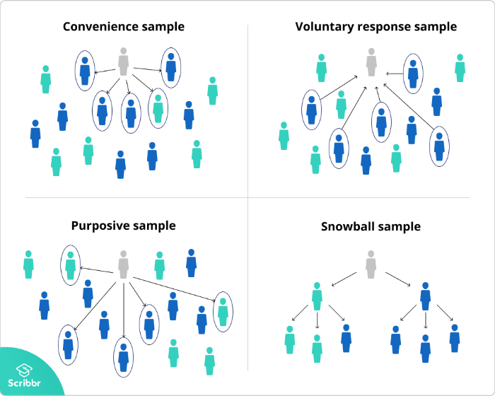
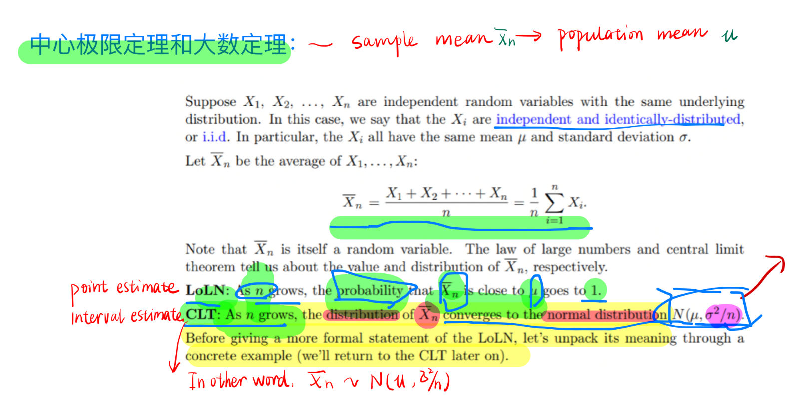

# How does frequentist learn
# 1. Samples and population:
|   |Definition   | Features  |Relations   
|---|---|---|---|
| Population  |entire group that you want to draw conclusions about   |Population parameter   |  estimation
| Samples  | specific group that you will collect data from  | Sample statistic  | hypothesis test 

- A **parameter** is a measure that describes the whole population. 
- A **statistic** is a measure that describes the sample.

- **Categorical variables** (e.g., political affiliation), the most common statistic or parameter is a **proportion**.
- **Numerical variables** (e.g., height), the **mean or standard deviation** are commonly reported statistics or parameters. 
---
  
- You can use estimation or **hypothesis testing** to estimate 
**how likely** it is that a sample statistic differs from the population parameter.
- **Confidence interval** takes account **sampling error (how much difference=how likely)**

### [Reliability vs validity](https://www.scribbr.com/methodology/reliability-vs-validity/)
## 1.1 Sampling

| Sampling method  |Methods   | Defination  |   
|---|---|---|
| Probability sampling  |   |every member of the population has a chance of being selected   |   
| Non-probability sampling  |   | individuals are selected based on non-random criteria, and not every individual has a chance of being included.  |   
|[Sampling size](https://www.surveymonkey.com/mp/sample-size-calculator/)   | [Sampling bias](https://www.scribbr.com/methodology/sampling-bias/)  | [Sampling error](https://www.scribbr.com/methodology/population-vs-sample/)  |    

### 1.1.1 Sampling bias
Sampling bias occurs when some members of a
 population are systematically more likely to be selected in a sample than others. 
 
Sampling bias limits the generalizability of findings because it is a threat to external validity, specifically population validity. In other words, findings from biased samples can only 
 be generalized to populations that share characteristics with the sample.

###1.1.2 [Descriptive statistics](https://www.scribbr.com/statistics/descriptive-statistics/)

**Descriptive statistics** summarize and organize characteristics of a data set- 
collection of responses or observations from a **sample** or **entire population**.

### 1.1.3 Univariate/bivariate:
- **distribution** concerns the frequency of each value.  
- **central tendency** concerns the averages of the values.  
- **variability or dispersion** concerns how spread out the values are.  

| Univariate descriptive statistics  |   | |Bivariate descriptive statistics  |   |   |  
|---|---|---|---|---|---|
|Central tendency   | Mean/median/mode  |  | Compare the central tendency  | hypothesis test  |
|Variability   | Range/std/interquartile  | | Correlation | Contigency table/scatter plot  | simultaneously study the **frequency and variability** of two variables to see if they vary together  |   

# 2 [Inferential statistics](https://www.scribbr.com/statistics/inferential-statistics/)
**Descriptive statistics** summarize the characteristics of samples
**Inferential statistics**, make educated guesses about population parameters based on your sample statistics.
>use **random and unbiased** sampling methods.

Inferential statistics have **two main uses**:
- **making estimates** about populations (for example, the mean SAT score of all 11th graders in the US).
- **testing hypotheses** to draw conclusions about populations (for example, the relationship between SAT scores and family income).

>**Sampling error** is the difference between a population parameter and a sample statistic.
## 2.1 Estimating population parameters from sample statistics

Sampling error is the difference between a parameter and a corresponding statistic. 

### 2.1.1 Two types of estimates
#### Pint estimate
 is a single value estimate of a parameter. For instance, a sample mean is a point estimate of a population mean.
#### Interval estimate 
gives you a range of values where the parameter is expected to lie. 
- **Confidence interval** is the most common type of interval estimate.
##### **Confidence interval** 
uses the **variability** around a **statistic** to come up with an interval estimate for a parameter.
- Confidence intervals are useful for estimating parameters because they **take sampling error into account.**
>While a point estimate gives you a precise value for the parameter you are interested in, a confidence 
>interval tells you the **uncertainty of the point estimate**.   
>They are best used in combination with each other.
>

##### Confidence level
- tells you the **probability (in percentage)** of the 
- **interval** containing the **parameter estimate** 
- if you **repeat the study** again.
> you can reasonably expect your **confidence interval** to contain the **parameter** a 
>certain percentage of the time.

##### Confidence interval vs LoC
- The sampling mean fluctuates around the true miu but there is **variation due to sampling process** 
or repeated measurement which is not avoidable.
- Sample mean xn is changing with sampling,  (but central tendency is miu) and 
**LoC gives us a way to describe the variation (sampling error)** of the process.[take the n samples as n repeated sampling process]
- When you have the distribution of sampling mean (based on LoC), you'll be good to know the 
the interval of the sample mean occurring 95% of the time.

>Distribution of sample mean is know - what is interval that is likely to happen 95 out of 100 times. **It's sample-dependent**

A 95% confidence interval means that if you **repeat your study** with a new sample **in exactly 
the same way** 100 times, you can expect your estimate to lie within the specified range 
of values 95 times.

### 2.1.1 Hypothesis testing

Hypothesis testing is a formal process of statistical analysis using **inferential statistics.**   
The goal of hypothesis testing is to 
- compare populations or 
- assess relationships between variables using samples.