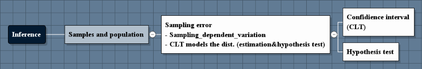
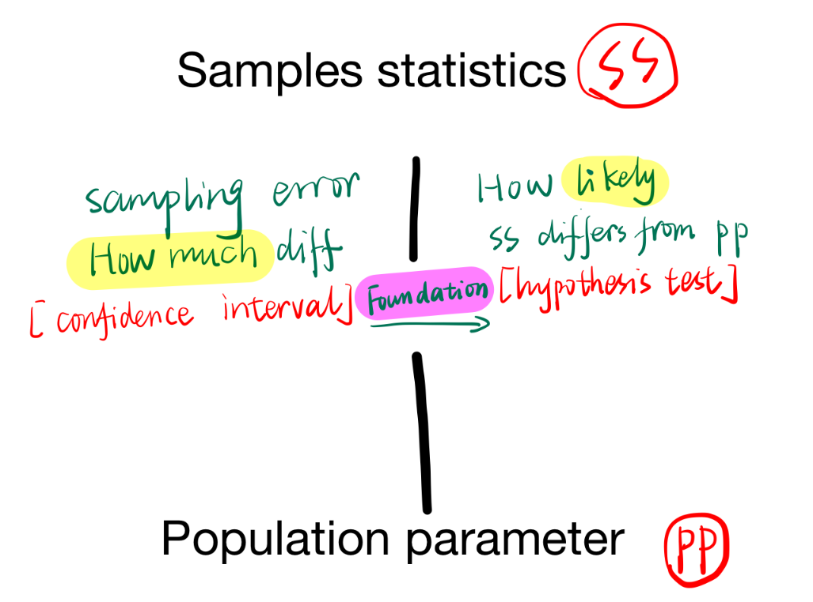
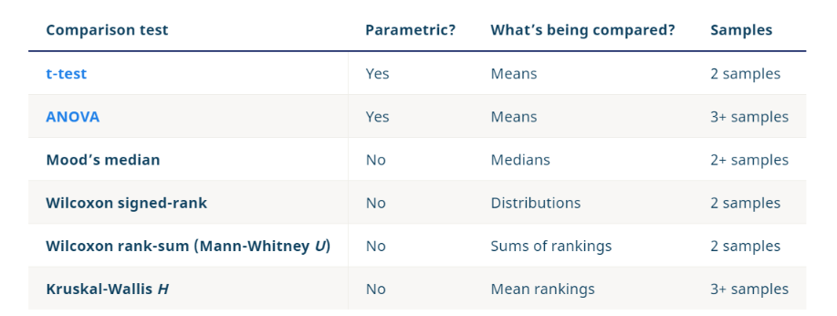
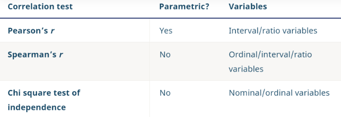
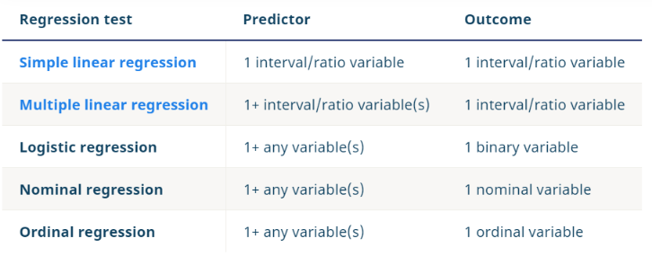
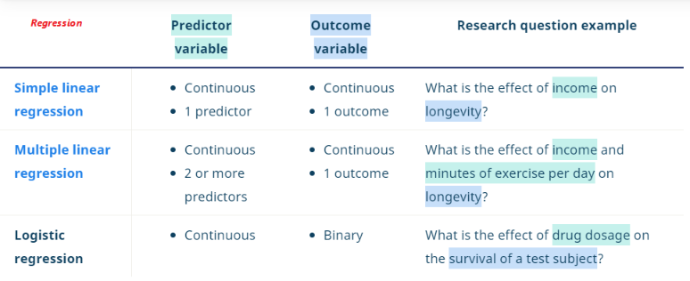
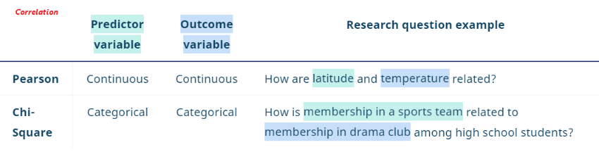
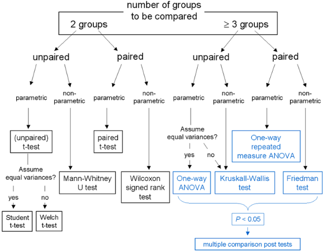
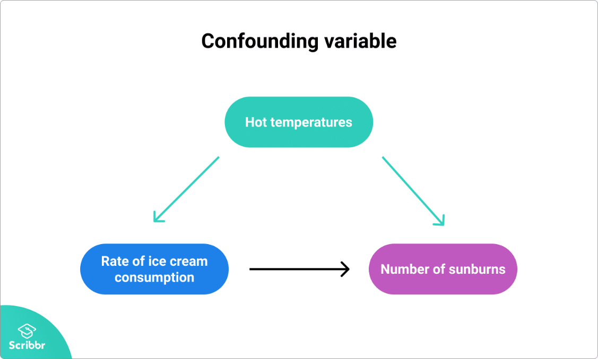

# How does frequentist learn

# 1. Samples and population:
|   |Definition   | Features  |Relations   
|---|---|---|---|
| Population  |entire group that you want to draw conclusions about   |Population parameter   |  estimation
| Samples  | specific group that you will collect data from  | Sample statistic  | hypothesis test 

- A **parameter** is a measure that describes the whole population. 
- A **statistic** is a measure that describes the sample.

- **Categorical variables** (e.g., political affiliation), the most common statistic or parameter is a **proportion**.
- **Numerical variables** (e.g., height), the **mean or standard deviation** are commonly reported statistics or parameters. 
---
 
- You can use estimation or **hypothesis testing** to estimate 
**how likely** it is that a sample statistic differs from the population parameter.
- **Confidence interval** takes account **sampling error (how much difference=how likely)**

## [Reliability vs validity](https://www.scribbr.com/methodology/reliability-vs-validity/)
## 1.1 Sampling

| Sampling method  |Methods   | Defination  |   
|---|---|---|
| Probability sampling  |   |every member of the population has a chance of being selected   |   
| Non-probability sampling  |   | individuals are selected based on non-random criteria, and not every individual has a chance of being included.  |   
|[Sampling size](https://www.surveymonkey.com/mp/sample-size-calculator/)   | [Sampling bias](https://www.scribbr.com/methodology/sampling-bias/)  | [Sampling error](https://www.scribbr.com/methodology/population-vs-sample/)  |    

### 1.1.1 Sampling bias
Sampling bias occurs when some members of a
 population are systematically more likely to be selected in a sample than others. 
 
Sampling bias limits the generalizability of findings because it is a threat to external validity, specifically population validity. In other words, findings from biased samples can only 
 be generalized to populations that share characteristics with the sample.

### 1.1.2 [Descriptive statistics](https://www.scribbr.com/statistics/descriptive-statistics/)

**Descriptive statistics** summarize and organize characteristics of a data set- 
collection of responses or observations from a **sample** or **entire population**.

- **distribution** concerns the frequency of each value.  
- **central tendency** concerns the averages of the values.  
- **variability or dispersion** concerns how spread out the values are.  

| Univariate descriptive statistics  |   | |Bivariate descriptive statistics  |   |   |  
|---|---|---|---|---|---|
|Central tendency   | Mean/median/mode  |  | Compare the central tendency  | hypothesis test  |
|Variability   | Range/std/interquartile  | | Correlation | Contigency table/scatter plot  | simultaneously study the **frequency and variability** of two variables to see if they vary together  |   

# 2. [Inferential statistics](https://www.scribbr.com/statistics/inferential-statistics/)
**Descriptive statistics** summarize the characteristics of samples  
**Inferential statistics**, make educated guesses about population parameters based on your sample statistics.
>use **random and unbiased** sampling methods.

Inferential statistics have **two main uses**:
- **making estimates** about populations (for example, the mean SAT score of all 11th graders in the US).
- **testing hypotheses** to draw conclusions about populations (for example, the relationship between SAT scores and family income).

**Sampling error:**   
>- Since the size of a sample is always smaller than the size of the population, some of the population isn’t captured by sample data.
>- This causes variation by different sampling - **sampling error - samples-dependent**
>- which is the difference between the true population values (called parameters) and the measured sample values (called statistics).

>Confidence intervals (CLT) are useful for estimating parameters because they **take sampling error into account.**

## 2.1 Estimating population parameters from sample statistics

Sampling error (think about repeated meansuring) is the difference between a parameter and a corresponding statistic. 

### Law of large numbers/Central Limit Theorem (CLT)

The law of large numbers as well as the central limit theorem are partial solutions to a general problem: 
**"What is the limiting behavior of Sn as n approaches infinity?"**
1.	By the law of large numbers, the sample averages converge in probability and almost surely to the expected value µ as n approaches infinity
2.	The classical central limit theorem describes the **size and the distributional form** of the **stochastic fluctuations** 
around the **deterministic number µ** during this convergence.
**Another way:**
1.	What is the essence of statistical inference: that samples can provide information about populations, 
and that the accuracy of this information increases with an increase in the samples.
2.	The Central Limit Theorem (CLT) adds one key result to the ones above. 
It says that for large enough sample size, the distribution of sample average (and, in fact, virtually any statistic)
 becomes closer and closer to Gaussian (normal), **no matter what the underlying distribution of X is**.  
  
 This remarkable result implies that under virtually all circumstances it is possible to make probabilistic 
 inferences about the values of population parameters based on sample statistics.

### 2.1.1 Two types of estimates
#### Point estimate
 is a single value estimate of a parameter. For instance, a sample mean is a point estimate of a population mean.
#### Interval estimate 
gives you a range of values where the parameter is expected to lie. 
- **Confidence interval** is the most common type of interval estimate.
##### **Confidence interval** 
uses the **variability** around a **statistic** to come up with an interval estimate for a parameter.
- Confidence intervals are useful for estimating parameters because they **take sampling error into account.**
>While a point estimate gives you a precise value for the parameter you are interested in, a confidence 
>interval tells you the **uncertainty of the point estimate**.   
>They are best used in combination with each other.

##### Confidence level
- tells you the **probability (in percentage)** of the 
- **interval** containing the **parameter estimate** 
- if you **repeat the study** again.
> you can reasonably expect your **confidence interval** to contain the **parameter** a 
>certain percentage of the time.

##### Confidence interval vs CLT
- The sampling mean fluctuates around the true miu but there is **variation due to sampling process** 
or repeated measurement which is not avoidable.
- Sample mean xn is changing with sampling,  (but central tendency is miu) and 
**LoC gives us a way to describe the variation (sampling error)** of the process.[take the n samples as n repeated sampling process]
- When you have the distribution of sampling mean (based on LoC), you'll be good to know the 
the interval of the sample mean occurring 95% of the time.

>Distribution of sample mean is know - what is interval that is likely to happen 95 out of 100 times. **It's sample-dependent**

A 95% confidence interval means that if you **repeat your study** with a new sample **in exactly 
the same way** 100 times, you can expect your estimate to lie within the specified range 
of values 95 times.

## 2.2 [Hypothesis testing](https://www.scribbr.com/statistics/statistical-tests/)
Hypothesis testing is a formal process of statistical analysis using **inferential statistics.**   
The goal of hypothesis testing is to 
- compare populations or (univariate..)
- assess relationships between variables using samples.(multi-factors..)  

| Features  |   |   |   |   
|---|---|---|---|
|**2 scenarios** | compare populations or (univariate..)  | assess relationships between variables using samples.(multi-factors..)  |   |
|**3 forms**   | tests of comparison  | correlation  | regression.  |
|**2 types of stat tests**  | parametric  |non parametric |**Statistical assumptions- 3**   | 
|**4 types of test statistics**   | t/z/F/X2-value  |   |   |  
|**5 steps**   | | |  |

There are 5 main steps in hypothesis testing:

- State your research hypothesis as a null (Ho) and alternate (Ha) hypothesis.
- Collect data in a way designed to test the hypothesis.
- Perform an appropriate statistical test.
- Decide whether the null hypothesis is supported or refuted.
- Present the findings in your results and discussion section.

### Backgrounds

#### [Three forms of statistical tests](https://www.scribbr.com/statistics/inferential-statistics/)
- **Comparison tests** assess whether there are differences in **means,
 medians or rankings** of scores of two or more groups.
  - **Means** can only be found for **interval or ratio data**, 
  - while **medians and rankings** are more appropriate measures for **ordinal data**.  
  
 
 
 - **Correlation tests** determine the extent to which two variables are associated.
   - Although **Pearson’s r** is the most statistically powerful test, 
   - **Spearman’s r** is appropriate for interval and ratio variables when the data **doesn’t follow a normal distribution**.
   - The **chi square test** of independence is the only test that can be used with **nominal variables**.  
   

- **Regression tests** demonstrate whether changes in predictor variables cause changes in an outcome variable.
  - Most of the commonly used regression tests are **parametric.** 
  - If your data is not normally distributed, you can **perform data transformations**.  
  

### 2.2.1 Null hypothesis
### 2.2.2 Which statisticl test to use

To determine which statistical test to use, you need to know: 
- whether your data meets certain assumptions.
- the types of variables that you’re dealing with.

Statistical tests make some common assumptions about the data they are testing:

- **Independence of observations (a.k.a. no autocorrelation)**: The observations/variables you include in your test are not related (for example, multiple measurements of a single test subject are not independent, while measurements of multiple different test subjects are independent).
- **Homogeneity of variance:** the variance within each group being compared is similar among all groups. If one group has much more variation than others, it will limit the test’s effectiveness.
- **Normality of data:** the data follows a normal distribution (a.k.a. a bell curve). This assumption applies only to quantitative data.

If your data do not meet the assumptions of **normality or homogeneity** of variance, 
you may be able to perform a **nonparametric statistical test**, which allows you to 
make comparisons without any assumptions about the data distribution

#### Parametric test
Parametric tests usually have stricter requirements than nonparametric tests,
 and are able to make stronger inferences from the data. 

Parametric tests make assumptions that include the following:

- the population that the sample comes from follows a normal distribution of scores
- the sample size is large enough to represent the population
- the variances, a measure of spread, of each group being comp 

| Types  |What   |example   |   
|---|---|---|
|Regression tests   | test cause-and-effect relationships.   | They look for the effect of one or more continuous variables on another variable.  |   
|Comparison tests  | Comparison tests look for differences among group means.   | They can be used to test the effect of a categorical variable on the mean value of some other characteristic.  | 
|Correlation tests   | Correlation tests check whether two variables are related without assuming cause-and-effect relationships.  |These can be used to test whether two variables you want to use in (for example) a multiple regression test are autocorrelated.   | 

  
  

#### [Non-parametric test](https://www.scribbr.com/statistics/statistical-tests/)
- Non-parametric tests are called “distribution-free tests” because they don’t assume anything about the distribution of the population data.
- useful when one or more of the common statistical assumptions are violated. 
- However, the inferences they make aren’t as strong as with parametric tests.

[Reference1](https://bookdown.org/thomas_pernet/Tuto/non-parametric-tests.html)
[Reference2](https://slcladal.github.io/basicstatz.html)
### 2.2.3 [Test statistics](https://www.scribbr.com/statistics/test-statistic/)

### Lookup table

## 2.4 Cause-effect relationship
### 2.4.1 [Independent_dependent variable and confounding variable](https://www.scribbr.com/methodology/types-of-variables/)
The variables in a study of a cause-and-effect relationship are called the independent and dependent variables.

- The independent variable is the cause. Its value is independent of other variables in your study.
- The dependent variable is the effect. Its value depends on changes in the independent variable.
### 2.4.2 [Confounding varialbe](https://www.scribbr.com/methodology/confounding-variables/)
In research that investigates a potential cause-and-effect relationship, 
a confounding variable is an unmeasured third variable 
that influences both the supposed cause and the supposed effect.  

A variable must meet two conditions to be a confounder:

- It must be correlated with the independent variable. This may be a causal relationship, but it does not have to be.
- It must be causally related to the dependent variable.  

>Example of a confounding variable  
You collect data on sunburns and ice cream consumption. You find that higher ice cream consumption is associated with a higher probability of sunburn. Does that mean ice cream consumption causes sunburn?
Here, the confounding variable is temperature: hot temperatures cause people to both eat more ice cream and spend more time outdoors under the sun, resulting in more sunburns.
