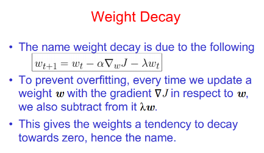
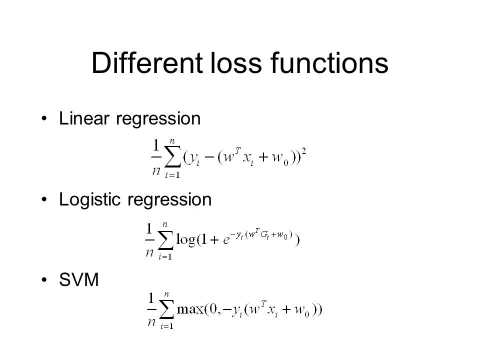
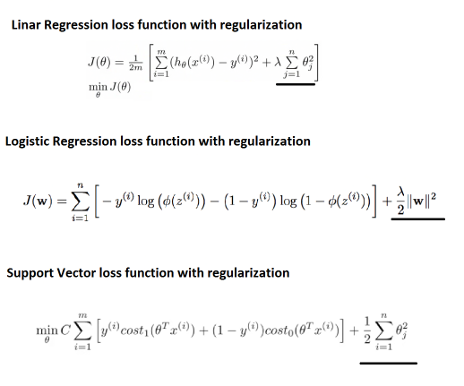
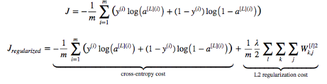
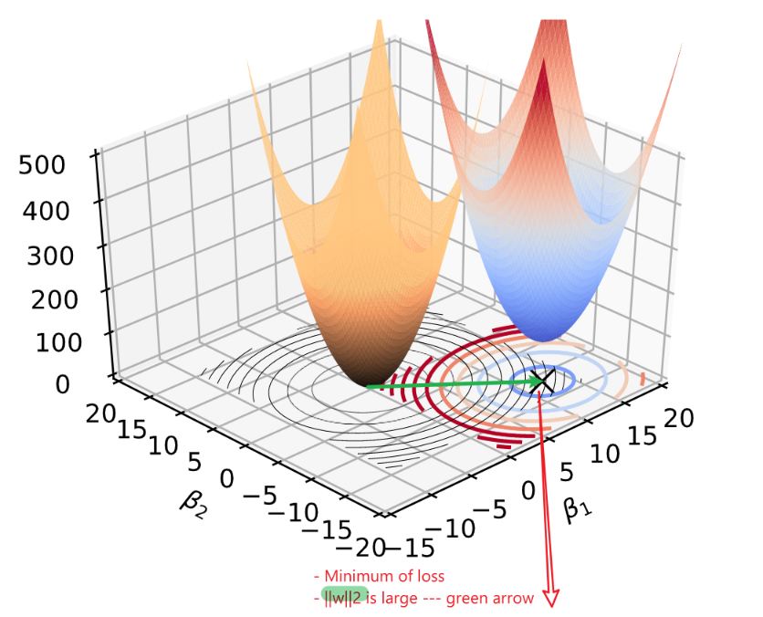
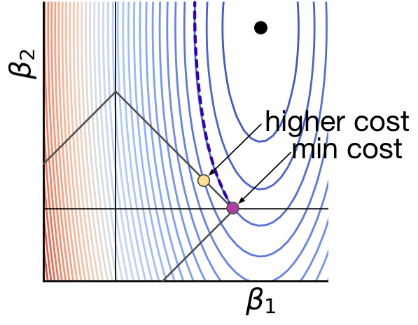
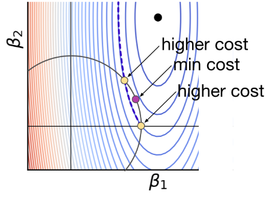

# 1. Optimization - function approximation
## 1.1 No free lunch theorem
For Inductive inference 
- Assumptions are made for a specific **learning task[dataset]** (prior distribution)
- Thus reduces the generability of the algorithm
- No one mothed dominates all others over all possible **datasets**
> There is no free lunch!  
>**Inductive Inference**- generalizing beyond the training data is impossible **unless** we add more assumptions **(Priors asserts)**

>This is usually done by bayes' inference

## 1.2 [Bias and variance - two ways ](http://cs229.stanford.edu/summer2020/BiasVarianceAnalysis.pdf)
[Another](https://www.datacamp.com/community/tutorials/tutorial-ridge-lasso-elastic-net)   

The concepts of Bias and Variance are slightly different in the contexts of Statistics
vs Machine Learning, though the two are closely related in spirit.
Different from **SSTO = SSR + SSE** of linear regress
### 1.2.1 **Estimator(model) - statistical setting** 

**Bias error**: are the simplifying **assumptions made by a model** to make the target function easier to learn

>High-Bias: Suggests more assumptions about the form of the target function  
> 

**Variance error**: 
Variance is the amount that the estimate of the target function will change if different training data was used. 
>High Variance:Suggests large changes to the estimate of the target function with changes to the training dataset.
> 

>**Low-variance** machine learning algorithms include:
>- Linear Regression, 
>- Linear Discriminant Analysis and 
>- Logistic Regression.  

>**High-variance** machine learning algorithms include: 
>- Decision Trees, 
>- k- Nearest Neighbors and 
>- Support Vector Machines

### 1.2.2 Bias-variance decomposition (of a specific ML model)
 

# 2. Prevent overfitting
**Cross-validation --- Finding the best regularization parameter (Hyperparameter)**
## 2.1 Cross validation
## 2.2 [Regularization - linear model](https://charlesliuyx.github.io/2017/10/03/%E3%80%90%E7%9B%B4%E8%A7%82%E8%AF%A6%E8%A7%A3%E3%80%91%E4%BB%80%E4%B9%88%E6%98%AF%E6%AD%A3%E5%88%99%E5%8C%96/)
- Regularization applies to **objective functions** in ill-posed optimization problems.
- Only impact the learning process of coefficients
- The regularization term, or penalty, imposes a cost on the 
optimization function for overfitting the function or to find an optimal solution.  
- [Implement - LR](https://harvard-iacs.github.io/2018-CS109A/labs/lab-5/student/)
>it constrains the size of the coefficients such that the only way the coefficients can increase is if we experience a comparable decrease in the model’s loss function.

### 2.2.1 L1 and L2 Regularization - weight decay

#### Linear models with regularization

  
Neural network

Demonstrated by a two dim cases,[x1,x2],  
 
  

### 2.2.2 [Geometric intuition of regularization](https://explained.ai/regularization/index.html)

#### Why is L1 more likely to zero coefficients than L2?

### PCA and L1 regularization
[Other regularization](https://en.wikipedia.org/wiki/Regularization_(mathematics)#Classification)
  

# 3. Data leakage

