>Now that we can compute the gradient of the loss function, the procedure of **repeatedly evaluating 
the gradient** and then performing a parameter update is called Gradient Descent.  

---
# 1. [Understand](https://ruder.io/optimizing-gradient-descent/)
- **Target**: find **theta** to minimize value of cost function   
- **Why**: Minimize loss function
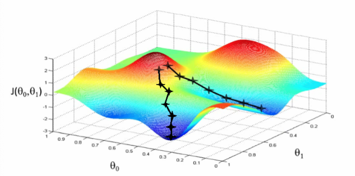  
## 1.1 How/elements
- **How**: move **theta** in a specific direction [gradient] to efficiently minimize loss function **from initial position**  
- **Attention**: and make sure all training data is included to find the optimal solution for them

 1. **loss function** - minimize
 2. **gradient** of loss function
    - training data 
    - ethta
 3. **learning rate** speed/(-)direction
 4. **Initializing theta** Random position
 5. **Relationship between each iteration**  站在上一个点 求导和往下走  
     _**ethta2= **ethta1** -lr*gradient@**ethta1**_
 
### 1.1.2 Epoch (role of training date)   
 6. **Relationship with training data**  
   (each **epoch** going through all the training data since the solution "ideally should" be optimal solution for all datapoint)**
    - Three ways (batch, mini-batch,stochastic)
    - Different is how many training data is used to update theta at each iteration until find the optimal value
                                                                                                                                                                                                
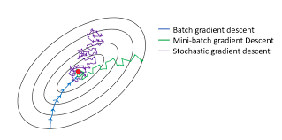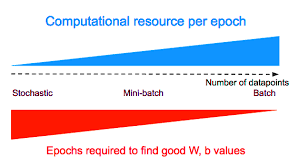   
  
  [Reference](https://towardsdatascience.com/implement-gradient-descent-in-python-9b93ed7108d1)                                                                                                                                                                                                                                                                                                                                                    
>Position of theta is impacted by the X as well (mini-batch, stochastic and batch) 

# 2. [**Implement**](https://www.geeksforgeeks.org/ml-stochastic-gradient-descent-sgd/?ref=rp):
[Implement in python](https://towardsdatascience.com/gradient-descent-in-python-a0d07285742f)  
## 2.1 [Three variants of GD](https://www.geeksforgeeks.org/ml-mini-batch-gradient-descent-with-python/?ref=rp)
  - [**Batch Gradient Descent**](https://ruder.io/optimizing-gradient-descent/index.html#gradientdescentvariants)
  - **Stochastic Gradient Descent**- one random sample
  
     The extreme case of this is a setting where the mini-batch contains only a single example. 
     This process is called Stochastic Gradient Descent (SGD) (or also sometimes on-line gradient descent).
      
  - [**Mini-batch Gradient Descent**](https://www.geeksforgeeks.org/ml-mini-batch-gradient-descent-with-python/?ref=rp)  
    Performs an update for every mini-batch of n training examples:
    >The size of the mini-batch is a hyperparameter but it is not very common to cross-validate it.   
                                                                                                                                                                                               

>Position of theta is impacted by the X as well (mini-batch, stochastic and batch)

|   |   |   |
|---|---|---|
| Batch  |  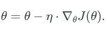  
 | entire training dataset  |
| SGD  | 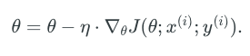  
  |  each training example |
| mini-batch  | 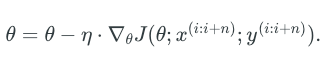  
  | every mini-batch of n training examples  |

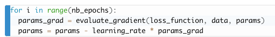  

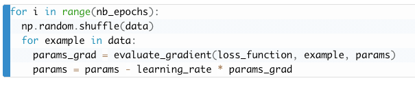  

  

---
## 2.2 Termination
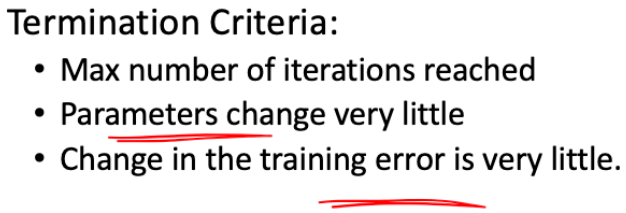  
## 2.3 Psudo code
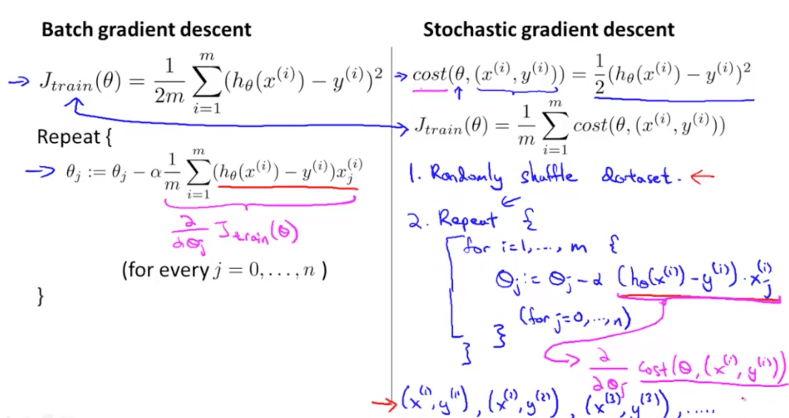
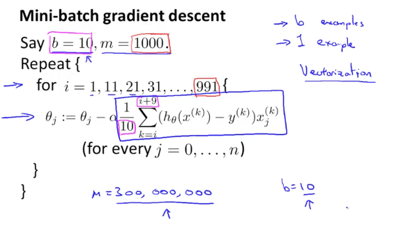
[Reference](https://www.ritchieng.com/machine-learning-resources/)
## 2.4 Code
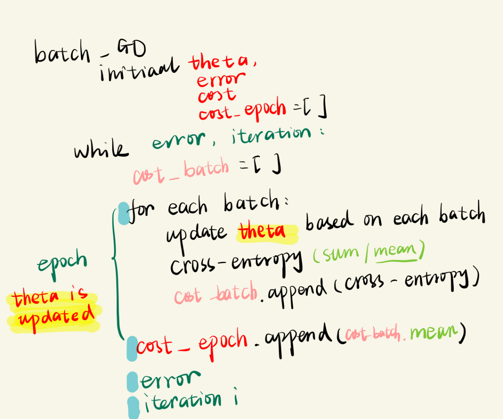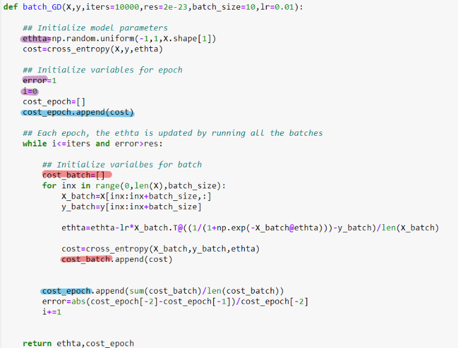
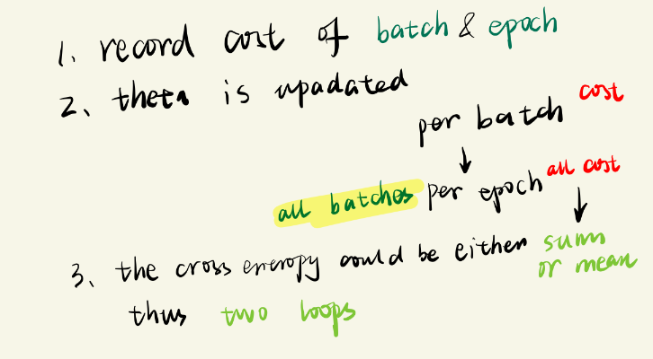
# 3. Parameters interesting to learn 
## 3.1 Explanation of N in the equation**  
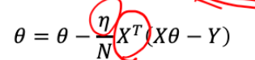 
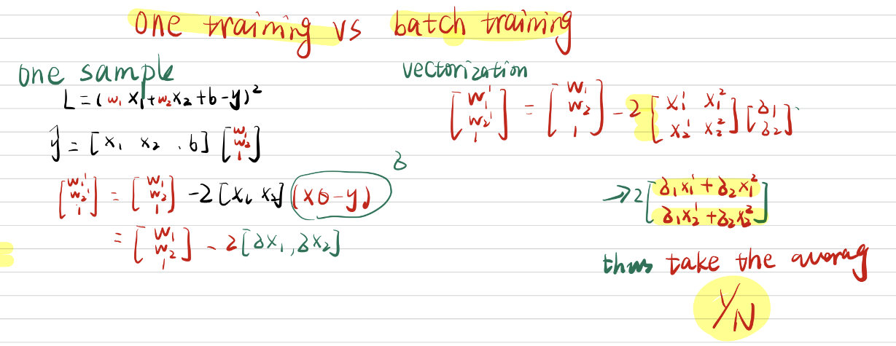
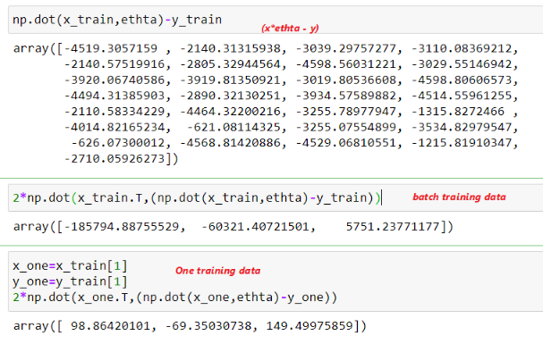

 **One sample example**
 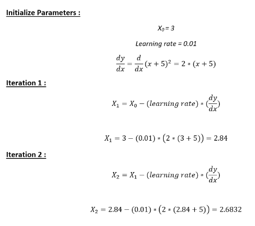

## 3.2 Understand theta
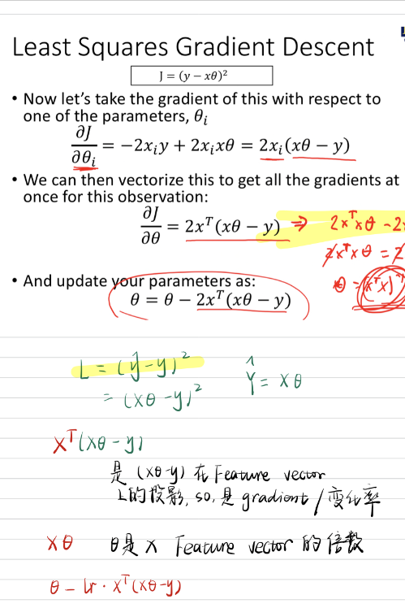

# 4. Normalization                                                                                                                                                                                                                                                                                                                                                                  
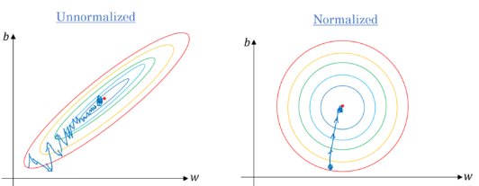                                                                                                                                                                                                                                                                                                                                                                  
 
[Reference](https://cs231n.github.io/optimization-1/)

# 5. [List of linear models](http://lina.faculty.asu.edu/deeplearn/Lectures/EEE598DL_KNN_LogisticRegression_SVM.pdf)

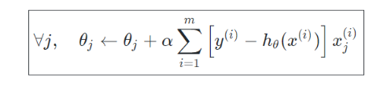 
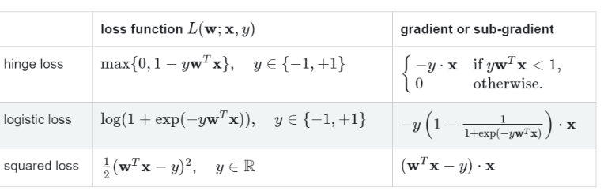

|   | Gradient  |Loss   | 
|---|---|---|
|Linear   | 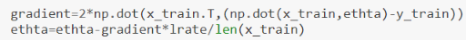  |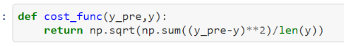   | 
|Logistic   |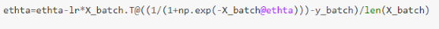   |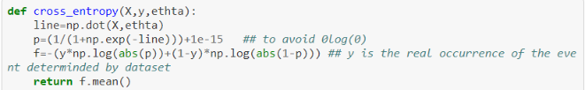   |
|   |   |   |
## 5.1 Loss and distance to line: With y=1:
>- Logistic regression:
  > 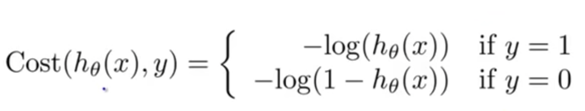
> - SVM: distance to marigin 1-f(x)  
  > 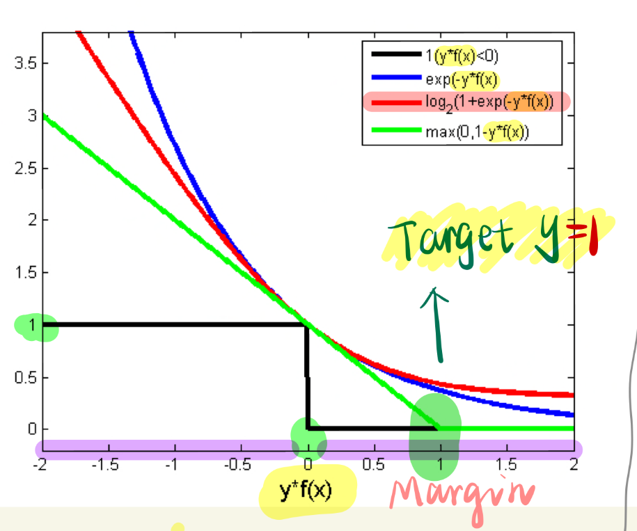

