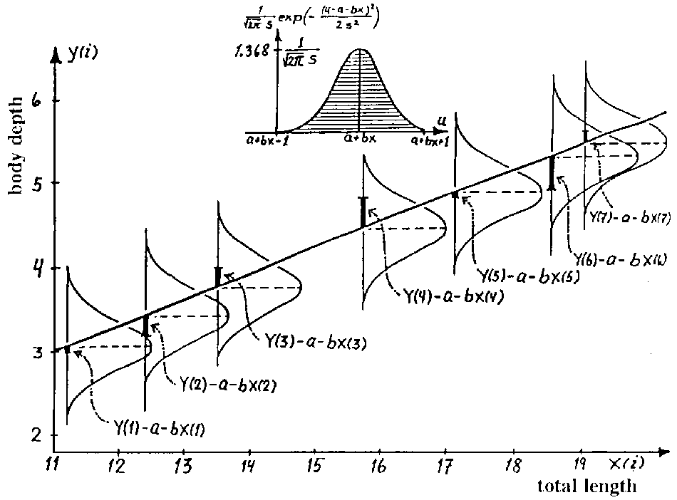
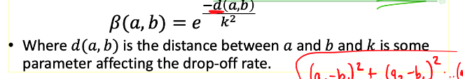

# 1. [Linear regression]()

## 1.1 Implement in python

#### 1.1.1 **EDA**- Used to exame correlation of features 
[Calculate pearsoneR](https://realpython.com/numpy-scipy-pandas-correlation-python/#correlation)

- [numpy](https://numpy.org/doc/stable/reference/routines.statistics.html)
- pandas
- spicy.stats.
- scatter_plot

### 1.1.2 Linear regression

- np.polyfit()
- sklearn

## 1.2 Understand linear regression
### 1.2.1 Statistical reference 

#### Assumption:
- Linearity: The relationship between X and the mean of Y is linear.
- Homoscedasticity: The variance of residual is the same for any value of X.
- **Independence/non-correlate:**    Observations are independent of each other.
- Normality: For any fixed value of X, Y is normally distributed.

  

[Homoscedasticity:](https://www.statisticssolutions.com/homoscedasticity/)
  

> - describes a situation in which the error term (that is, the “noise” or random disturbance in the relationship between the independent variables and the dependent variable) is the same **across all values** of the independent variables.

 >- **OLS regression** gives **equal weight** to all observations, but when heteroscedasticity is present, the cases with larger disturbances have more “pull” than other observations. 

 > - heteroscedasticity = standard errors are biased.  Because the standard error is central to conducting significance tests and calculating confidence intervals.

#### OLS and MLE
#### [Coefficient of Determination - r-squared](https://online.stat.psu.edu/stat462/node/95/)
  
  

**SSTO = SSR + SSE**
- SSR is the "regression sum of squares" and quantifies how far the estimated sloped regression line, y^i, is from the horizontal "no relationship line," the sample mean or y-.
- SSE is the "error sum of squares" and quantifies how much the data points, yi, vary around the estimated regression line, y^i.
- SSTO is the "total sum of squares" and quantifies how much the data points, yi, vary around their mean, y-.

  

In short, the "coefficient of determination" or "r-squared value," denoted r2, is the regression sum of squares divided by the total sum of squares. Alternatively, as demonstrated in this screencast below, since SSTO = SSR + SSE, 
the quantity r2 also equals one minus the ratio of the error sum of squares to the total sum of squares: 
####  (Pearson) Correlation Coefficient r
The correlation coefficient r is directly related to the coefficient of determination r2 in the obvious way.  
 

- Alternative formula for r  
  
- r is a function of the estimated slope coefficient b1  
  
The estimated slope b1 of the regression line and the correlation coefficient r always share the same sign
#### [Model evaluation and F-test](https://online.stat.psu.edu/stat462/node/107/)
#### [Correlation and cause-effect](http://www.mit.edu/~6.s085/notes/lecture3.pdf)
As an extremely crucial remark, correlation does not imply causation!  which is one of the most common sources of error in interpreting
statistics.

### 1.2.2  Machine learning  (Optimization)    
  
|   |Fitting Method   |  
|---|---|
|  Stat| MLE - OLD |  
|  ML |  Loss function|  

 

Solutions:
- Gradient descent (Optimization)
  
   - Batch GD
   - SGD
   - Mini-batch GD
- Close solution (linear algebra)
     

# 2. Locally Weighted Regression

- How many neibors to allow to influence a test point?
- A way to give larger weights to closer points. **Gaussian similarity metric**
  

- **Loss function**: find theta minimize the locally weighted sum of squared residuals to the **sample x**
  

- Rewrite the weights into diagonal matrix   
    

- Taking the **derivative**   
    

