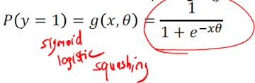
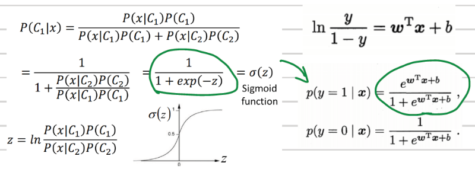
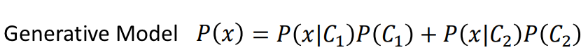
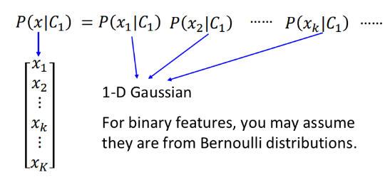
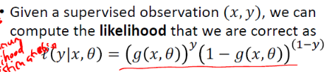
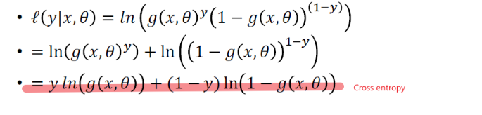
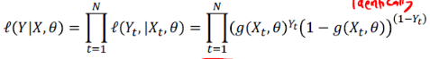
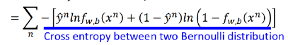
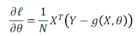
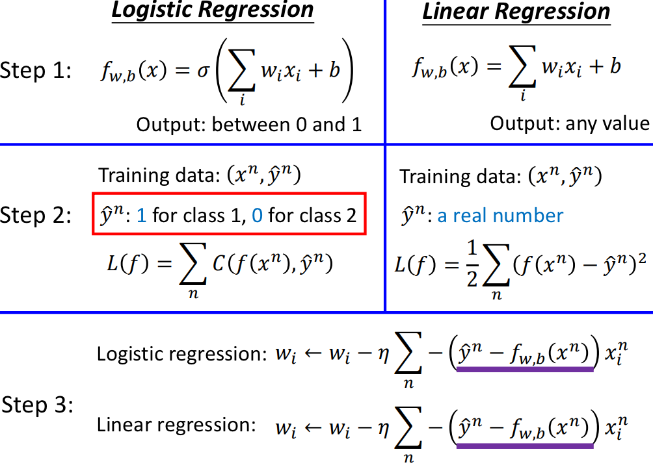

# Logistic regression

# 1. Sigmoid/logistic function

## 1.1 Geometric interpretation

  

**Actually, it's determined by distance to the line Wx+b**
## 1.2 Statistical meaning
  
  

**Naive Bayes Classifier**

# 2. Cost function
## 2.1 MLE - maximize log likelihood
- One observation - binomial dist  
MLE -   
Log - 

- Entire dataset  
`Observation are conditionally independent of one another`
  

## 2.2 Gradient  
 

**This is (almost) the same form as the least squared
error for linear regression**

