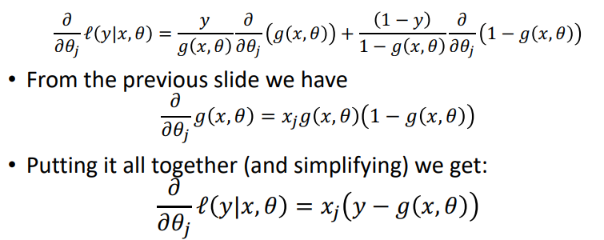

Logistic regression

---
# 1. Geometric interpretation

  

**Actually, it's determined by distance to the line Wx+b**
# 2. Statistical meaning - special case with assumption
  
  

## 2.1 Assume Gaussian dist of features - **Generative model**
- Split the data by class and build 
- two features x=(sp Defence, Defense)

## 2.2 **Naive Bayes Classifier**

# 3. Assumptions
**Observation are conditionally independent of one another**

# 4. Cost function - observations are conditionally independent of one another
## 4.1 A sequence of Bernoulli trials
  

Recall that in **a sequence of Bernoulli trials** y1,... yn, where there is a constant
probability of success p, the likelihood is

>Originally, yi gives the **occurrences of the event**, when inference to **a single event**, yi should 
be the **probability of occurrences y** of the event..
>- which is the **true P** -- y is the real occurrence of the event determined by dataset)

### 4.2.* Another view

## 4.2 MLE - (conditional) likelihood function
- One observation - binomial dist  
  

- Entire dataset  
**Observation are conditionally independent of one another**
  

## 4.3 Gradient  

**This is (almost) the same form as the least squared
error for linear regression**

