# 1. [Intuition](https://www.cs.princeton.edu/courses/archive/spring16/cos495/slides/ML_basics_lecture4_SVM_I.pdf)

  
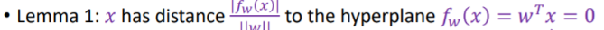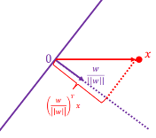
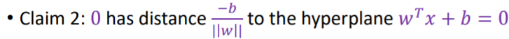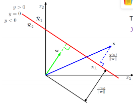   

# Geometric interpretation
Geometrically, finding the HMC for two separable classes amounts to the following:

- Draw the convex hull40 around each class (these are the polygons surrounding each class in Figure 14.3).

- Draw the shortest line segment that connects the two convex hulls (this is the dotted line segment in Figure 14.3).

- The perpendicular bisector of this line segment is the HMC!

- The margin boundaries are formed by drawing lines that pass through the support vectors and are parallel to the separating hyperplane (these are the dashed line segments in Figure 14.3).
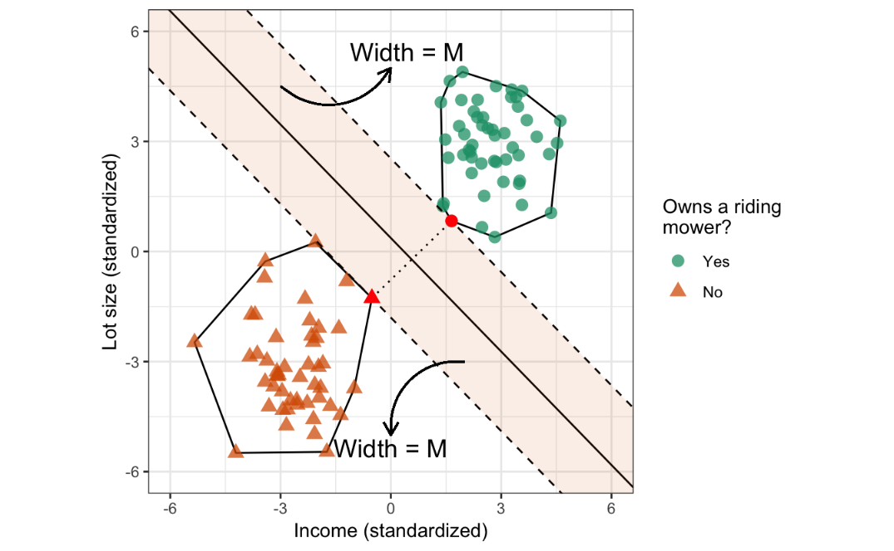
# 2. [Derivation](https://www.cs.princeton.edu/courses/archive/spring16/cos495/slides/AndrewNg_SVM_note.pdf)
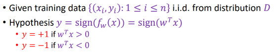

## 2.1 Objective:
1. Maximize margin **Geometric distance**
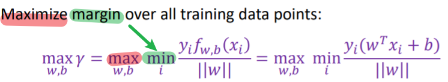  
   
2. Correctly classify
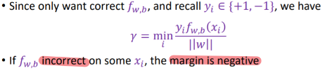
   
- Wx+b=0 has infinite equivalent representation ...
say x+y+3=0;   .5x+.5y+1.5=0;   3x+3y+9=0;
  > - Note this is the hyperplane (works for points on the plane), not the point not on.
  > - points not on will give Wx+b!=0 for example Wx+b=1
  
  - The distance to the hyperplane is the same:
   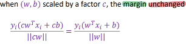

  - if Wx+b=1 **Functional distance**
    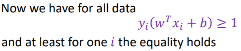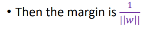  
    
## 2.2 optimization problem
 for finding the **optimal margin classifier:**
 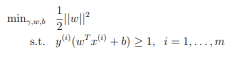  
 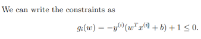
---

### [Lagrangian](file:///F:/2020_2/2020/Notes_concepts/Books/AndrewNg_SVM_note.pdf)
**Lagrange multiplier a**  
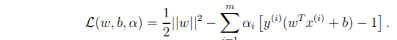   

- **objective function** is a **quadratic program**, or QP, because the objective function is quadratic
in the unknowns, 
- **constraints** are **linear** in the unknowns. 
- Many datasets will not be **linearly separable**. 
  - no way to satisfy all the constraints in Eqn. (9). 
    
  - One way to cope with **loosen some of the constraints** by introducing **slack variables**.

[Ref](https://www.cs.cmu.edu/~epxing/Class/10701/slides/lecture10-fit.pdf)
- structural risk:
- empirical risk:

### Slack variable

## SVM vs Logistic regression/regularization 
