# Navie Bayesian classification

# 1. [Bayes inference - P(f=x|y=i)-->P(y=i|x)](https://github.com/yz599/2020_2/blob/master/2020/Notes_concepts/1_1_Bayes_inference.md)

|   |meaning   |types   |roles   |   |
|---|---|---|---|---|
|P(y=i)  |  Prior |**condition**(marginal distribution)| randomly choose one, the P of y=i    | **a fact** of the datasets(sample)- percentage of **samples** that have their class y=i|
|P(x)|  Evidence/features|marginal distribution  |percentage of **samples** with feature Xn **with all y values** |**a fact** of the datasets(sample)  |
|P(y=iIx):|Posterior | Conditional distribution  | to be learnt  |**from Below**   |
|**P(f=xIy=i)**|Likelihood   |Conditional distribution   |could be learnt from joint distribution of Xn|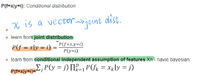  |
|H(Y)-H(YIX)   |Mutual information |cost function |difference between **prior P(y=1)** and **posterior P(YIX)**  |what could be learn about Y with known X   |

**P(f=x|y=i) is to be learnt from the samples - just like MLE**
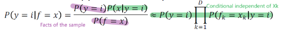
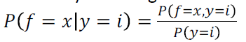
---
- **Prior P(y=i):** _marginal distribution_  
The prior P(y=i) is just the percentage of samples that have their class y=i  

- **P(x):** _marginal distribution_   
  > This is **a fact** of the datasets(sample) just like P(y). **So it couldn't be learnt**  

  The marginal probability P(X) is computed by summing (or integrating) the joint probability over other variables.

- **Posterior P(y=i|x):** _Conditional distribution_   
 What could we learn about the P of y=i, if we know x features.
  >**X are vector of the features of the decision tree**
  > The features give more information about what y is. **mutual information**

- **Mutual information H(Y)-H(Y|X):** what could be learn about Y with known X
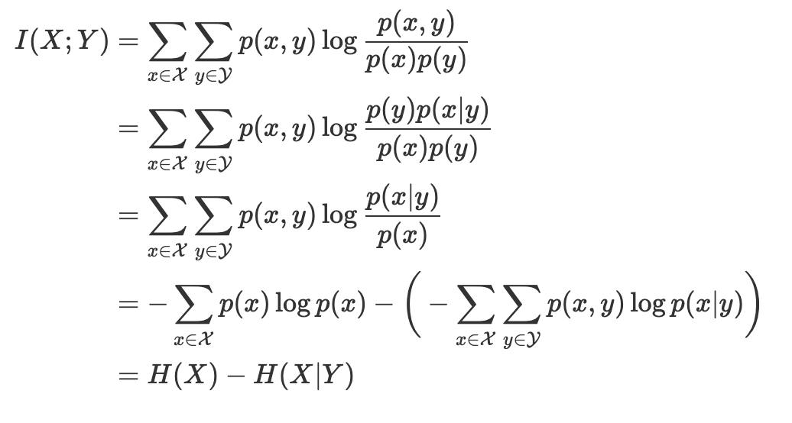 

- **P(f=x|y=i):** _Conditional distribution_  

  - 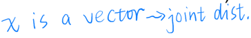  
  - learn from **joint distribution**  
  
  - learn from **conditional independent assumption of features** Xn - navie bayesian  
     **P(f=x|y=i)=**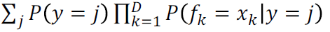
     
      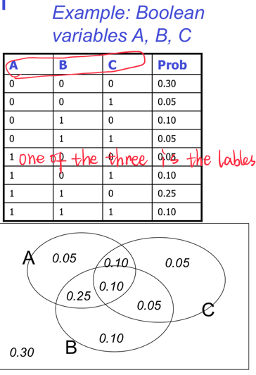
---
Illustration of three distributions using Gaussian:

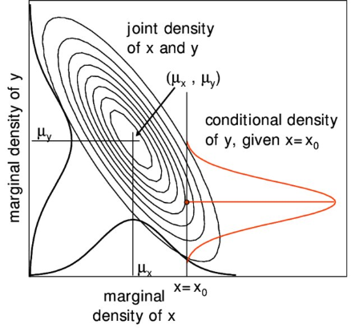

# 2. Navie Bayesian - conditional independent assumption of features in vector X

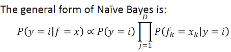

- a **special case of decision tree** with features that are **conditionally independent**
> more likely, the features are dependent, like rain and lower temperature
>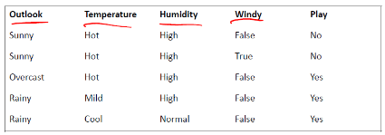
- works for categorical and Continuous values
- When this doesn't hold true,search for other models by Decision tree

# 4. [Statistical learning - learning from joint distribution](https://github.com/yz599/2020_2/blob/master/2020/CMU/ML_probability.md)
Machine learning is looking for a conditional probability P(Y|X) by finding joint distribution

Example:  

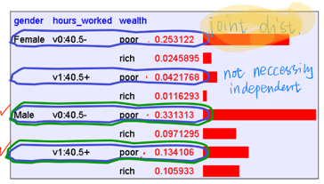  

_**The 4th column shows share of the examples and hence the table is actually a dataset..**_

> The joint distribution allows us to compute the joint probability/marginal prob and hence conditional prob P(Y|X) 

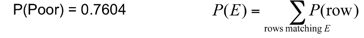

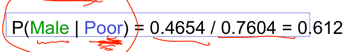

1.	Suppose we want to learn the function f: <G, H> —>W

2.	Equivalently, P(W | G, H)   Solution: learn joint distribution from data, calculate P(W | G, H)   

e.g., P(W=rich | G = female, H = 40.5)= 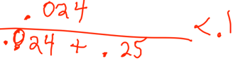
