#  Decision tree - split by feature values  

# 1. Tree is representing a boolean function
We're actually looking for a **_boolean function_**
  

**Because the feature are dependent....**

# 2. Feature selection by information gain
 Splitting data by features values - learning from features - conditional entropy

## 2.1 Information Gain (IG)
- mutual information of H(y) and conditional entropy H(y|x)
- reduction in entropy, that would occur if we split on this **attribute/feature Y**

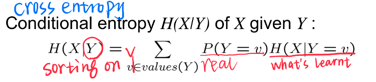  

 **IG(y,x)=H(Y)-H(Y|X)**

  

# 3. [ID3 Implement](http://www.sthda.com/english/articles/35-statistical-machine-learning-essentials/141-cart-model-decision-tree-essentials/)
Idea: (recursively) choose most significant
attribute/feature as root of (sub)tree
 

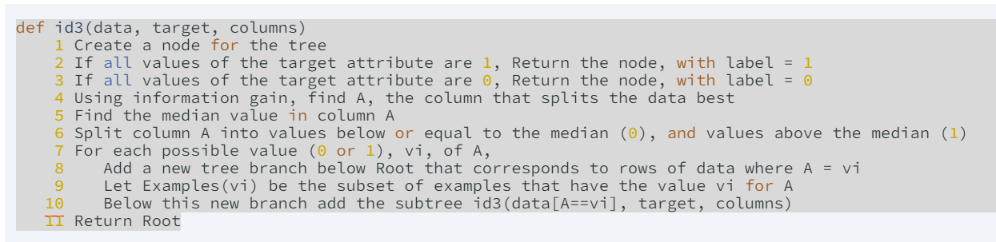
# 4. [CART](https://sefiks.com/2018/08/27/a-step-by-step-cart-decision-tree-example/)
[Ref](https://medium.com/machine-learning-researcher/decision-tree-algorithm-in-machine-learning-248fb7de819e)
# 5 Ensembling method
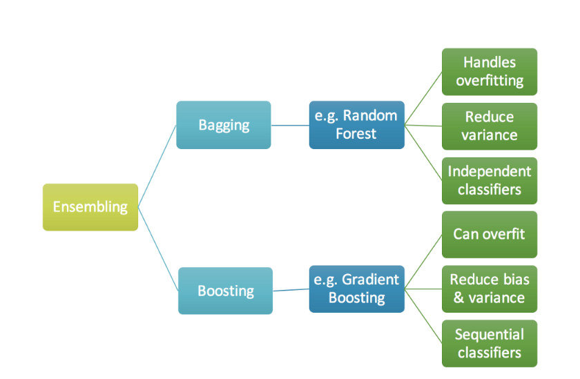
**Bagging** and random forests are “bagging” algorithms that aim to 
- **reduce the complexity of models** that overfit the training data. 

In contrast, **boosting** is an approach 
- to **increase the complexity** of models that suffer from high bias,
- that is, models that underfit the training data.

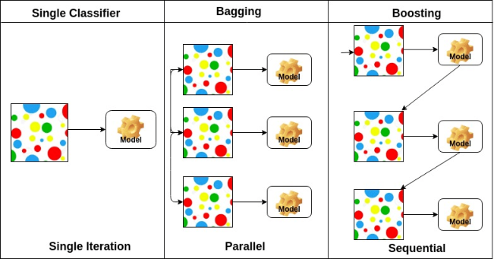 
## 5.1 Boosting - lower bias
### 5.1.1 [Gradient Boosting](https://medium.com/mlreview/gradient-boosting-from-scratch-1e317ae4587d)
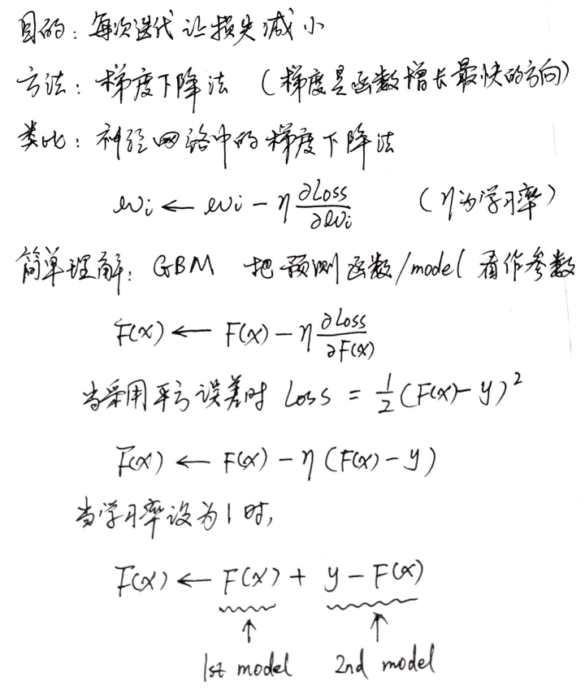
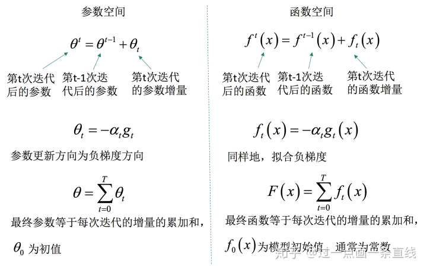

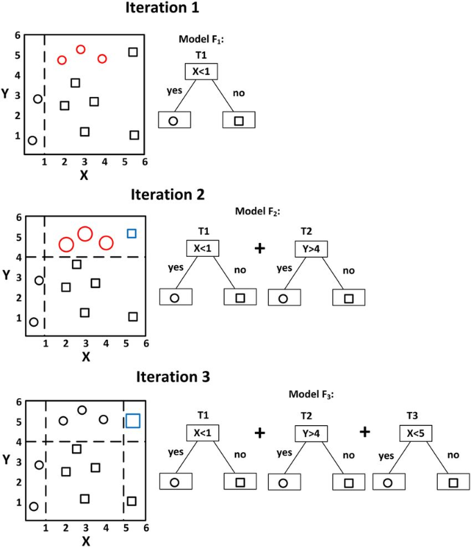[Ref](https://zhuanlan.zhihu.com/p/108144048)
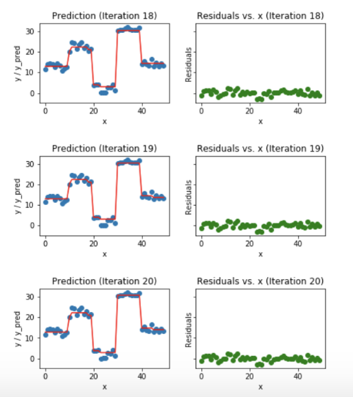[Ref](https://medium.com/mlreview/gradient-boosting-from-scratch-1e317ae4587d)
### 5.1.2 [Adaptive boosting](https://www.datacamp.com/community/tutorials/adaboost-classifier-python)
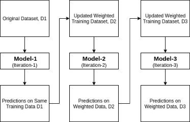

It works in the following steps:

- Initially, Adaboost selects a training subset randomly.
- It iteratively trains the AdaBoost machine learning model by **selecting the training set** based on the accurate prediction of the **last training**.
- It assigns the **higher weight** to wrong classified **observations** so that in the next iteration these observations will get the high probability for classification.
- Also, It assigns the **weight to the trained classifier** in each iteration according to the **accuracy** of the classifier. The more accurate classifier will get high weight.
- This process iterate until the complete training data fits without any error or until reached to the specified maximum number of estimators.
- To classify, perform a **"vote"** across all of the learning algorithms you built.
#### [Psodocode](https://zhuanlan.zhihu.com/p/41536315)
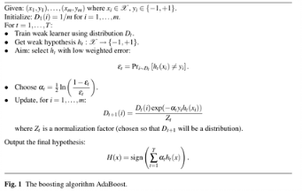
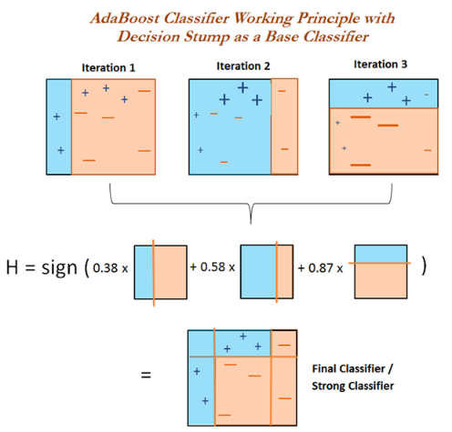[Ref](https://subscription.packtpub.com/book/big_data_and_business_intelligence/9781789953633/2/ch02lvl1sec22/adaboost-classifier)

## 5.2 Bagging - lower variance
### 5.2.1 [High variance model - DT](https://towardsdatascience.com/understanding-the-effect-of-bagging-on-variance-and-bias-visually-6131e6ff1385)
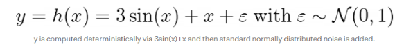
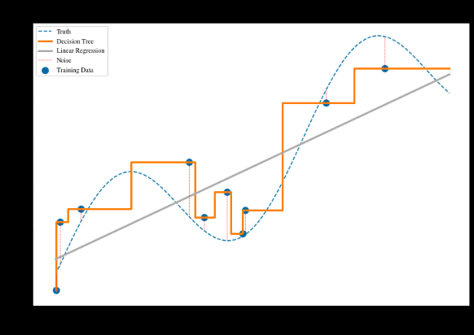
- Decision Tree fits the training data perfectly, 
- also captures the noise, which we do not want. 
- We are only interested in capturing the underlying structure of the labels (namely 3sin(x)+x), instead.
### 5.2.2 Bias and Variance of Decision Trees and Linear Regression
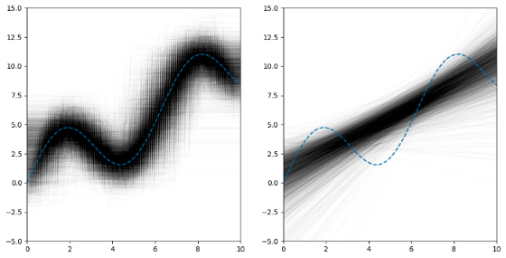
- we query our distribution D three times for 10 samples each time 
- conduct the same experiment 3000 times, each of size 10 again
> - Decision Trees (left side) fit the data quite well on average
>   - Decision Trees having a **low bias**
>   - and High variance (vertical width of black tube is wider )
>- Linear model clearly can not capture the complex pattern of the underlying label structure. 
   >  - We say that Linear Regression has **high bias**, in this case, it is not able to learn the truth
        
### 5.2.3 Intuition
 - a way to reduce the variance of a black-box estimator (e.g., a decision tree), 
 **by introducing randomization** into its construction procedure and
   > - sampling a function from a distribution (on sampling a function from a distribution. ):
- then making an ensemble out of it.  
  > - Averaging these models gives us another model (e.g. a Random Forest) with the **same bias**, but with **lower variance.** 

[Central Limit Therom](https://darrenho.github.io/SML2015/11_scribe.pdf)
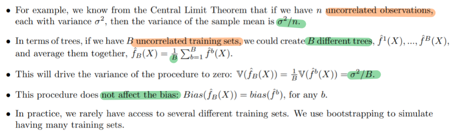
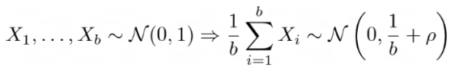
- ρ is a term that reflects the dependencies between random variables. If they are all independent, then ρ=0
- If the random variables X are all correlated with value 1, this implies that ρ=(b-1)/b, i.e. the variance of the average will be 1 again
   >In the best case, we can average independent samples. The more correlated they are, the more useless they become in the averaging process.

### 5.2.4 Random forest - decorrelate the trees

The idea behind getting many and not maximally correlated trees is the following:
- Use a random subset of the training samples for each tree.
- Use a random subset of features in each step of growing each tree.
Having two sources of randomization helps to **reduce the correlation** between different trees even more than using only one of them.

The injected randomness in forests yield decision trees with somewhat **decoupled prediction errors**. 
By taking an average of those predictions, some errors can cancel out. 

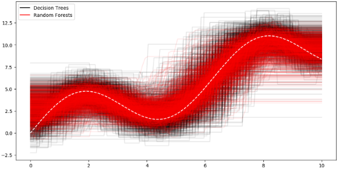  
- vertical width of the red tube, formed by the Random Forests is smaller than the Decision Trees’ black tube.
- So, Random Forests have a lower variance than Decision Trees, as expected.
- The averages (the middle) of the two tubes **are the same** which means that the process of averaging did not change the bias.