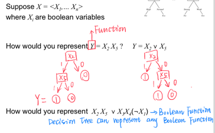

#  Decision tree - split by feature values  

# 1. Tree is representing a boolean function
We're actually looking for a **_boolean function_**

# 2. Feature selection by information gain
 Splitting data by features values - learning from features - conditional entropy>

## 2.1 Information Gain (IG)
- mutual information of H(y) and conditional entropy H(y|x)
- reduction in entropy, that would occur if we split on this attribute/feature H(y|x):

 **IG(y,x)=H(Y)-H(Y|X)**

  

# 3. Implement
Idea: (recursively) choose “most significant”
attribute/feature as root of (sub)tree
  

# 4. Overfitting