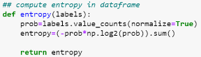
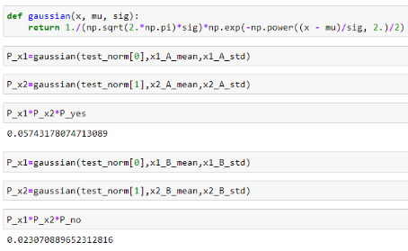

# Cost function

Some additional notes on loss functions:
1. As hinge-loss decreases, so does training error.
2. As z→−∞, the log-loss and the hinge loss become increasingly parallel.
3. The exponential loss and the hinge loss are both upper bounds of the zero-one loss. (For the exponential loss, this is an important aspect in Adaboost, which we will cover later.)
4. Zero-one loss is zero when the prediction is correct, and one when incorrect.
---
|Model   | Information_Gain/KL  |  Cross entropy/Condi entropy - share*entropy  ||
|---|---|---|---|
|Decision tree|minimize IG/KL= H(Y)-H(yIX) | |**Evaluate purity of the subset - learn from _features_**|
|Logistic - **discr P(yIX)**| | - a single case -- true occurrence(label)*log(Pred)   |**Derived form sequence of bernoulli' trail/higher than P(Y)**  |
|Naive Bayesian - **gener P(xy)**||||

The cost function of logistic regression and decision tree are talking about the same thing..
- Decision tree (gener know all date): true condi_occurance (frequency) *entropy = **weighted entropy**
- Logistic regression (Discr know one single case): sum of **weighted (1 or 0 true label) entropy** of single case

**Generative Classifiers**
1. Assume some functional form for P(Y), P(X|Y)
2. Estimate parameters of P(X|Y), P(Y) directly from training data
3. Use Bayes rule to calculate P(Y |X)

**Discriminative Classifiers**
1. Assume some functional form for P(Y|X)
2. Estimate parameters of P(Y|X) directly from training data

- **Generative classifiers**  
  - Naïve Bayes  
  - Bayesian networks
  - Markov random fields
  - Hidden Markov Models (HMM)
- **Discriminative Classifiers**
  - Logistic regression
  - Scalar Vector Machine
  - Traditional neural networks
  - Nearest neighbour
  - Conditional Random Fields (CRF)s

||||
|---|---|---|
|Naive Bayesian|Learn from joint distribution/Ciid|||
|Original Y   |P(Y)=count(Y)/total   |   |

# 2. Implement
## 2.1 Decision tree
- Information gain...

- Entropy  
  

- Information Gain  
  

## 2.2 Naive Bayesian
- Joint distribution  

## 2.3 Logistic regression

