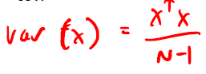
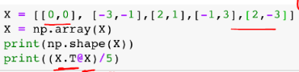
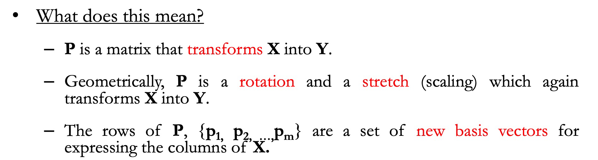
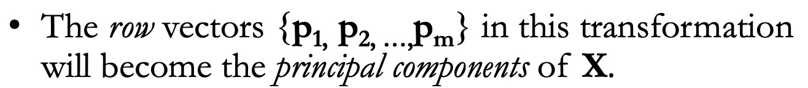
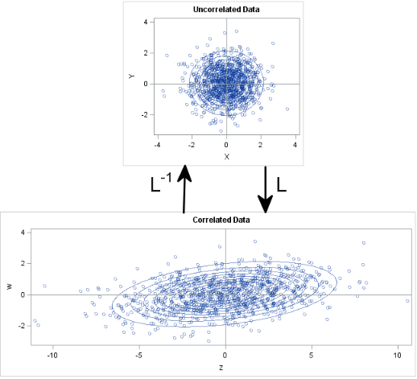

**Eigen-decomposition -- PCA**

**Cholesky decomposition -- MultiG**

> [Eigenvalues of R are square roots of eigenvalues of A](https://math.stackexchange.com/questions/2903455/a-simple-proof-for-the-relationship-between-the-eigenvalues-of-a-positive-defini)

> R is an upper triangular matrix with positive diagonal entries  

**The concept of covariance matrix is important in **
- PCA
- Multi Gaussian distribution (Naive Bayesian classifier)
- Mahalanobis distance
- LDA

# 1. How to compute
> Row 1: feature 1 * feature 1,2,...n  

  

# 2. PCA - project feature to eigenvector
## 2.1 Projection to new base 

## 2.2 New base is eigenvector of covariance matrix

## Intuition
- Inherently, the covariance matrix gives the correlation between features
- The eigenvectors of symmetric matrix is orthogonal to each other.
- The eigenvalue gives the variance along that axis
- Project data onto the eigenvector (eigenvalue used to determined principle comp)

# 3. Mahalanobis distance   
 
   
it provides a way to measure distances that takes into account the scale of the data.

## 3.1 [Distance measure by probability (standard deviation)](https://blogs.sas.com/content/iml/2012/02/15/what-is-mahalanobis-distance.html)
- In statistics, we sometimes measure "nearness" or "farness" in 
terms of the scale of the data. Often "scale" means **"standard deviation.**
- For many distributions, such as the normal distribution, 
this choice of scale also makes a statement about **probability**.
- z-score of x is the quantity z = (x-miu)/sigma - the number of standard deviations that x is from the mean.

- bivariate normal data that is overlaid with prediction ellipses.
- The ellipses in the graph are the 10% (innermost), 20%, ..., and 90% (outermost) 
prediction ellipses for the **bivariate normal distribution that generated the data**. 

|   |Euclidean distances   |standard deviation   |  
|---|---|---|
|(4,0)   | 4  |  75% prediction ellipse |  
| (0,2)   | 2  | 90% prediction ellipse  |  

 
- variance in the Y direction is less than the variance in the X direction,
- so in some sense the point (0,2) is "more standard deviations" away from the origin than (4,0) is.
- point at (4,0) is "closer" to the origin in the sense that you are **more likely to observe** an observation near (4,0) than to observe one near (0,2). 
- The probability density is higher near (4,0) than it is near (0,2).

> above explains why the Euclidean distance is not a good measurement in this case
## 3.2 Compute M distance by Eudiance distance - z score

# 4 [Cholesky transformation by Cholesky matrix](https://blogs.sas.com/content/iml/2012/02/08/use-the-cholesky-transformation-to-correlate-and-uncorrelate-variables.html)
  

**MVN(0,I) -- MVN(0,SIGMA)**
- SIGMA gives a new variance and correlation of two independent normal distribution
- If Diagonal, only stretch
- D=square root eigen value * eigenvector matrix (scaling and rotation/relation)
- MVN(miu,SIGMA)- shifts miu  
- The covariance matrix defines the shape of the data. 
  - Diagonal spread is captured by the covariance, 
  - while axis-aligned spread is captured by the variance.
  

## 4.1 Correlate variables 
- Cholesky matrix transforms **uncorrelated variables** into variables whose variances and covariances are given by Sigma
>if you generate **p standard normal variates**, the Cholesky transformation maps the variables into variables for 
>the multivariate normal distribution with covariance matrix sigma and centered at the origin (denoted MVN(0, sigma)).
- Given the covariances between variables, did you know that you can write down an invertible linear transformation that "uncorrelates" the variables? 

### 4.1.1 Scaling -diagonal
 

 

### 4.1.2 Scaling and rotation  

 
### 4.1.3 Decorrelate variables and compute z-score
  
After transforming the data, you can compute the standard **Euclidian distance** from the point z to the **origin**.
    
You can rewrite zTz in terms of the original correlated variables:  

>The Mahalanobis distance accounts for the variance of each variable and the covariance between variables. Geometrically, it does this by transforming the data into **standardized uncorrelated data**
> and computing the **ordinary Euclidean distance** for the transformed data.