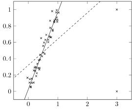
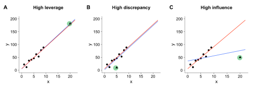
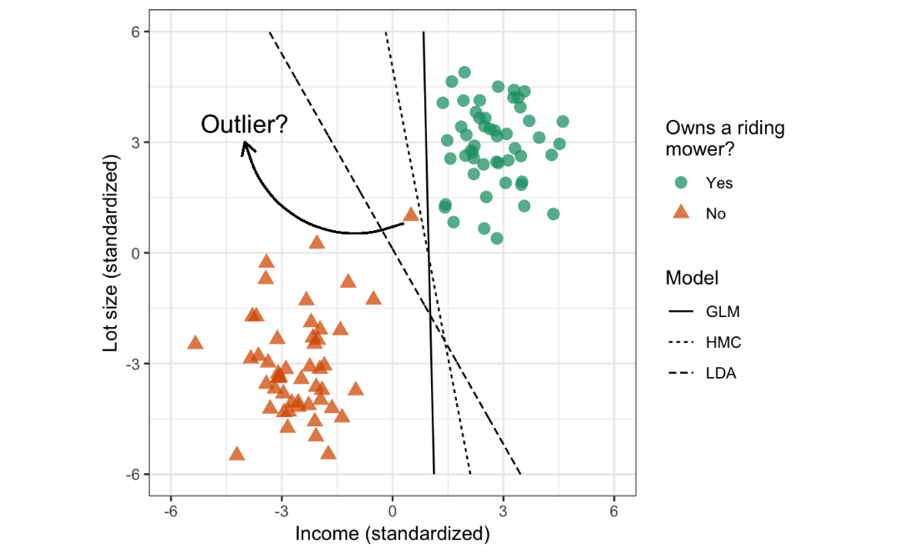
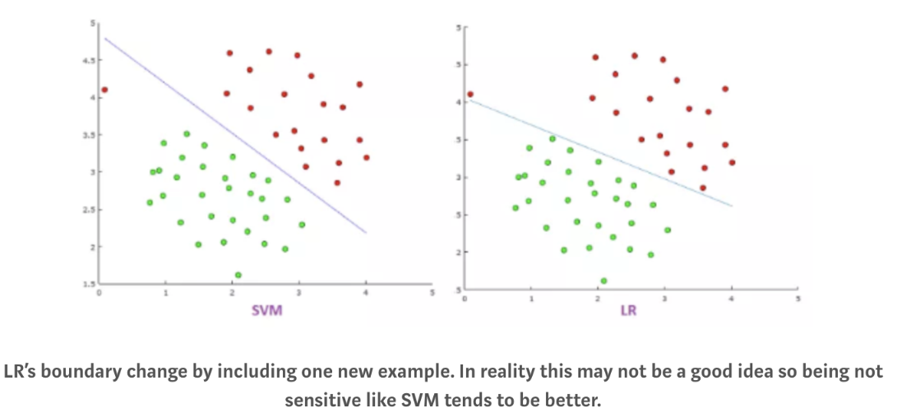
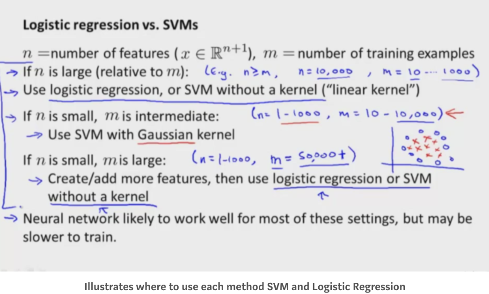

>Models that sensitive to outliers are charaterized by:
> - variance analysis
> - distance based classifer
> 
**Also feature scaling** is important for above cases

---
# 1. variance analysis (linearity/correlation):   

|   |   |   |   |   |
|---|---|---|---|---|
|PCA|Maximize variance on projection axis  |Eigen: covariance matrix   |   |   |
|Linear regression|Minimize residuals (variance) |MSE: sqrt(y-ybar)/N  |ANOVA   |   |
|LDA|classification by variance analysis|Eigen: Sw-1@Sb | similar to MNOVA   |See above   |

[PCA](https://www.researchgate.net/figure/Illustration-of-the-effect-of-outliers-on-the-PCA-The-data-set-consists-of-50-points_fig1_346029036)

[LR](https://tillbe.github.io/outlier-influence-identification.html)

# 2. Distance to separation line
|   |   |   |   |   |
|---|---|---|---|---|
|SVM |   |   |   |   |
|Logistic  |   |   |   |   |
|   |   |   |   |   |  

The **decision boundaries** obtained using logistic regression and the **HMC(SVM)** will not generalize well to new data and accuracy will suffer (i.e., these models are not robust to outliers in the feature space). 

The **LDA** model seems to produce a more reasonable decision boundary.
# 3. SVM Logit LDA

LDA focuses on all data points.
SVM focuses only on the points that are difficult to classify

|   |Assumption   |Cost | data  | Outliers  |  
|---|---|---|---|---|
| LDA   |normally distributed, homoscedasticity,ect|Least squares estimation|ALL   | [not robust][1]? |   
|SVM   | NO  |Hinge| Margin  | not robust  |  
| Logit  |NO   |Log (cross-entropy) | ALL  | not robust/more sensitive  |  

>LR is more sensitive to outliers than SVM because the cost function of LR diverges faster than those of SVM
[Ref1](https://nancyyanyu.github.io/posts/c8f688ba/)

[LDA](https://stats.stackexchange.com/questions/95247/logistic-regression-vs-lda-as-two-class-classifiers)  
[1]: https://online.stat.psu.edu/stat508/lesson/9/9.2/9.2.9

# 4. When to use which

[Ref](https://gdcoder.com/support-vector-machine-vs-logistic-regression/)