# Curse of dimensionality
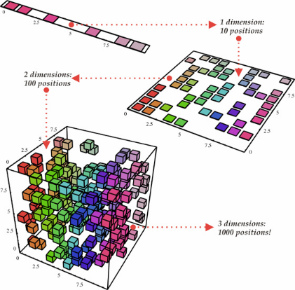
Dimension 
- complete coverage requires exponentially 
  
- otherwise spareness
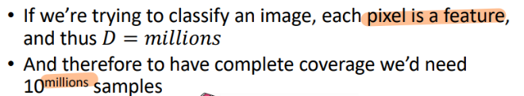
## 1. Redundant Features
### Correlation
## 2. Manifold 
- Eudiance Distance is meaningless

# 1. PCA - unsupervised
## Assumption
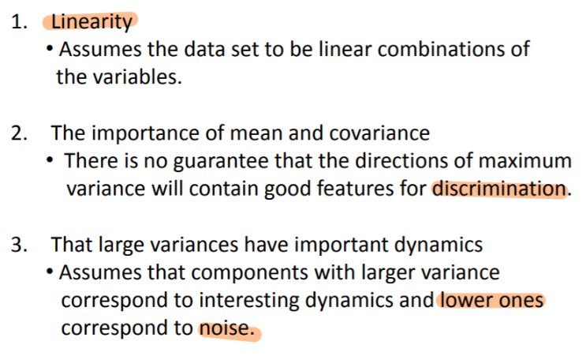
4. **No significant** outliers
## 1.1 Projection to new base
> - **Project original features** to axis 
that maximize variation of projected feature  
> - the axis is the **eigen vector** of **covariance matrix**...

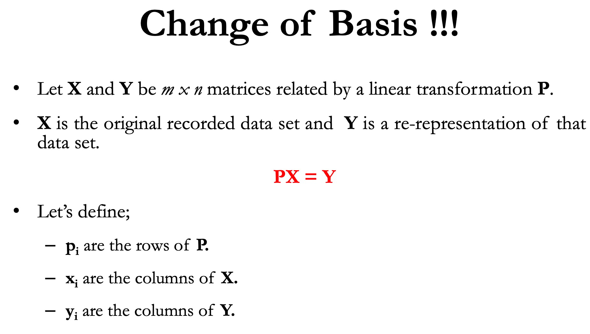
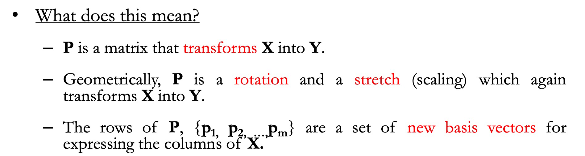
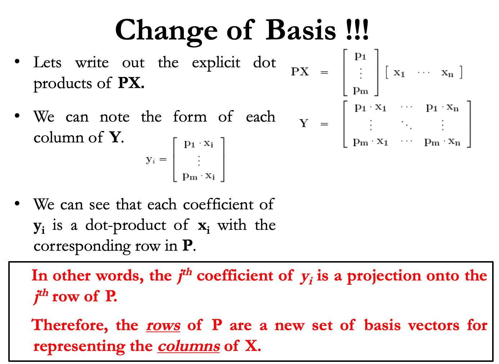
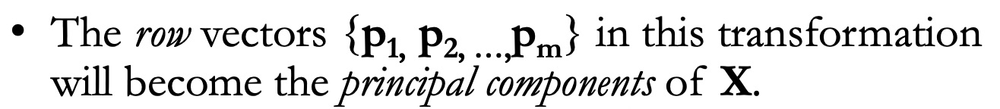
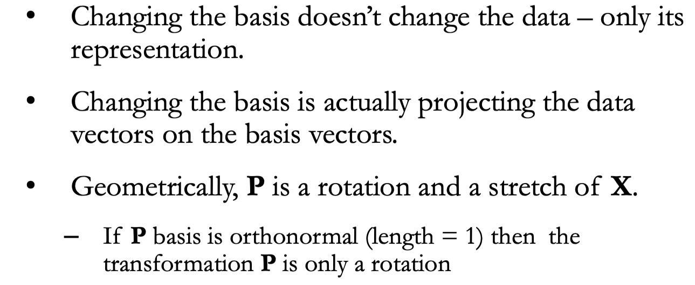
### New base is eigenvector of covariance matrix

## 1.2 Intuition
- Inherently, the covariance matrix gives the correlation between features
- The eigenvectors of symmetric matrix is orthogonal to each other.
- The eigenvalue gives the variance along that axis
- Project data onto the eigenvector (eigenvalue used to determined principle comp)
## 1.3 How - derivation

Project feature to axis to maximize variation
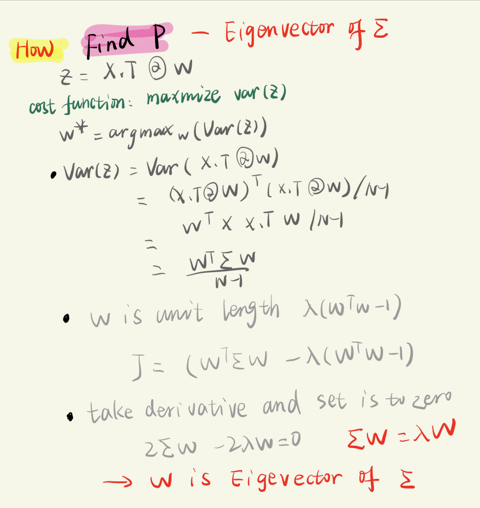
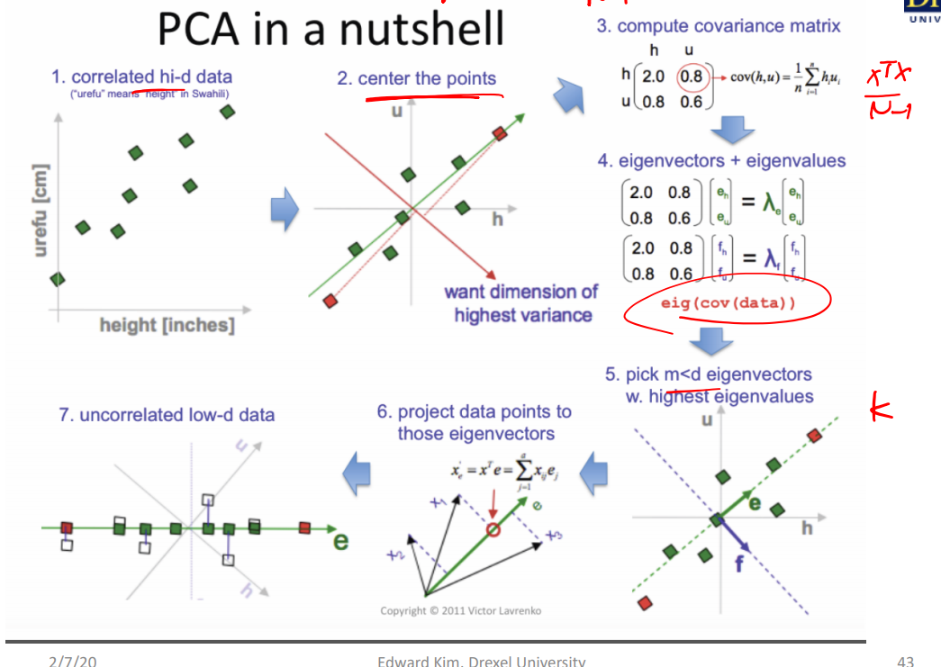

## PCA whitening

# 2. LDA - Supervised
>find projection to a line such that samples from
different classes are **well separated**
> 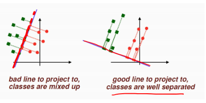

## Assumption
>Assumptions of discriminant analysis are the same as those for MANOVA. 

- **Multivariate normality**: Independent variables are normal for each level of the grouping variable.[9][7]
- **Homogeneity of variance/covariance (homoscedasticity)**: Variances among group variables are the same across levels of predictors. Can be tested with Box's M statistic.[9] It has been suggested, however, that linear discriminant analysis be used when covariances are equal, and that quadratic discriminant analysis may be used when covariances are not equal.[7]
- **Multicollinearity:** Predictive power can decrease with an increased correlation between predictor variables.[7]
- **Independence:** Participants are assumed to be randomly sampled, and a participant's score on one variable is assumed to be independent of scores on that variable for all other participants.[9][7]
## 2.1 What
Identify attributes that account for the **most variance** **between classes**
## 2.2 How
>Find a projection that maximizes the **difference in
the means** after projection:
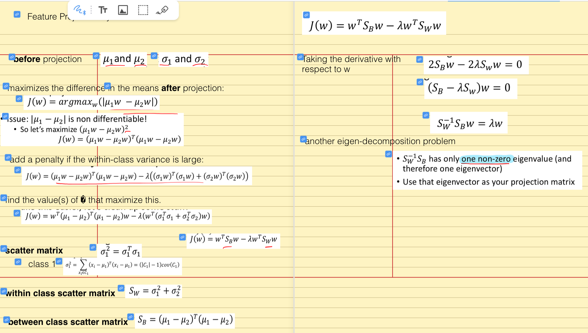
## 2.3 Intuition
>  The **eigenvalue** can be viewed as a **ratio of SSbetween and SSwithin** as in ANOVA when the dependent variable is the discriminant function, and the groups are the levels of the IV[clarification needed].[9] This means that the largest eigenvalue is associated with the first function, the second largest with the second, etc..
## 2.2 Compare with PCA
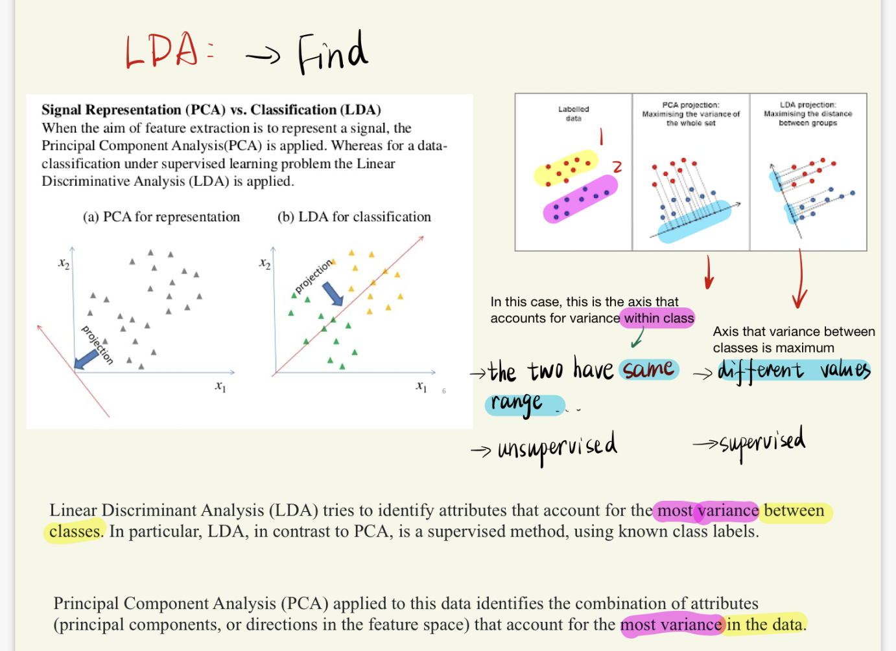

# 3. SVD