SVPErM 
- find margin
- Optimization problem

# 1. [Intuition](https://www.cs.princeton.edu/courses/archive/spring16/cos495/slides/ML_basics_lecture4_SVM_I.pdf)

  
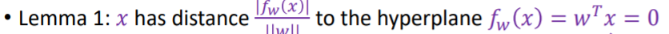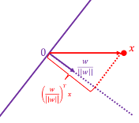
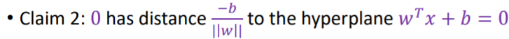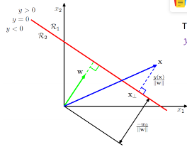   

# 1. Geometric interpretation
Geometrically, finding the HMC for two separable classes amounts to the following:

- Draw the convex hull40 around each class (these are the polygons surrounding each class in Figure 14.3).

- Draw the shortest line segment that connects the two convex hulls (this is the dotted line segment in Figure 14.3).

- The perpendicular bisector of this line segment is the HMC!

- The margin boundaries are formed by drawing lines that pass through the support vectors and are parallel to the separating hyperplane (these are the dashed line segments in Figure 14.3).

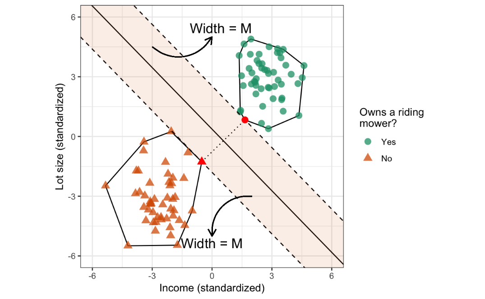

## Understand the margin=1
- Wx+b=0 has infinite equivalent representation ...
say x+y+3=0;   .5x+.5y+1.5=0;   3x+3y+9=0;
  > - Note this is the hyperplane (works for points on the plane), not the point not on.
  > - points not on will give Wx+b!=0 for example Wx+b=1
  
  - The distance to the hyperplane is the same:
   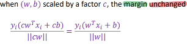

  - if Wx+b=1 **Functional distance**
    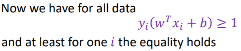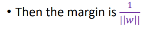 
    
# 2. [Duality](https://www.cs.princeton.edu/courses/archive/spring16/cos495/slides/AndrewNg_SVM_note.pdf)
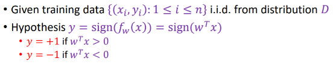

## 2.1 Intuition - Two optimization/steps
 **1. Find support vector**
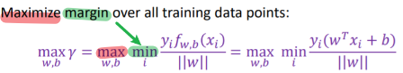  
   
**2. Minimize loss**

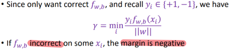  

>with slack variable   
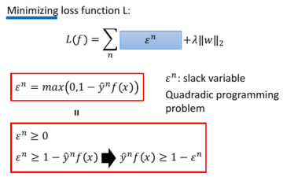
   
## 2.2 optimization problem
 for finding the **optimal margin classifier:**
 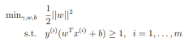  
 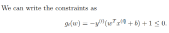
---
### [Why does lagrange multiplier work](https://www.quora.com/Intuitively-how-do-Lagrange-multipliers-work-in-SVMs)
### [2.2.1 Lagrangian duality](file:///F:/2020_2/2020/Notes_concepts/Books/AndrewNg_SVM_note.pdf)
#### **Lagrange multiplier a**  
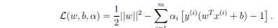   

>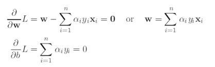  
> - Taking the derivative of **L** with respect to w,andb and setting those to zero,
> - Useful to get dual lar objective function **see below**

#### **Dual Lagrangian objective function - GD could be applied**  
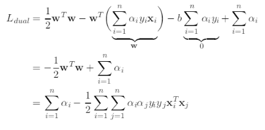  

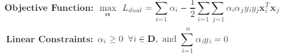

#### KKT condition of multiplier - help find support vector
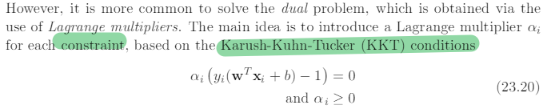

#### [Compute weight vector](https://notebook.zoho.com/app/index.html#/all-notes/eodp29495e3280f3242f998bdfac80c69e2cb)

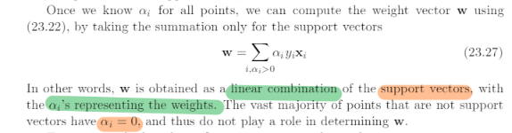

# 3. Gradient descent
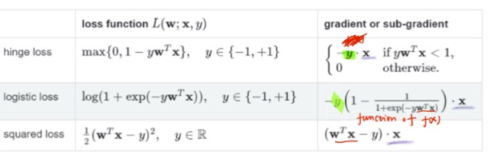
## Rewrite loss function with slack variable
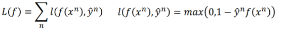
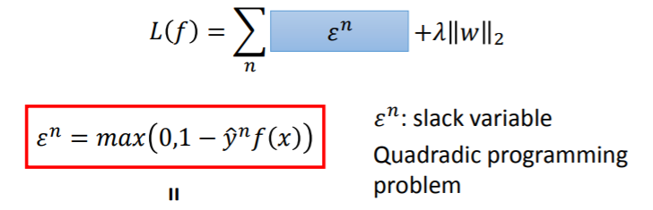

>Inside red box: distance to margin compare with 1
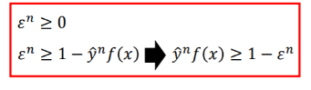
## 3.1 Gradient
### 3.1 Without regularization

- with respect to function f(x)
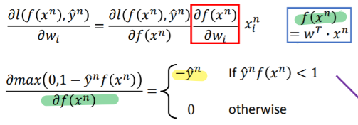

- with respect to W:
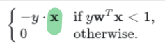
  
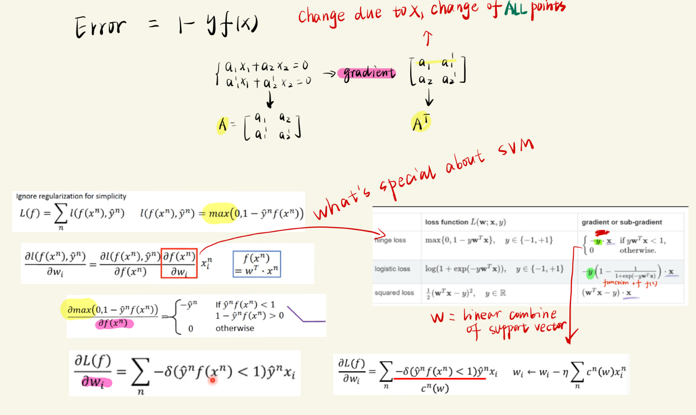

# 3. Soft margin

# SVM and ANN
