# Navie Bayesian classification
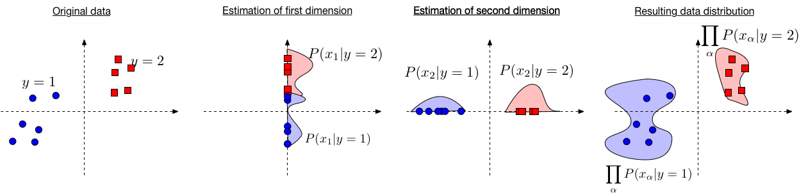
  
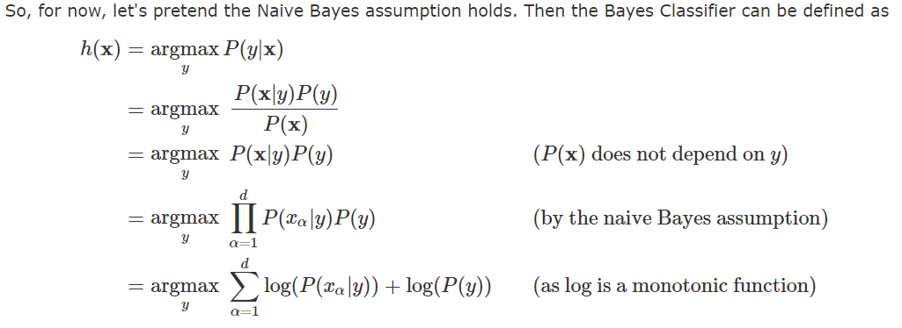
# 1. [Bayes inference - P(f=x|y=i)-->P(y=i|x)](https://github.com/yz599/2020_2/blob/master/2020/Notes_concepts/1_1_Bayes_inference.md)

|   |meaning   |types   |roles   |   |
|---|---|---|---|---|
|P(y=i)  |  Prior |**condition**(marginal distribution)| randomly choose one, the P of y=i    | **a fact** of the datasets(sample)- percentage of **samples** that have their class y=i|
|P(x)|  Evidence/features|marginal distribution  |percentage of **samples** with feature Xn **with all y values** |**a fact** of the datasets(sample)  |
|P(y=iIx):|Posterior | Conditional distribution  | to be learnt  |**from Below**   |
|**P(f=xIy=i)**|Likelihood   |Conditional distribution   |could be learnt from joint distribution of Xn|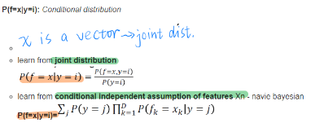  |
|H(Y)-H(YIX)   |Mutual information |cost function |difference between **prior P(y=1)** and **posterior P(YIX)**  |what could be learn about Y with known X   |

**P(f=x|y=i) is to be learnt from the samples - just like MLE**

---
- **Prior P(y=i):** _marginal distribution_  
The prior P(y=i) is just the percentage of samples that have their class y=i  

- **P(x):** _marginal distribution_   
  > This is **a fact** of the datasets(sample) just like P(y). **So it couldn't be learnt**  

  The marginal probability P(X) is computed by summing (or integrating) the joint probability over other variables.

- **Posterior P(y=i|x):** _Conditional distribution_   
 What could we learn about the P of y=i, if we know x features.
  >**X are vector of the features of the decision tree**
  > The features give more information about what y is. **mutual information**

- **Mutual information H(Y)-H(Y|X):** what could be learn about Y with known X
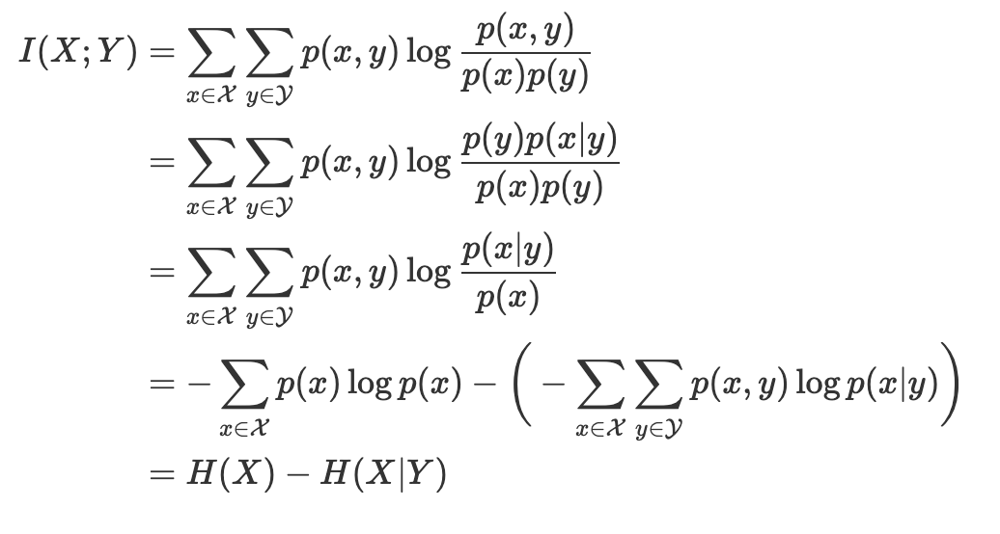 

- **P(f=x|y=i):** _Conditional distribution_  

  - 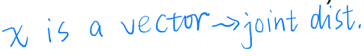  
  - learn from **joint distribution**  
  
  - learn from **conditional independent assumption of features** Xn - navie bayesian  
     **P(f=x|y=i)=**
     
      
---
Illustration of three distributions using Gaussian:

# 2. Navie Bayesian - conditional independent assumption of features in vector X

- a **special case of decision tree** with features that are **conditionally independent**
> more likely, the features are dependent, like rain and lower temperature
>
- works for categorical and Continuous values
- When this doesn't hold true,search for other models by Decision tree

## 2.1 [Example](https://www.geeksforgeeks.org/naive-bayes-classifiers/)  

We need to find P(xi | yj) for each xi in X and yj in y.

|OUTLOOK|	TEMPERATURE|	HUMIDITY|	WINDY|	PLAY GOLF|
|---|---|---|---|---|
|0|	Rainy	|Hot|	High|	False|	No|
|1|	Rainy	|Hot|	High|	True|	No|
|2	|Overcast|	Hot|	High|	False	|Yes|
|3|	Sunny	|Mild|	High|	False	|Yes|
|4	|Sunny|	Cool|	Normal|	False	|Yes|
|5	|Sunny|	Cool|	Normal|	True	|No|
|6	|Overcast|	Cool|	Normal|	True|	Yes|
|7	|Rainy|	Mild|	High|	False	|No|
|8	|Rainy	|Cool|	Normal|	False|	Yes|
|9	|Sunny|	Mild|	Normal|	False	|Yes|
|10|	Rainy|	Mild|	Normal|	True|	Yes|
|11|	Overcast|	Mild|	High	|True|	Yes|
|12|	Overcast|	Hot|	Normal|	False	|Yes|
|13|Sunny	|Mild|	High	|True|	No|

We assume that:
- no pair of features are dependent. 
- each feature is given the same weight(or importance).   
  >For example, knowing only temperature and humidity alone can’t predict the outcome accuratey. None of the attributes is irrelevant and assumed to be contributing equally to the outcome.

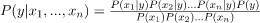  

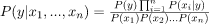  

>Now, as the denominator remains constant for a given input, we can remove that term:

  

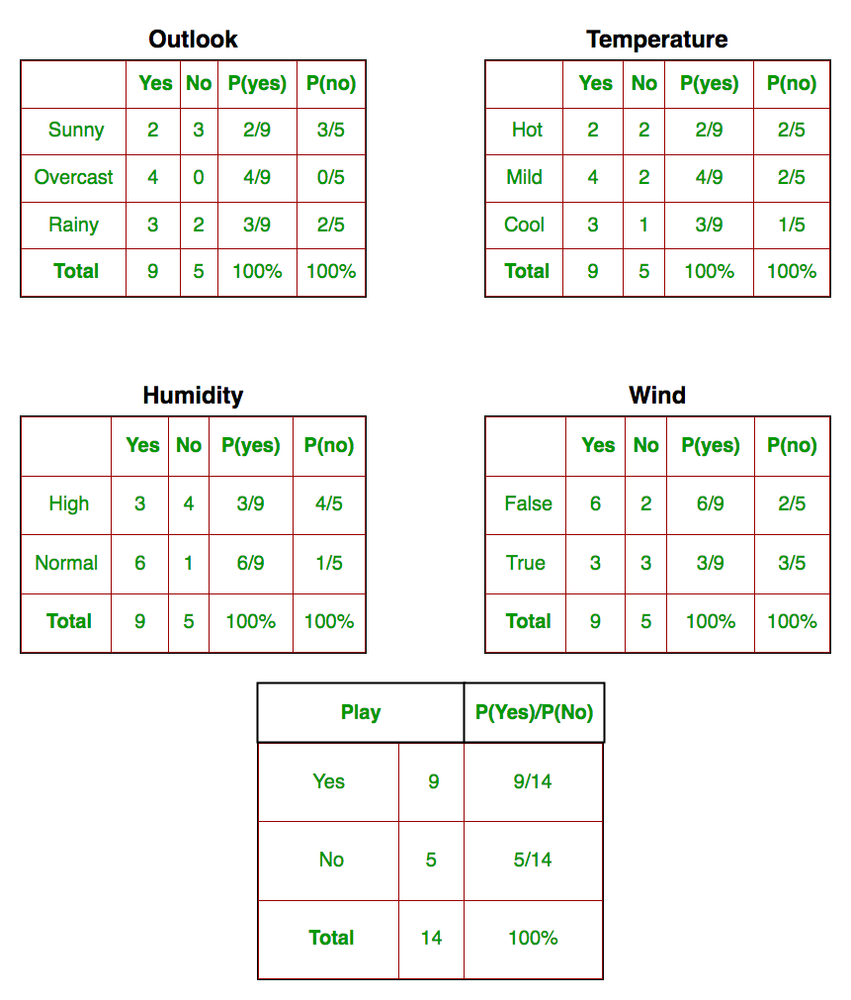  

today = (Sunny, Hot, Normal, False)

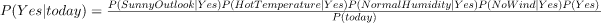  

  

Since, P(today) is common in both probabilities, we can ignore P(today) and find proportional probabilities as:

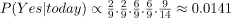  

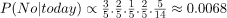  

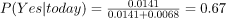  

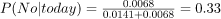  

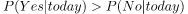  

## 2.2 Continous data

In case of continuous data, we need to make some assumptions regarding the distribution of values of each feature.

Gaussian Naive Bayes classifier: ontinuous values associated with each feature are assumed to be distributed according to a Gaussian distribution.
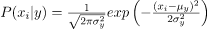  

# 3. [Statistical learning - learning from joint distribution](https://github.com/yz599/2020_2/blob/master/2020/CMU/ML_probability.md)
Machine learning is looking for a conditional probability P(Y|X) by finding joint distribution

Example:  

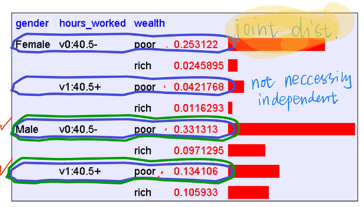  

_**The 4th column shows share of the examples and hence the table is actually a dataset..**_

> The joint distribution allows us to compute the joint probability/marginal prob and hence conditional prob P(Y|X) 

1.	Suppose we want to learn the function f: <G, H> —>W

2.	Equivalently, P(W | G, H)   Solution: learn joint distribution from data, calculate P(W | G, H)   

e.g., P(W=rich | G = female, H = 40.5)= 

# 4. Gaussion Naive Bayesian - [a linear classifier](https://www.cs.cornell.edu/courses/cs4780/2018fa/lectures/lecturenote05.html)

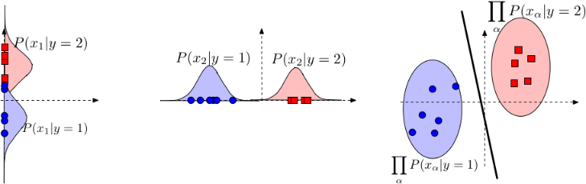
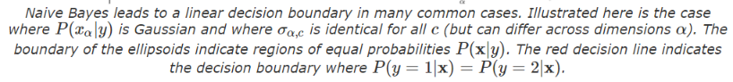
