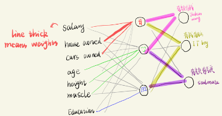

#

# 1. Linear combination of features - compare with DT
## 1.1 Doing the same thing
> - combination of features **(dependent)**  
> - at different values(range) - **Relu** Where non-linearity comes in 

Decision tree learns non-linear relationship between features by:
- cut feature into intervals (pieces) 
   - ANN: **approximate the linear (assumed)** relationship between features (see picture) 
   - DT: use smaller pieces to approximate relationship of features (DT regression)
- the learning is supervised under labels (Gini impurity/cross entropy or similarity score Z..)

|   | relation between features  | non-linearity  | Supervised by  |   
|---|---|---|---|
| DT  | piece-wise|cut into intervals and find corresponding relationship (CART)   | Gini impurity  | 
| NN| linear (assumption) | Relu  | Cross entropy (maximize P(target)/Z similarity score)  | 

>DT learns the relationship between multiple features by multiple branches

>ANN learns using linear combination of those features  

## 1.2 "Backpropagation"

From bottom to top: Decision tree
From right to left: NN

- Grouping data with the same labels -- What Cost function does (Gini impurity,cross entropy)
- Learn **feature boundary** (relationship/interaction) for the same labels

---
- Classification output layer: multiple objects given
- Regression output layer: multiple group with similar y value 

[Ref](http://playground.tensorflow.org/#activation=relu&batchSize=10&dataset=circle&regDataset=reg-plane&learningRate=0.03&regularizationRate=0&noise=0&networkShape=4,3,2&seed=0.34704&showTestData=false&discretize=false&percTrainData=50&x=true&y=true&xTimesY=false&xSquared=false&ySquared=false&cosX=false&sinX=false&cosY=false&sinY=false&collectStats=false&problem=classification&initZero=false&hideText=false)
## 1.3 Relu - find liner relationship max(z) piecewisely (0)

- Kind of **step function** and thus allow us to evaluate relationship between features piece-wise (Relu at different regions)
- Relu function says regions... (**we know close point should behavior similar**)
- Weights of Linear relationship of multiple features...max(z=w@X_train)
- Decision tree boundary line is an approximation of such linearity 
  
---
Explain why find (soft)max at output layer

>- **Learn** boundary line (piece-wise line) : cost function: max(p)==max(z=w@X_train)
>  - **w weights** give the **relationship between features** by maximizing (w@X_train)
      
     Another view of linear regression: minimize residuals/distance of data to target line == maximize projection of the data onto the line: maxium is on the line. 

>- **Predict** -- multiple the Weight (vector) with Xtest
>  - **w@X_test:** projection (similarity)  to the learned boundary line/correlation of features/ weights 
>  - Orthogonal = not alike =0 

> Therefore, **compare max** at output layer 
## 1.4 Prediction (see above)
- similarity between X_test and learned boudary lines (weights) 
- similarity= w@X_test
- find class corresponding to max score (softmax)

# 2. Multi-nomial - compare with logistic regression

## 2.1 Predicted y 

### 2.2.1 From softmax to sigmoid

> Convert raw output value ito probability

- The softmax operates on a **vector**
- while the sigmoid takes a **scalar**.
- sigmoid function is a special case of the softmax function for a 
  classifier with only **two input classes**.
  
----
>[Set the input vector to be [x, 0] ](https://deepai.org/machine-learning-glossary-and-terms/softmax-layer)

It is not necessary to calculate the second vector component explicitly because when there are two probabilities, they must sum to 1.

### 2.2.2 [Used in multi-class classifier](https://glassboxmedicine.com/2019/05/26/classification-sigmoid-vs-softmax/)  

> - Convert raw output value ito probability
> - Sigmoid and softmax functions produce different results. 

  
|Func   |sum   |   |   |function|application|
|---|---|---|---|---|---|
| Sigmoid  |probabilities not sum to one   | are independent  | look at raw data separately  | |More than one right answer = **Non-exclusive outputs** (e.g. chest x-rays, hospital admission)|
| Softmax  | sum to one  |increase P of one, decrease others   | interrelated  ||**Only one** right answer = **Mutually exclusive** outputs (e.g. handwritten digits, irises)|

- **One_vs _all**: we apply a sigmoid function to each element of the raw output independently.
  - scalar
  - whether it's this specific class or not
  

# 3. Layers of Neural Network

Learn and predict: 
>**find similarity X_train to X_test** by w@X_test since the weights give X_trains relationship of a class(max(w@X_train))

- weights are learned to form new features (at next layers nodes)
- weights give relationship between features **supervised by labels**
  - fit line to X_trains within the same group (label) (CART in DT)
  - weights give the relationship (**print training data onto the learned weights**)
  - w@X_test, how similar the X_test to W == to X_train
  - find out similar X_trains to X_test by find similarity score at the output layer
  
- Relu allow to learn piecewisely 
  
- for each piece: Relu max(0,z) == maximize w@X_train

