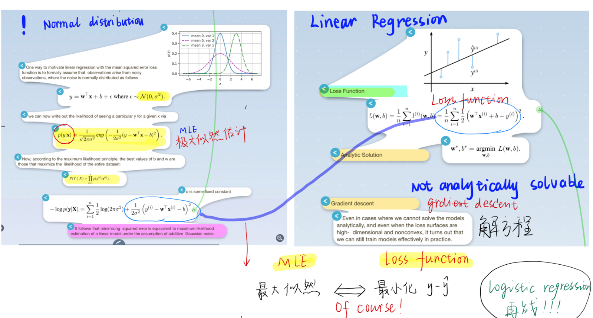
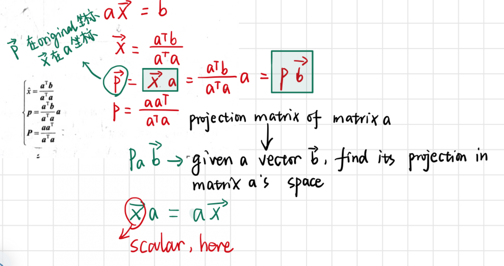
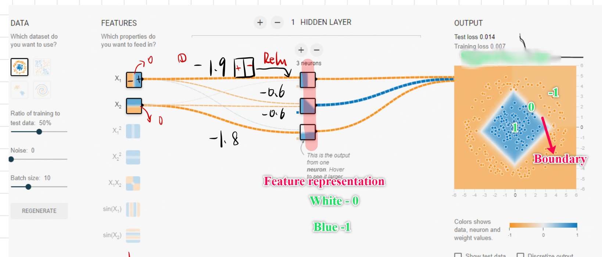

This notes discussed the NN from three different perspectives

- **Feature representation (Linear - non-linear)**
- **Geometric intuition**
- **Statistical learning**

# 1. Linear regression

  

  

# 2. Logistic regression

## Classify the data by distance to the line

1.	The input is projected onto the weight vector and scaled/shifted along this direction. This is a linear operation that reduces the input to a single value, which is then passed through the (possibly nonlinear) activation function.

2.	Consider a hyperplane in input space that's orthogonal to the weight vector. All inputs falling within this hyperplane are mapped to the same output value (the decision boundary plotted below is an example of such a hyperplane). 

3.	The function is a surface bent into a sigmoidal shape along the direction of the weight vector. Changing the network parameters can rotate the direction of the sigmoidal surface, and stretch or shift it. But, the fundamental sigmoidal shape will always remain.

## 2.1 Prior probability and the line

# 3. Neural network
## 3.1 [Linearity assumption:](http://d2l.ai/chapter_multilayer-perceptrons/mlp.html)

Linearity implies: that for whatever target value we are trying to predict, increasing the value of each of our inputs should either drive the value of the output up or drive it down, irrespective of the value of the other inputs.

    Example: Say we are trying to predict whether an individual will or will not repay a loan. We might reasonably imagine that all else being equal, an applicant with a higher income would be more likely to repay than one with a lower income. In these cases, linear models might perform well, and they might even be hard to beat.

    But what about classifying images in FashionMNIST? 
    
    Should increasing the intensity of the pixel at location (13, 17) always increase the likelihood that the image depicts a pocketbook? That seems ridiculous because we all know that you cannot make sense out of an image without accounting for the interactions among pixels.

If we use a linear model, we’d basically be saying that for each pixel, increasing its value (making it more white) 
must always increase the probability that the image depicts a dog or 
must always increase the probability that the image depicts a cat. 
We would be making the absurd assumption that the only requirement for 
differentiating cats vs. dogs is to assess how bright they are. 

That approach is doomed to fail in a work that contains both black dogs and black cats, 
and both white dogs and white cats. Thus we need models capable of discovering patterns 
that might be characterized by interactions among the many features

## 3.2 Representation - Non-linear transform through activation function
  

## 3.3 Geometric
### 3.3.1 In the original feature space

#### [Feature representation and boundary](https://colah.github.io/posts/2014-03-NN-Manifolds-Topology/)

Example to demonstrate the transformation:  

A tanh layer tanh(Wx+b) consists of:
- A linear transformation by the “weight” matrix W
- A translation by the vector b
- Point-wise application of tanh.

>- Boundary is projection of the function onto the original feature space. 
>- So it's learnt by the function in high dimension and good for illustration
>- This feasure representation in original space could be seen as the projection 
of high dimension function as well

### 3.3.2 Perspective of Kernel - projection to high dimension
#### [Function approximation](https://towardsdatascience.com/representation-power-of-neural-networks-8e99a383586) 
[Other reference](http://neuralnetworksanddeeplearning.com/chap4.html)
> The function could separates the instances because how it has been learnt. **Loss function-Cross entropy**

Function of features is learned by **backpropagation** process therefore, 
let's look at the ANN learning from the **outerest hidden layer**:
- is what ANN's looking for 
- from **kernal perspective**, project the data(or representation features from prior layer ) 
to higher dimension as the results of Relu(Wx+b) **which is separable**
- use backpropagation to **determine/learn** achieve such a function separating datapoints
---
- Goal: a function could separate the data (could be thought as kernal function)
- Use neural net to approximate the function, hence the function could be only represented by
the neurual network (something similar to Tyler Series)

  

## [Opening the black box of deep neural networks via information](http://mitliagkas.github.io/ift6085/student_slides/IFT6085_Presentation_IB.pdf)

  

