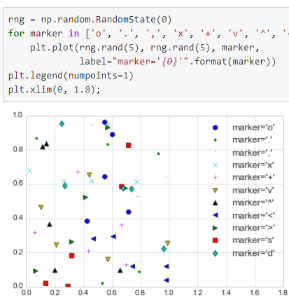

## 2.1 Scatter plot
## 2.2.1 plt.plot
>- The third argument in the function call is a character that represents the type of symbol used for the plotting. 
>- By default, it's line.  

## 2.2.2 plt.scatter

>- can be used to create scatter plots where the properties of each individual point (size, face color, edge color, etc.) can be individually controlled or mapped to data.
>- as datasets get larger than a few thousand points, plt.plot can be noticeably more efficient than plt.scatter
>
>
>
## 2.2.3 df.plot(kind="scatter")

