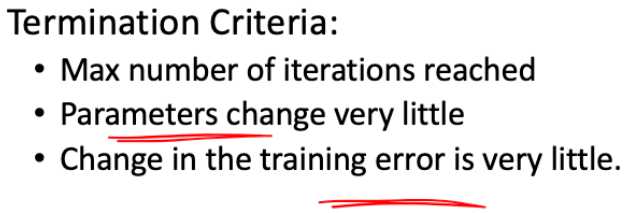

# Questions:

 [LR from scratch](https://github.com/yz599/ML-From-Scratch/blob/master/mlfromscratch/supervised_learning/regression.py)


|   | numpy.random  |random   |   |   |
|---|---|---|---|---|
| Floating  |.rand()   | random()  | scale=min+(value*(max-min))  | Initial parameter  |
|  Floating|.uniform()   | NA  |   | Initial parameter   |
|  Gaussian |.randn()   |  Gauss |   | Initial parameter   |
|  Constant |.zeros()   | NA  |   | Initial parameter   |
| Integer  |.randint(0,10,20)   | randint  |   | SGD  |
 


# 1. [Permutation of the data](https://stackoverflow.com/questions/15474159/shuffle-vs-permute-numpy)

np.random.permutation has two differences from np.random.shuffle:

- if passed an array, it will return a shuffled copy of the array; 
- np.random.shuffle shuffles the array inplace
if passed an integer, it will return a shuffled range i.e. np.random.shuffle(np.arange(n))

- np.random.permutation is useful when you need to shuffle ordered pairs, especially for classification:

```python
from np.random import permutation
from sklearn.datasets import load_iris
iris = load_iris()
X = iris.data
y = iris.target

# Data is currently unshuffled; we should shuffle each X[i] with its corresponding y[i]


perm = permutation(len(X))
X = X[perm]
y = y[perm]
```


# 2. Normalization/standardization of the dataset
- extremely important for algrithoms with distance calculated
- improve the speed of the optimization procedure 
  
## 2.1 Data leakage
- use training mean/std to standardize testing data -- information leakage..(Element of statistical learning)
> In sklearn..
- [Preprocessing module](https://scikit-learn.org/stable/modules/preprocessing.html) 
  - class StandardScaler that implements the 
  - Transformer API to 
  - compute the mean and standard deviation on a **training set** 
  - later reapply the same transformation on the **testing set**. 
  
# 3. Initialize the model parameter and add bias
```python

##-----------------------[-1, 1] -rand -------------------------
#Initialize the parameters of parameter using random values in the range [-1, 1]

ethta_init=np.random.rand(3)   
ethta=ethta_init*2-1           
##[0,1), uniform
## rescaled to a desired range: scaled value = min + (value * (max - min))

##-----------------------[-1/N, 1/N] -uniform -------------------------

def initialize_weights(self, n_features):
    """ Initialize weights randomly [-1/N, 1/N] """
    limit = 1 / math.sqrt(n_features)
    self.w = np.random.uniform(-limit, limit, (n_features, ))

##------------------------randn [ANN]----------------------
def initialize_parameters(input_layer, hidden_layer, output_layer):
    # initialize 1st layer output and input with random values
    W1 = np.random.randn(hidden_layer, input_layer) * 0.01
    # initialize 1st layer output bias
    b1 = np.zeros((hidden_layer, 1))
    # initialize 2nd layer output and input with random values
    W2 = np.random.randn(output_layer, hidden_layer) * 0.01
    # initialize 2nd layer output bias
    b2 = np.zeros((output_layer,1))
    
    parameters = {"W1": W1,
                  "b1": b1,
                  "W2": W2,
                  "b2": b2}
    
    return parameters
##------------------------randn [LR]----------------------
w_coeff=np.random.randn(x.shape[1],1)


##------------------------zero initialization----------------------
w = np.zeros(X.shape[1])


```
```python
# Insert constant ones for bias weights

X = np.insert(X, 0, 1, axis=1)
X=np.c_[np.ones((len(X),1)),X] 
X=np.hstack([np.ones((len(X),1)),X])

# https://github.com/yz599/ML-From-Scratch/blob/master/mlfromscratch/supervised_learning/regression.py
# https://github.com/pytholabsbot1/Linear-regression-from-scratch-python/blob/master/Linear_reg3.ipynb
```


# 4. Train error - RMSD = least square error
  

# 5. [Gradient descent](https://github.com/saugatapaul1010/Implement-SGD-from-scratch./blob/master/Implement%20SGD%20for%20Linear%20Regression%20for%20Boston%20Housing%20Dataset.ipynb)
 

# 6. Locally weighted LR - instance based model
- could be seen as modified linear regression 
- the loss function (distance sum) is modified by assign more weight to the nearest datapoints
- one prediction needs **all instances** 


