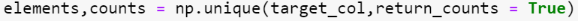
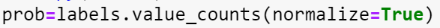
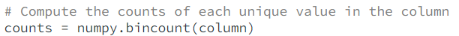
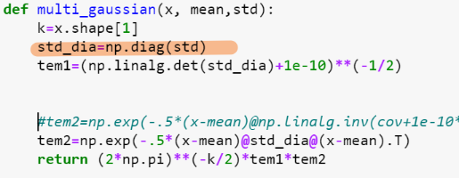
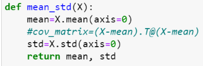

# 1. Cost functions

## 1.1 Decision tree
### 1.1 Unique value 

### 1.2 data feature target
- One feature will be split on multiple times at different level (nodes)
- Each node: **all features**, subset of data, target column
- Child node () is determind by parent node value (features are dependent) 
  - thus conditional entropy
  - **weighed** by % of feature value calculated for
    
# 2. Naive bayesian classifer

Features are conditionally independent
- the sigma (covariance matrix/m-distance) should only include std ..(correlation not considered)
- find std and np.diag(std)

    
