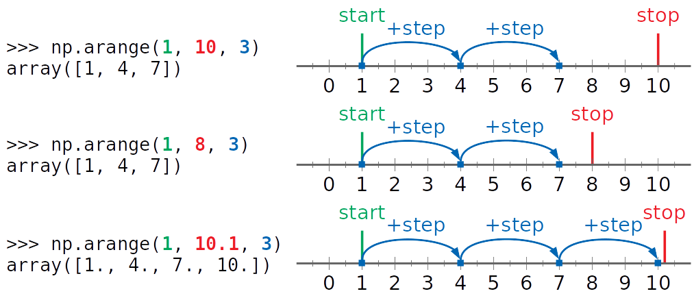

## Questions:
### 1. Normalization/standardalization of the dataset
- extremely important for algrithoms with distance calculated
- improve the speed of the optimization procedure 
  
### Standardalization and test_train_split
- use training mean/std to standardize testing data -- information leakage..(Element of statistical learning)
> In sklearn..
- [Preprocessing module](https://scikit-learn.org/stable/modules/preprocessing.html) 
  - class StandardScaler that implements the 
  - Transformer API to 
  - compute the mean and standard deviation on a **training set** 
  - later reapply the same transformation on the **testing set**. 
  
### 2. [Permutation of the data](https://stackoverflow.com/questions/15474159/shuffle-vs-permute-numpy)

np.random.permutation has two differences from np.random.shuffle:

- if passed an array, it will return a shuffled copy of the array; 
- np.random.shuffle shuffles the array inplace
if passed an integer, it will return a shuffled range i.e. np.random.shuffle(np.arange(n))

- np.random.permutation is useful when you need to shuffle ordered pairs, especially for classification:

``` { .python }
from np.random import permutation
from sklearn.datasets import load_iris
iris = load_iris()
X = iris.data
y = iris.target

Data is currently unshuffled; we should shuffle each X[i] with its corresponding y[i]


perm = permutation(len(X))
X = X[perm]
y = y[perm]
```

### 3. RMSD
  


### [4. Generate random number](https://machinelearningmastery.com/how-to-generate-random-numbers-in-python/)

|   | numpy.random  |random   |   |   |
|---|---|---|---|---|
| Floating  |.rand()   | random()  | scale=min+(value*(max-min))  |   |
| Integer  |.randint(0,10,20)   | randint  |   |   |
|  Gaussian |.randn()   |  Gauss |   |   |
>numpy.arange([start, ]stop, [step, ], dtype=None)
  

  


### [5. Create array](https://numpy.org/doc/stable/reference/routines.array-creation.html)

### 6. Locally weighted LR - instance based model
- could be seen as modified linear regression 
- the loss function (distance sum) is modified by assign more weight to the nearest datapoints
- one prediction needs **all instances** 


