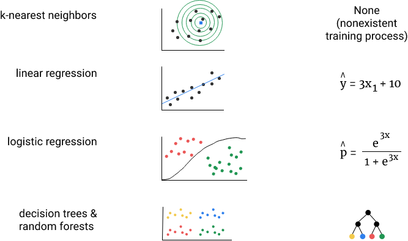
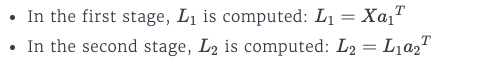
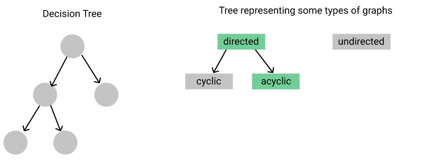
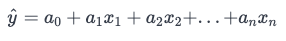
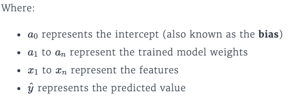
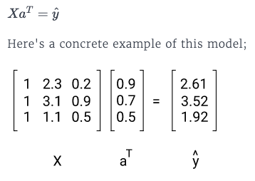
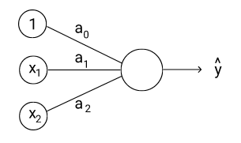
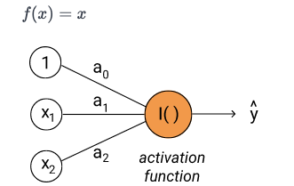
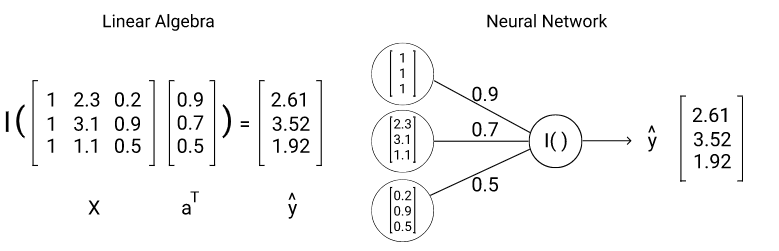
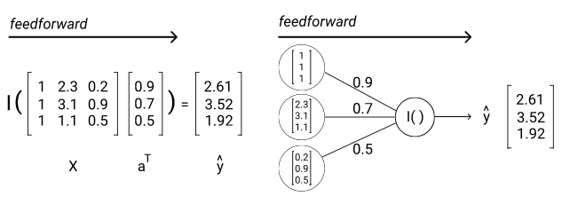

Recap

## 1. [NN overview](https://app.dataquest.io/m/241/representing-neural-networks/1/nonlinear-models)

A deep neural network is a specific type of neural network that excels at capturing nonlinear relationships in data. Deep neural networks have broken many benchmarks in audio and image classification. Previously, linear models were often used with nonlinear transformations that were discovered by hand through research.

Deep neural networks have some ability to discover how to structure the nonlinear transformations during the training process automatically and have grown to become a helpful tool for many problems

### 1.1 ANN representation
Neural networks are usually represented as graphs. A graph is a data structure that consists of nodes (represented as circles) that are connected by edges (represented as lines).

Graphs are commonly used to represent how components of a system are related or linked. For example, the Facebook Social Graph describes how all of the users on Facebook are connected to each other (and this graph is changing constantly as friends are added and removed). Google Maps uses graphs to represent locations in the physical world as nodes and roads as edges.
Graphs are a highly flexible data structure; you can even represent a list of values as a graph. Graphs are often categorized by their properties, which act as constraints. You can read about the many different ways graphs can be categorized on Wikipedia.

### 1.2 Graph application
Graphs provide a mental model for thinking and reasoning about a specific class of models -- those that consist of a series of functions that are executed in a specific order. In the context of neural networks, graphs let us compactly express a pipeline of functions that we want to be executed in succession. Later in this course, we'll explore the math behind the following example:

This pipeline has 2 stages of functions that happen in sequence:

The second stage can't happen without the first stage, because L1 is an input to the second stage. As we'll learn in this course, at the heart of neural network models is the successive computation of functions. This is known as a computational graph. A computational graph uses nodes to describe variables and edges to describe how variables are combined. Here's a simple example:
 
 
 
 The computational graph is a powerful representation, as it allows us to compactly represent models with many layers of nesting. In fact, a decision tree is really a specific type of computational graph. There's no compact way to express a decision tree model using just equations and standard algebraic notation.
 
 
 ### 1.3 ANN that performs linear regression

 If you recall, a linear regression model is represented as: 
   
 The first step is to rewrite this model using linear algebra notation, as a product of two vectors:  
   
 
**Neural Network Representation**

In the neural network representation of this model:

- each feature column in a data set is represented as an input neuron
- each weight value is represented as an arrow from the feature column it multiples to the output neuron

The neurons and arrows act as a visual metaphor for the weighted sum, which is how the feature columns and weights are combined.

Inspired by biological neural networks, an activation function determines if the neuron fires or not. In a neural network model, the activation function transforms the weighted sum of the input values. For this network, the activation function is the identity function. The identity function returns the same value that was passed in:

While the activation function isn't interesting for a network that performs linear regression, it's useful for logistic regression and more complex networks. Here's a comparison of both representations of the same linear regression model:

### 1.4 Feedforward
Because the inputs from one layer of neurons feed to the next layer of the single, output neuron, this is known as a feedforward network. In the language of graphs, a feedforward network is a directed, acyclic graph.

