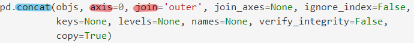
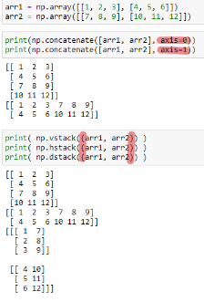
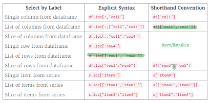
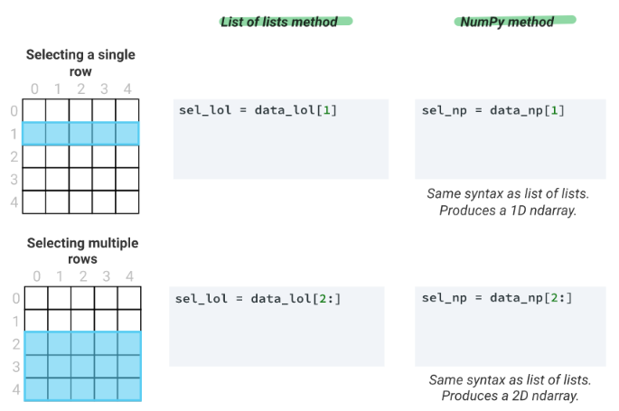
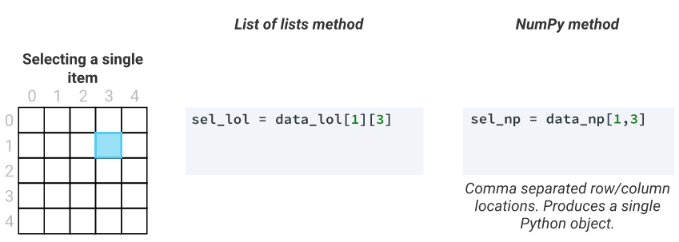
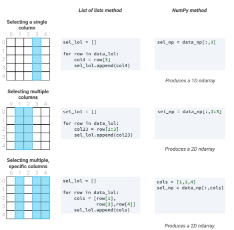

|   | New_data_aixs_conc |New_data_axis_split |New_data_key |Reshape   |
|---|---|---|---|---|
|Numpy|np.concatenate([],axis)|np._stack_(vstack, hstack, dstack)/_.split_/_.c__/.r_/_.insert_ |NA |Reshape/ravel/flatten -**change dimension**  |
|Pandas| **on axis** |NA|pd.merge/df.join **on key** |pivot/melt/**stack/unstack**   |   

> np.append uses np.concatenate

#1. New data
## 1.1 np.concatenate and pd.concat
  
Keep in mind that unlike the append() and extend() methods of Python lists, 
- the append() method in Pandas does not modify the original object–instead it **creates a new object** with the combined data. It also is not a very efficient method, because it involves creation of a new index and data buffer. 
- Thus, if you plan to **do multiple append operations**, it is 
generally better to **build a list of DataFrames** and **pass them all at once** to **the concat()** function.

## 1.2 np.stack and pd.stack
[np.stack](https://mp.weixin.qq.com/s?__biz=MzIzMjY0MjE1MA==&mid=2247486547&idx=1&sn=b3e8816663938f55df8603990c5d42db&chksm=e8908f5adfe7064c8500716ac77e5579077ef186ce9721110cc06c26b11ba7a10b65ea82862a&scene=21#wechat_redirect)
通用的东西是好，但是可能效率不高，NumPy 里还有专门合并的函数
- vstack：v 代表 vertical，竖直合并，等价于 concatenate(axis=0)
- hstack：h 代表 horizontal，水平合并，等价于 concatenate(axis=1)
- dstack：d 代表 depth-wise，按深度合并，深度有点像彩色照片的 RGB 通道

--- 
[pd.stack()](https://mp.weixin.qq.com/s?__biz=MzIzMjY0MjE1MA==&mid=2247486784&idx=1&sn=50a54067e9d596d4a03beb2b281167fb&chksm=e8908e49dfe7075f3cb3b1d5ef9b6ad149c63d3e33a8a42e503717ed09d82df7aa71e87c1eb1&scene=21#wechat_redirect)
- 列索引 → 行索引，用 stack 函数
- 行索引 → 列索引，用 unstack 函数
---

---

# 2. Indxing
## 2.1 Pandas

## 2.2 Numpy

https://s3.amazonaws.com/dq-content/289/selection_columns_updated.svg
https://s3.amazonaws.com/dq-content/289/selection_rows.svg
https://s3.amazonaws.com/dq-content/289/selection_item.svg
https://s3.amazonaws.com/dq-content/289/selection_1darray_updated.svg
https://s3.amazonaws.com/dq-content/289/selection_2darray_updated.svg
