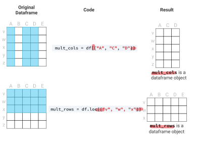

# Rules of broadcasting
- **matrix + array"** either match the row or the column dimension....
- anything + scalar  
- row +column  

# 1. Broadcasting
## 1.1 Rules
**Rule 1:** If the two arrays differ in their number of dimensions, 
the shape of the one with fewer dimensions is padded with ones on its 
leading (left) side.

**Rule 2:** If the shape of the two arrays does not match in any dimension, 
the array with **shape equal to 1** in that **dimension is stretched** to match 
the other shape.

  

1. one has less dimension than the other
2. one should has the same dimension (or 1) in the second axis as the other one (less dimension)

**Example:**

- a has fewer dimensions
  - M.shape=(2,~~3~~)/(3,1)
  - a.shape=(~~3~~,)/(3,)
- by rule 1
  - M.shape -> (2, 3)/(3,1)
  - a.shape -> (1, 3)/(1,3)
- by rule2
  - M.shape -> (2, 3)/(3,3)
  - a.shape -> (2, 3) /(3,3)

## 1.2 Application
row-wise 
### 1.2.1 np.array-row  

  
**row-wise**
### 1.2.2 df-df.col(series)

- df-row see above

- col-col  
  

- df-col  
  
  

---

- Otherwise: **df-series**  
Different from numpy array the column should match as well...so  

>Difference between numpy/df arithmetic is that the df needs to align the column not the 
>elements only hence column arithmetic is not possible since the index is "index" not the "column" 

# 2. Dimension of array
## 1_D
- creation 
- indexing

| functions  |Dimension   |
|---|---|
|np.arange   |1-D   | 
|np.linspace   | 1-D  | 
|Other   |size=scalar 1-D/**tuple 2_D** | 
|pd.Series|1-D|
|df.col|1-D series|
|df.iloc[:,1]|1-D series|
|df.iloc[:,[]]/::2]|2-D (**both index - lists**)|

- **Pandas**

- **Numpy:**  

## 2.2 1_D to 2_D/row2col

# 3. Dot product

>If one of the operands is 2_d array, the dimension should be matched.
Pay attention to dimension of the results

| Operands  |results   | ||
|---|---|---|---|
| two 1_D  |scalar   |no need ||
|one 1_D   |1_d array   |dimension match   ||
|zero 1_D   |2_d array   |dimension match  |see above|
|matrix|2_d array|dimension match ||

>The order the matrix matters since the dimension should match m*n and n*q

