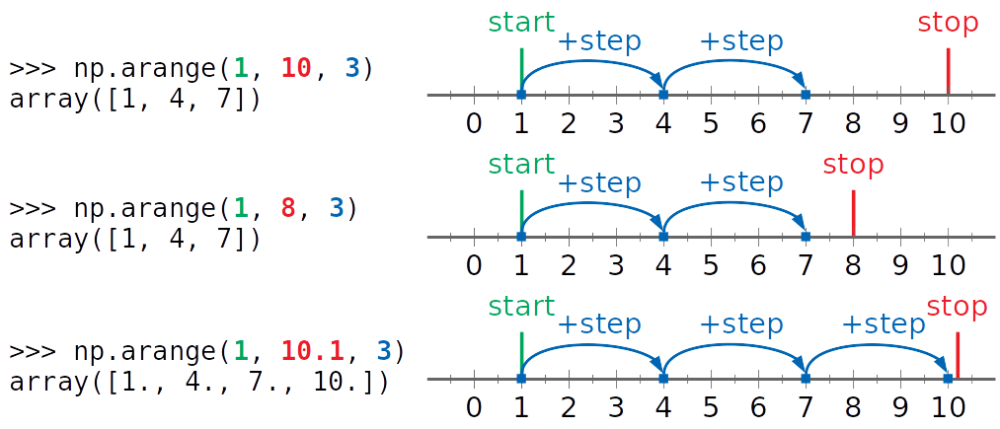
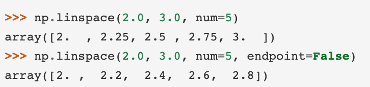
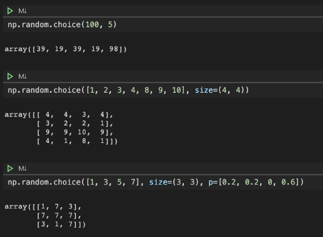
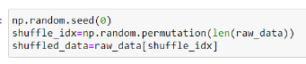
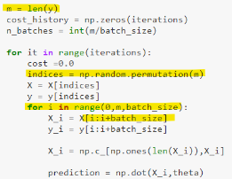
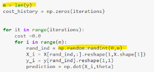

# [Numpy](https://programming.vip/docs/numpy-a-common-module-in-python.html)
## 1.1 [Array and matrix](https://www.xspdf.com/resolution/51708476.html)
[Create array](https://numpy.org/doc/stable/reference/routines.array-creation.html)

numpy.arange([start, ]stop, [step, ], dtype=None)
  

 

                  
## 1.2 Random module

### 1.2.1 Simple random data

| Functions  |Children   |  ---|
|---|---|---|
| randint(low, high=None, size=None)  | Integer  | Random sampling(SGD) - permutation|
| uniform(low=0.0, high=1.0, size=None)  | rand(d0,d1,d2..) [0,1) |parameter initialization |
| normal(loc=0.0, scale=1.0, size=None)  | randn(d0,d1,d2..) N(0,1)|noise/parameter initialization  |
| lognormal(mean=0.0, sigma=1.0, size=None)  | list goes on....  | |

- All functions has a **dtype** argument
- Distribution **with parameter** has keyword **size**, which should be a **scalar or tuple**
- Float: (0,1) - randn(N)/rand(uniform)/random/sample/random_sample

> Initialize weights of the model


### 1.2.2 from array

- Choice(a[, size, replace, p])
generates a random sample from a given 1-D array


- Permutation  
permute the sequence randomly
  - shuffle(x)	Modify a sequence in-place by shuffling its contents.
  - permutation(x)	Randomly permute a sequence, or return a permuted range.  

#### Shuffle the dataset before splitting
``` { .python }
from np.random import permutation
from sklearn.datasets import load_iris
iris = load_iris()
X = iris.data
y = iris.target

Data is currently unshuffled; we should shuffle each X[i] with its corresponding y[i]


perm = permutation(len(X))
X = X[perm]
y = y[perm]
```
> Before the dataset is split, the dataset should be shuffled... 



#### Mini Batch/stochastic gradient descent
[Reference](https://jcboyd.github.io/assets/lsml2018/stochastic_gradient_descent.html)
- [indexes = np.random.randint(0, len(X), batch_size)](https://github.com/arseniyturin/sgd-from-scratch)
- [Batch](https://towardsdatascience.com/gradient-descent-in-python-a0d07285742f)
  - Permutation
- [Stochastic](https://towardsdatascience.com/gradient-descent-in-python-a0d07285742f)
  - np.random.randint(len(X))
  

