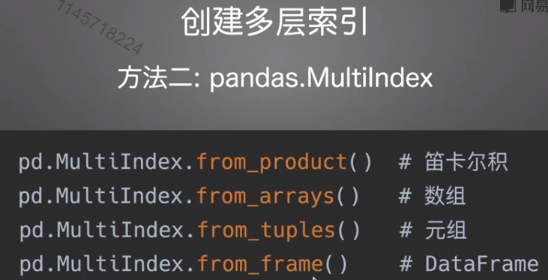

# 1. Data container

##1.3 MultiIndex (header=,index_col=)

 

  

### 1.3.1 Create array
  

### 1.3.2  Using df methods/function
- set_index
- groupby  
- pd.pivot_table
 

  
### 1.3.3 Selecting
- tuple
- column

  
