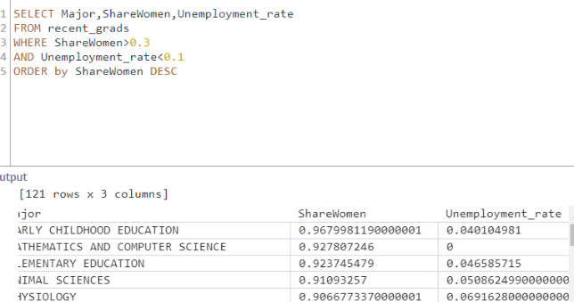

## SQL enables us to pull data from many sources

---

In many real-word situations, data is spread across many sources. 
Using SQL allows us to select specific data and transform it to fit our needs. 
For example, working with spreadsheets can be difficult if the data we need to answer our question is spread across many files. 
SQL allows us to structure our data in a way that makes all of our data accessible from one place.  

**SQL data is structured into multiple, connected tables.**  

  

## 1. Introduction to database
We provide a database, jobs.db, loaded with these data into a single table named recent_grads 
(in the next course, we'll learn how to work with a database containing multiple tables.)  

#### 1.1 Select
  

**In the query above, we specified:**

- The columns we wanted using SELECT * — the symbol * selects all the columns.
- The table we wanted to query using FROM recent_grads.

> select col,col

#### 1.1.1 Limit ROW

#### 1.1.2 Questions - filter/conditional
1. Which majors had mostly female students

- only the Major columns
- only the rows where ShareWomen is greater than 0.5 (corresponding to 50%)

**Filter rows** by specific criteria, we can use the WHERE statement.**[And/or]**  
A WHERE statement commonly uses three things:

- The column we want the database to filter on: ShareWomen
- A comparison operator that specifies how we want to compare a value in a column: >=
- The value we want the database to compare each value to: 0.5

#### 1.1.3 Order by

#### Summary
