## [Create your own DB](https://campus.datacamp.com/courses/introduction-to-relational-databases-in-sql/your-first-database?ex=5)

### Create a DB for university_professor table
#### 1. Redundancy in the table

1.1 One **entity type** in the **Database**  
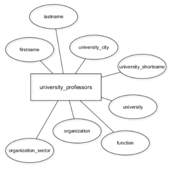

**Better DB with four entities**
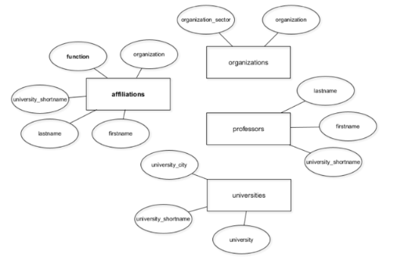

#### Reference - SQL commands
1. Create table  
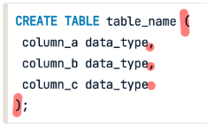  
Delete table   
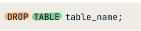

1.1 Data type- alter datatype after table creation  
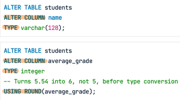
1.2 Cast  

---
2. Alter table  --- alter column..  
2.1 add col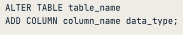  
> add row 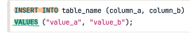

2.2 rename col 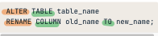  
2.3 drop col 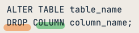   
2.4 update col value  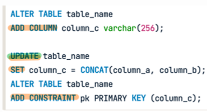   
2.5 constraints  
- key
  - add constraint name primary key ()
  - add constraint name a_id references **table B** (id)
- unique
- datatype & NULL **alter column**  

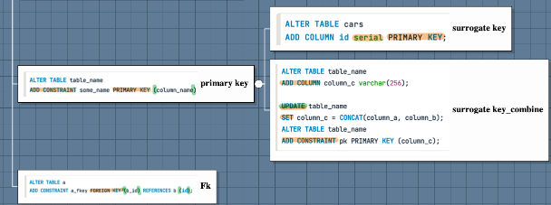
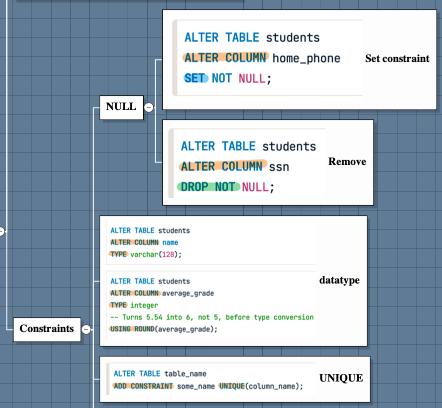

---
3.Inter into  --- alter rows  
3.1 add one row    
3.2 add table 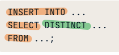

