## Other operation on col
A key idea in SQL is that every result is a table.
> Operation on col is done after select clause
>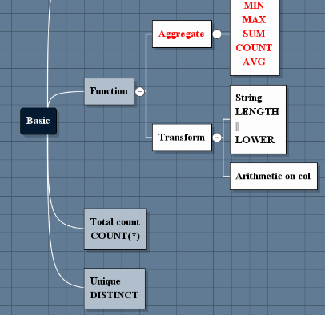

---
### 1.1.3 QUESTIONS
- What is the lowest/highest/average proportion of women on the recent_grads table?  
- How many majors had mostly female students?
- How many had mostly male students?
- How many rows in .. col or table?
- What's the lowest median salary?
- What's the highest median salary?
- What's the total number of students?
- Which majors had the largest spread (difference) between the 25th and 75th percentile starting salaries?

#### Aggregate function - most of them ignore missing values.

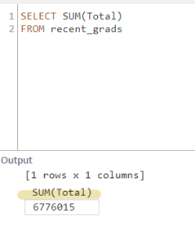
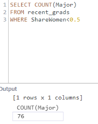
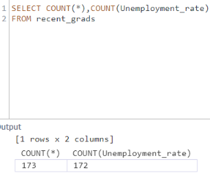
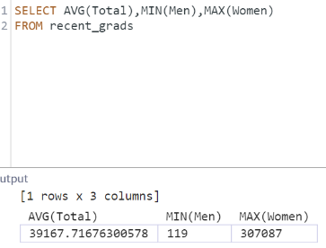

#### Change column names
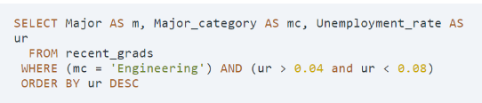
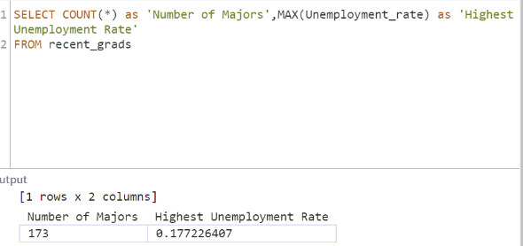

#### Distinct 
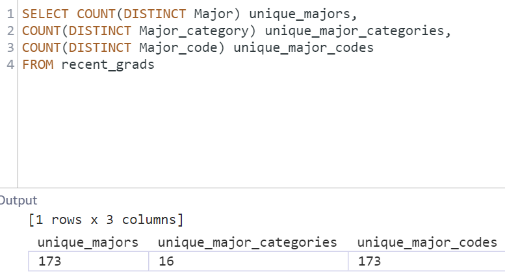

##### String functions and operations  
##### LENGTH
We'll now learn about functions that, when we pass them a column as input, return (a transformation of the input in) another column.
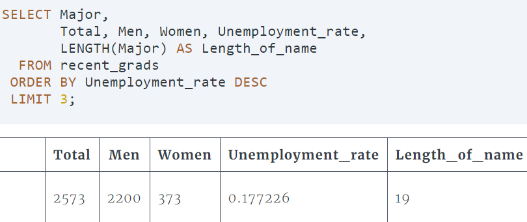
##### String concatenation
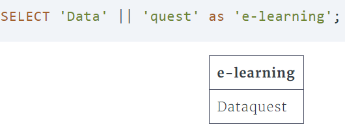
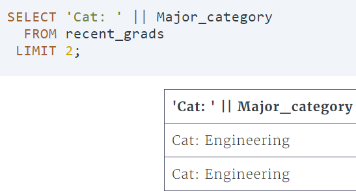
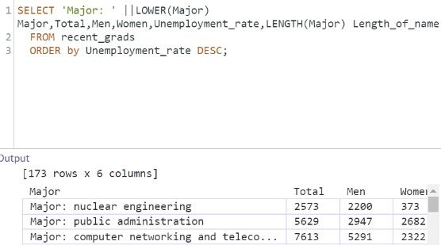

#### Arithmetic oper on col
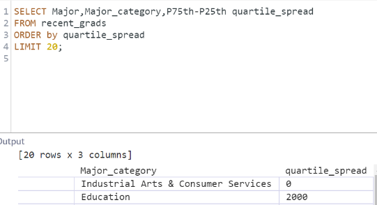