## Creat new column - group
[Reference](https://app.dataquest.io/m/254/group-summary-statistics/1/introduction)
  
  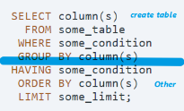
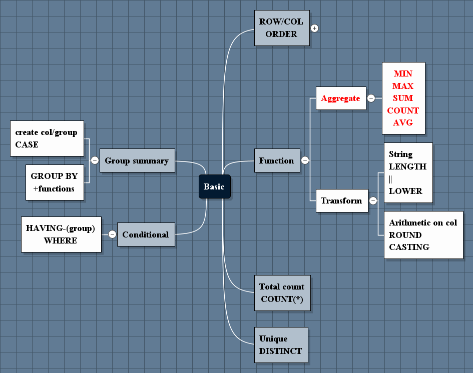

### Question
1. Create new column based on other columns - CASE
2. The total number of people employed in each major category 

#### CASE - continous to discrete
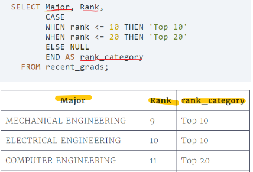
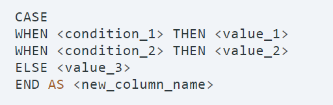

- It starts with **CASE** to indicate that we'll be creating values by cases.
- It ends with **END** to indicate where the CASE clause terminates.
- Each explicit case is signaled by the reserved word WHEN.
- The value for each case is given after the reserved word **THEN**
- There is a fallback value given by the reserved word **ELSE**.  

The ELSE line is optional without it, rows that don't match any WHEN will be set with a missing value (NULL).

#### Group by
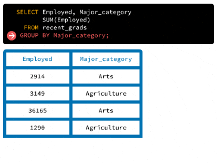  
 - The **GROUP BY** statement splits the Major_category column into groups 
 (with one group for each unique major category), then calculates the sum for each group.  
 - For each group, the GROUP BY statement queries each column, 
 and runs all of the aggregation functions we include in the query after the SELECT statement:  
 
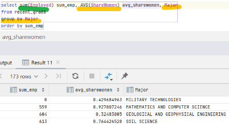

---
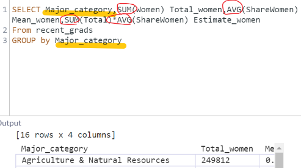

**by multi columns**
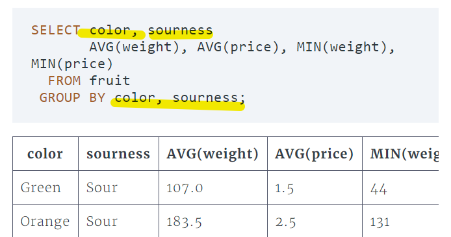

#### HAVING
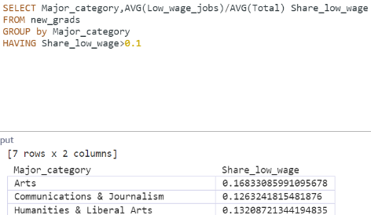
#### ROUND/CASTING
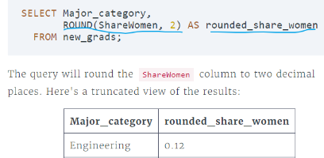  

If we try to **divide two integer **columns (Women and Total, for instance), 
SQLite (and most other SQL dialects) will round down and return integer values:

>To get float value, we can use the CAST() function to the transform the columns into Float type:
>
>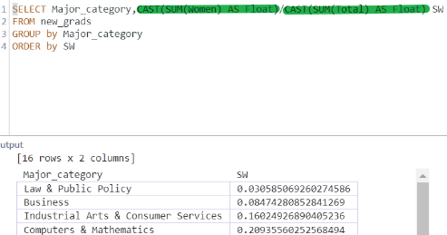