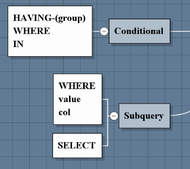
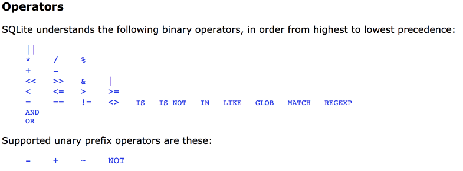
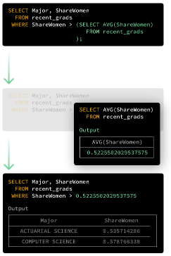
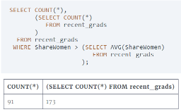
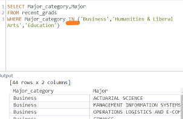
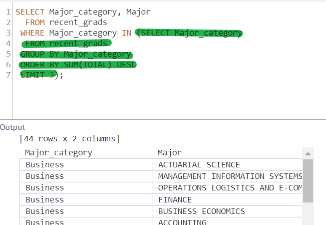

## Subquery 
  

A subquery is a query nested within another query.   
In general, you want to start with the inner queries first and work your way outwards.

IN
### Questions
**WHERE**
1. Which rows are above the average for the ShareWomen column? - find conditions **VALUE**  
2. Find the top 3.. - **Multiple value**

**SELECT**    
Function on two different tables

  

